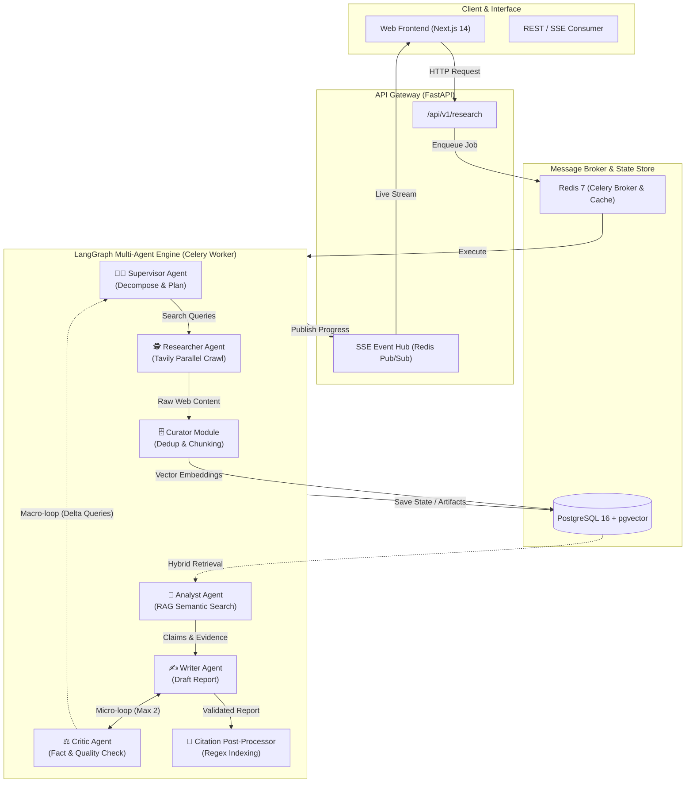

<div align="center">

# 🌐 Multi-Agent Research System

### *Nền tảng Nghiên cứu Chuyên sâu Tự động hóa bằng Kiến trúc Đa Tác tử (Multi-Agent System)*

[](https://opensource.org/licenses/MIT)
[](https://www.python.org/)
[](https://fastapi.tiangolo.com/)
[](https://langchain-ai.github.io/langgraph/)
[](https://github.com/pgvector/pgvector)
[](https://redis.io/)
[](https://www.docker.com/)
[](https://github.com/NguyenChien536/Multi-Agent-Research-System/pulls)

<p align="center">
  <a href="#-tổng-quan-kiến-trúc">Kiến trúc</a> •
  <a href="#-tính-năng-nổi-bật">Tính năng</a> •
  <a href="#-khởi-chạy-nhanh">Khởi chạy nhanh</a> •
  <a href="#-cấu-hình-môi-trường">Cấu hình</a> •
  <a href="#-hướng-dẫn-sử-dụng--api">API & Sử dụng</a> •
  <a href="#-so-sánh--benchmark">Benchmark</a> •
  <a href="#-đóng-góp">Đóng góp</a>
</p>

</div>

---

## 📖 Mục lục

- [💡 Đặt vấn đề & Giải pháp](#-đặt-vấn-đề--giải-pháp)
- [✨ Tính năng nổi bật](#-tính-năng-nổi-bật)
- [🏗️ Tổng quan Kiến trúc](#️-tổng-quan-kiến-trúc)
- [📁 Cấu trúc Thư mục Dự án](#-cấu-trúc-thư-mục-dự-án)
- [🚀 Khởi chạy Nhanh (Quick Start)](#-khởi-chạy-nhanh-quick-start)
  - [Cách 1: Khởi chạy bằng Docker Compose (Khuyên dùng)](#cách-1-khởi-chạy-bằng-docker-compose-khuyên-dùng)
  - [Cách 2: Cài đặt cho Môi trường Phát triển (Local Dev)](#cách-2-cài-đặt-cho-môi-trường-phát-triển-local-dev)
- [⚙️ Cấu hình Biến Môi trường (.env)](#️-cấu-hình-biến-môi-trường-env)
- [📡 Hướng dẫn Sử dụng & API Endpoints](#-hướng-dẫn-sử-dụng--api-endpoints)
- [📊 So sánh & Benchmark](#-so-sánh--benchmark)
- [🗺️ Lộ trình Phát triển (Roadmap)](#️-lộ-trình-phát-triển-roadmap)
- [🤝 Hướng dẫn Đóng góp (Contributing)](#-hướng-dẫn-đóng-góp-contributing)
- [📄 Giấy phép (License)](#-giấy-phép-license)

---

## 💡 Đặt vấn đề & Giải pháp

Trong kỷ nguyên bùng nổ thông tin, việc sử dụng các mô hình ngôn ngữ lớn (LLM) đơn lẻ (như ChatGPT, Claude) bằng một prompt trực tiếp thường bộc lộ những hạn chế cố hữu:

* ❌ **Ảo giác thông tin (Hallucination):** Tự bịa số liệu, sự kiện hoặc trích dẫn các liên kết không tồn tại.
* ❌ **Nông cạn & Thiếu cấu trúc:** Câu trả lời ngắn, không đào sâu vào các khía cạnh ngách của vấn đề.
* ❌ **Thiếu cơ chế tự sửa sai:** Khi gặp thông tin sai hoặc mâu thuẫn, LLM đơn lẻ không có quy trình phản biện để kiểm chứng chéo.

**Multi-Agent Research System** giải quyết triệt để bài toán này bằng cách mô phỏng một **Tổ chức Nghiên cứu Chuyên nghiệp**:

| Vai trò Agent | Chức năng tương ứng | Công nghệ áp dụng |
| :--- | :--- | :--- |
| 🧑‍💼 **Supervisor Agent** | Lập đề cương phân tầng, phân bổ tác vụ và điều phối | LangGraph State Graph & Dynamic Routing |
| 🕵️ **Researcher Agent** | Tìm kiếm mở rộng, cào dữ liệu web song song | Tavily Search API, Trafilatura, SSRF Guard |
| 🗄️ **Curator & VectorDB** | Khử trùng URL, chia đoạn ngữ nghĩa và vector hóa | pgvector (PostgreSQL 16), Cosine Similarity |
| 🧠 **Analyst Agent** | Khai phóng insight, tổng hợp luận điểm (`Claims`) kèm bằng chứng (`Evidence`) | Semantic RAG, Multi-query Retrieval |
| ⚖️ **Critic Agent** | Giám sát chất lượng độc lập, phát hiện lỗ hổng tri thức | Micro-loop (Writer ⟷ Critic) & Macro-loop |
| ✍️ **Writer & Citation Validator** | Biên soạn báo cáo, đánh số trích dẫn chuẩn hóa | Regex Deterministic Citation `[1]`, `[2]` |

---

## ✨ Tính năng nổi bật

- 🤖 **Điều phối Đa Tác tử (Multi-Agent Orchestration):** Xây dựng trên nền tảng **LangGraph**, quản lý trạng thái (`ResearchState`) bất biến và hỗ trợ phục hồi điểm kiểm tra (Postgres Checkpointer).
- 🔄 **Cơ chế Vòng lặp Kép (Dual-Loop Mechanism):**
  - **Micro-loop (Writer ⟷ Critic):** Tối đa 2 chu kỳ chỉnh sửa hành văn, cấu trúc và logic mà không lãng phí tài nguyên tìm kiếm lại.
  - **Macro-loop (Supervisor ⟷ Researcher):** Tự động sinh truy vấn ngách (Delta Queries) đào sâu khi phát hiện thiếu hụt dữ liệu thực sự.
- 🛡️ **Chống Ảo giác 100% (Zero-Hallucination Citation):** Toàn bộ trích dẫn được neo giữ (Grounding) từ `DocumentChunk` → `Evidence` → `ResearchClaim`. Module đánh số trích dẫn bằng code Python thuần, nói KHÔNG với việc để LLM tự tạo link giả.
- ⚡ **Thu thập Dữ liệu Song song & An toàn:** Tích hợp **Tavily Search API** chạy bất đồng bộ (`asyncio.gather`), tích hợp bộ lọc **SSRF Guard** ngăn chặn truy cập tài nguyên mạng nội bộ.
- 📊 **Cơ sở dữ liệu Vector tích hợp (RAG):** Sử dụng **PostgreSQL + pgvector** lưu trữ chunks và embedding đa chiều, hỗ trợ tìm kiếm ngữ nghĩa tương đồng cao.
- 💰 **Kiểm soát Ngân sách & Hạn mức (Research Budget Guardrails):** Cấu hình giới hạn chi phí tối đa (`max_cost_usd`), số lượt gọi LLM (`max_llm_calls`) và thời gian timeout cho từng tác vụ.
- 📡 **Truyền dữ liệu Thời gian thực (SSE Streaming):** Theo dõi trực tiếp từng suy nghĩ (thoughts), tiến độ cào web và trạng thái chuyển giao giữa các Agent qua giao thức Server-Sent Events.
- 📄 **Xuất bản Chuẩn Học thuật:** Hỗ trợ render định dạng **Markdown** và **PDF chuyên nghiệp** (gồm trang bìa, mục lục, bảng biểu, trích dẫn chuẩn APA/IEEE).

---

## 🏗️ Tổng quan Kiến trúc

Hệ thống tuân thủ nghiêm ngặt mô hình **Clean Layered Architecture**, phân tách rành mạch giữa Tầng Giao tiếp (API), Tầng Điều phối Nghiên cứu (LangGraph Multi-Agent), Tầng Dữ liệu (PostgreSQL + Redis) và Hàng đợi tác vụ bất đồng bộ (Celery Worker).



---

## 📁 Cấu trúc Thư mục Dự án

```text
MultiAgent Research System/
├── backend/
│   ├── app/
│   │   ├── agents/          # Định nghĩa LangGraph State, Nodes và Multi-Agent Graph
│   │   ├── api/v1/          # FastAPI REST endpoints (Tasks, Health, Stream)
│   │   ├── core/            # App Configuration, Database async engine, Security
│   │   ├── db/              # Session maker và Database base models
│   │   ├── models/          # 12 Entities SQLAlchemy (Task, Source, Claim, Evidence, Chunk...)
│   │   ├── schemas/         # Pydantic v2 schemas phục vụ Request/Response validation
│   │   ├── tools/           # Custom Search Tools, Web Scrapers, SSRF Guards
│   │   ├── worker.py        # Celery Application & Task Workers
│   │   └── main.py          # FastAPI application factory & Middlewares
│   ├── Dockerfile           # Docker image đa giai đoạn cho Backend & Celery Worker
│   └── requirements.txt     # Danh sách thư viện Python & Agent dependencies
├── frontend/                # Giao diện người dùng Next.js 14 App Router (Đang phát triển)
├── docker/
│   └── init-db.sql          # SQL Script kích hoạt PostgreSQL extensions (pgvector & uuid-ossp)
├── .env.example             # Bản mẫu biến môi trường chuẩn
├── docker-compose.yml       # Điều phối PostgreSQL, Redis, FastAPI Backend, Celery Worker
├── pyproject.toml           # Cấu hình dự án Python & Linter
└── README.md                # Tài liệu hướng dẫn sử dụng & Kiến trúc hệ thống
```

---

## 🚀 Khởi chạy Nhanh (Quick Start)

### Yêu cầu Tiên quyết
* [Docker](https://docs.docker.com/get-docker/) & [Docker Compose](https://docs.docker.com/compose/) (khuyên dùng v2.20+)
* [Git](https://git-scm.com/)
* Khóa API: **Tavily API Key** ([Đăng ký miễn phí tại đây](https://tavily.com/)) và **OpenAI API Key** hoặc **Anthropic API Key**.

---

### Cách 1: Khởi chạy bằng Docker Compose (Khuyên dùng)

Chỉ với 3 bước để khởi động toàn bộ hạ tầng (PostgreSQL, pgvector, Redis, FastAPI, Celery Worker):

#### 1. Clone mã nguồn
```bash
git clone https://github.com/NguyenChien536/Multi-Agent-Research-System.git
cd "Multi-Agent-Research-System"
```

#### 2. Cấu hình biến môi trường
Tạo file `.env` từ file mẫu:
```bash
cp .env.example .env
```
Mở file `.env` và điền các API Key của bạn:
```env
TAVILY_API_KEY=tvly-xxxxxxxxxxxxxxxxxxxxxxxx
OPENAI_API_KEY=sk-proj-xxxxxxxxxxxxxxxxxxxx
# Hoặc sử dụng Anthropic:
ANTHROPIC_API_KEY=sk-ant-xxxxxxxxxxxxxxxxxx
```

#### 3. Khởi chạy toàn bộ hệ thống
```bash
docker compose up -d --build
```

Kiểm tra trạng thái các dịch vụ đang chạy:
```bash
docker compose ps
```

Khi khởi chạy thành công, bạn có thể truy cập ngay:
* 📘 **FastAPI Swagger Docs (Kiểm thử API):** [http://localhost:8000/api/v1/docs](http://localhost:8000/api/v1/docs)
* 🩺 **Health Check Endpoint:** [http://localhost:8000/api/v1/health](http://localhost:8000/api/v1/health)
* 🗄️ **PostgreSQL + pgvector:** Cổng `5432`
* ⚡ **Redis Broker:** Cổng `6379`

Dừng hệ thống khi không sử dụng:
```bash
docker compose down
```

---

### Cách 2: Cài đặt cho Môi trường Phát triển (Local Dev)

Nếu bạn muốn chỉnh sửa mã nguồn và debug trực tiếp trên máy:

#### 1. Khởi chạy Database & Redis bằng Docker
```bash
docker compose up -d postgres redis
```

#### 2. Thiết lập Môi trường Ảo Python
```bash
cd backend
python -m venv .venv

# Trên Windows:
.venv\Scripts\activate
# Trên Linux/macOS:
source .venv/bin/activate

# Cài đặt thư viện:
pip install -r requirements.txt
```

#### 3. Chạy API Server
```bash
uvicorn app.main:app --reload --host 0.0.0.0 --port 8000
```

#### 4. Khởi chạy Celery Worker (ở terminal riêng biệt)
```bash
# Trên Windows:
celery -A app.worker.celery_app worker --loglevel=info -P solo
# Trên Linux/macOS:
celery -A app.worker.celery_app worker --loglevel=info --concurrency=4
```

---

## ⚙️ Cấu hình Biến Môi trường (.env)

| Biến Môi trường | Kiểu dữ liệu | Giá trị Mặc định | Ý nghĩa & Mô tả |
| :--- | :---: | :--- | :--- |
| `ENVIRONMENT` | `string` | `development` | Môi trường triển khai (`development` / `production`). |
| `API_V1_STR` | `string` | `/api/v1` | Tiền tố đường dẫn API. |
| `DATABASE_URL` | `string` | *URL Postgres Async* | Kết nối CSDL Async (`postgresql+asyncpg://...`). |
| `REDIS_URL` | `string` | `redis://redis:6379/0` | Kết nối Redis cho Celery broker & Pub/Sub. |
| `TAVILY_API_KEY` | `string` | **Bắt buộc** | Khóa API Tavily phục vụ tìm kiếm & cào dữ liệu web. |
| `OPENAI_API_KEY` | `string` | Tùy chọn | Khóa API OpenAI (dùng cho GPT-4o và Embeddings). |
| `ANTHROPIC_API_KEY` | `string` | Tùy chọn | Khóa API Anthropic (dùng cho Claude 3.5 Sonnet). |
| `EMBEDDING_MODEL` | `string` | `text-embedding-3-small` | Tên mô hình vector hóa tri thức. |
| `DEFAULT_BUDGET_USD` | `float` | `2.00` | Ngân sách chi phí trần cho mỗi phiên nghiên cứu. |
| `DEFAULT_MAX_LLM_CALLS` | `integer` | `50` | Giới hạn tối đa số lần gọi LLM trong 1 tác vụ. |
| `LANGSMITH_TRACING` | `boolean` | `false` | Bật/tắt giám sát vết thực thi trên LangSmith. |

---

## 📡 Hướng dẫn Sử dụng & API Endpoints

### 1. Tạo mới một Đề tài Nghiên cứu (Create Task)

Gửi yêu cầu khởi tạo nghiên cứu thông qua HTTP POST:

```bash
curl -X POST "http://localhost:8000/api/v1/research" \
  -H "Content-Type: application/json" \
  -d '{
    "title": "Nghiên cứu Thị trường Xe điện Việt Nam 2026",
    "research_question": "Phân tích xu hướng chuyển dịch xe điện tại Việt Nam, cơ sở hạ tầng trạm sạc và thị phần VinFast so với các hãng xe Trung Quốc năm 2026.",
    "research_depth": "deep",
    "language": "vi",
    "max_sources": 15,
    "max_iterations": 2,
    "citation_style": "IEEE",
    "budget": {
      "max_cost_usd": 1.5,
      "max_llm_calls": 30,
      "timeout_seconds": 300
    }
  }'
```

**Mã phản hồi mẫu (`201 Created`):**
```json
{
  "id": "67b8a1c9-3e2b-4fa8-9e6b-7cb85a123456",
  "title": "Nghiên cứu Thị trường Xe điện Việt Nam 2026",
  "status": "PENDING",
  "created_at": "2026-09-20T10:15:30Z"
}
```

---

### 2. Kích hoạt Workflow Đa tác tử (Start Execution)

Sau khi tạo task, gọi endpoint `/start` để đưa tác vụ vào hàng đợi Celery:

```bash
curl -X POST "http://localhost:8000/api/v1/research/67b8a1c9-3e2b-4fa8-9e6b-7cb85a123456/start"
```

Hệ thống sẽ chuyển trạng thái sang `PLANNING`, Supervisor Agent sẽ tiến hành lập đề cương và kích hoạt toàn bộ chu trình.

---

### 3. Kiểm tra Trạng thái & Lấy Báo cáo Cuối cùng

```bash
curl -X GET "http://localhost:8000/api/v1/research/67b8a1c9-3e2b-4fa8-9e6b-7cb85a123456"
```

Báo cáo trả về có định dạng chuẩn khoa học kèm danh mục trích dẫn đã được xác minh:
```markdown
# Báo cáo Nghiên cứu: Chuyển Dịch Thị Trường Xe Điện Việt Nam 2026

## 1. Tổng quan Xu hướng
Thị trường xe điện tại Việt Nam ghi nhận tốc độ tăng trưởng kép hàng năm đạt 28.5% [1]...

## 2. Phân tích Hạ tầng Trạm Sạc
...

---
## Danh mục Tài liệu Tham khảo
[1] Bộ Công Thương - Báo cáo Phát triển Năng lượng Xanh 2025. URL: https://moit.gov.vn/...
[2] Vietnam EV Market Outlook 2026 - BloombergNEF. URL: https://about.bnef.com/...
```

---

## 📊 So sánh & Benchmark

| Tiêu chí Đánh giá | Prompting Truyền thống (ChatGPT / Claude) | RAG Cơ bản (Basic Naive RAG) | **Multi-Agent Research System** |
| :--- | :---: | :---: | :---: |
| **Độ sâu Báo cáo** | Ngắn, khái quát | Phụ thuộc dữ liệu có sẵn | **Chuyên sâu, cấu trúc đa tầng** |
| **Tìm kiếm Web Đa chiều** | ❌ (Chỉ tìm đơn lẻ 1 câu) | ❌ (Chỉ đọc nội bộ) | **✅ Phân rã đa truy vấn song song** |
| **Khử trùng lặp Dữ liệu** | ❌ Không có | ⚠️ Thủ công | **✅ Tự động hash & lọc URL** |
| **Kiểm tra Ảo giác (Critic)** | ❌ Hoàn toàn không | ❌ Không | **✅ Vòng lặp phản biện khép kín** |
| **Độ tin cậy của Trích dẫn** | ⚠️ Dễ bịa link ảo | ⚠️ Tham chiếu mập mờ | **✅ Neo giữ bằng chứng (Grounding 100%)** |
| **Báo cáo Xuất bản (PDF)** | ❌ Chỉ có văn bản chat | ❌ Văn bản thô | **✅ Định dạng học thuật / Doanh nghiệp** |

---

## 🗺️ Lộ trình Phát triển (Roadmap)

- [x] **Giai đoạn 1 (Core Foundations):**
  - [x] Kiến trúc Clean Architecture với FastAPI & SQLAlchemy Async.
  - [x] Tích hợp PostgreSQL 16 + `pgvector` và Redis Message Broker.
  - [x] Thiết lập Celery Background Worker và Docker Compose toàn diện.
- [x] **Giai đoạn 2 (Multi-Agent Engine):**
  - [x] Xây dựng LangGraph State Machine với cơ chế Micro-loop và Macro-loop.
  - [x] Tích hợp Tavily Search API song song với bảo vệ SSRF.
  - [x] Curator module lọc dedup và Post-processor đánh số citation chuẩn xác.
- [ ] **Giai đoạn 3 (Frontend & User Experience):**
  - [ ] Hoàn thiện giao diện Next.js 14 App Router với TailwindCSS & Shadcn UI.
  - [ ] Hiển thị SSE Live Streaming trực quan hóa biểu đồ Agent.
  - [ ] Module Human-in-the-Loop: Cho phép người dùng duyệt đề cương trước khi chạy.
- [ ] **Giai đoạn 4 (Enterprise Extensions):**
  - [ ] Hỗ trợ mô hình mã nguồn mở Local LLM qua Ollama / vLLM.
  - [ ] Bộ xuất bản báo cáo PDF tùy chỉnh theo template trường học/doanh nghiệp.
  - [ ] Đánh giá tự động chất lượng bằng Ragas Framework.

---

## 🤝 Hướng dẫn Đóng góp (Contributing)

Chúng tôi luôn chào đón mọi đóng góp từ cộng đồng mã nguồn mở! Nếu bạn muốn đóng góp:

1. **Fork** repository này về tài khoản GitHub của bạn.
2. Tạo một nhánh tính năng mới (`git checkout -b feature/tinh-nang-moi`).
3. Commit những thay đổi của bạn (`git commit -m 'feat: thêm thuật toán lọc nguồn thông minh'`).
4. Push nhánh lên GitHub (`git push origin feature/tinh-nang-moi`).
5. Tạo một **Pull Request** mới để chúng tôi xem xét và gộp mã nguồn.

> Vui lòng tuân thủ quy tắc định dạng mã nguồn (PEP 8, Black, Ruff) trước khi gửi PR.

---

## 📄 Giấy phép (License)

Dự án được phân phối dưới giấy phép **MIT License**. Xem chi tiết tại file [LICENSE](LICENSE).

---

<div align="center">

⭐ **Nếu bạn thấy dự án này hữu ích, hãy tặng chúng tôi một Star trên GitHub!** ⭐

*Được phát triển với niềm đam mê dành cho Cộng đồng Trí tuệ Nhân tạo & Tự động hóa Nghiên cứu.*

</div>
