# TÀI LIỆU ĐẶC TẢ YÊU CẦU PHẦN MỀM (SRS)
# DỰ ÁN: MULTI-AGENT RESEARCH SYSTEM (ATI)

> **ĐÃ ĐƯỢC THAY THẾ / BẢN LƯU TRỮ:** Đây là SRS v2.5.0, chứa các đề xuất và phạm vi cũ. Kể từ 08/10/2026, yêu cầu hiện hành là [SRS v4.0](docs/requirements/SRS.md), sơ đồ tại [System Design](docs/architecture/system-design.md), và quyết định phạm vi tại [ADR-004](docs/architecture/decisions/ADR-004-multi-agent-research-delivery.md). Các phần bên dưới chỉ để tham khảo lịch sử; không dùng làm spec triển khai khi có mâu thuẫn.

---

## LỊCH SỬ THAY ĐỔI TÀI LIỆU (DOCUMENT REVISION HISTORY)

| Phiên bản | Ngày cập nhật | Tác giả | Mô tả thay đổi |
| :--- | :--- | :--- | :--- |
| **1.0.0** | 10/2024 | Nhóm phát triển ATI | Bản thảo đặc tả ban đầu (MVP cơ bản, sơ đồ ASCII, RAG & PDF Export ở trạng thái tham khảo/ngoài phạm vi). |
| **2.0.0** | 09/2026 | Nhóm Kiến trúc & Kỹ sư AI ATI | - Đánh giá toàn diện và nâng cấp chuẩn kiến trúc Enterprise.<br>- Chuyển đổi toàn bộ sơ đồ ASCII sang chuẩn **Mermaid** trực quan.<br>- Chính thức hóa cấu trúc **Vector Database & Semantic RAG Pipeline** vào luồng nghiên cứu cốt lõi.<br>- Tích hợp đặc tả module **PDF Export** chuẩn học thuật/doanh nghiệp.<br>- Chuẩn hóa Data Model (bổ sung `DocumentChunk`, `ExportArtifact`, sửa lỗi duplicate field ở `AgentRun`).<br>- Thêm ER Diagram, Sequence Diagram, State Diagram và Component Diagram chi tiết. |
| **2.1.0** | 09/2026 | Nhóm Kiến trúc ATI | - **Tối ưu hóa Pipeline** dựa trên phân tích 6 repo tham chiếu (GPT Researcher 18k⭐, company-research-agent, DeepResearchAgent 3.5k⭐, STORM, LangGraph, Mem0).<br>- **Đổi thứ tự**: Critic kiểm tra Draft của Writer (không phải output Analyst) để chặn hallucination trong văn xuôi.<br>- **Thêm Curator Module** (code thuần Python) lọc relevance score + URL dedup trước khi nạp VectorDB.<br>- **Thêm Post-Processor Module** (code thuần Python) đánh số Citation bằng regex deterministic thay vì LLM.<br>- **Micro-loop** (Writer ⟷ Critic, tối đa 2 lần) sửa lỗi hành văn mà không cần quay lại Researcher.<br>- **Macro-loop** với Delta Queries: Supervisor sinh truy vấn ngách mới khi Critic phát hiện thiếu dữ liệu.<br>- **1 Researcher + `asyncio.gather()`** thay vì nhiều Agent song song — chuẩn mực từ tất cả repo tham chiếu.<br>- Chuẩn hóa Search Provider chính thức: **Tavily Search API**. |
| **2.2.0** | 09/2026 | Nhóm Kiến trúc ATI | - **Production Hardening** — bổ sung 16 nâng cấp kiến trúc dựa trên review chuyên sâu cấp Staff Engineer.<br>- **Research Budget System**: Mỗi Task có budget riêng (max LLM calls, max tokens, max cost, timeout).<br>- **Evidence/Claim Chain**: Thêm entity `Evidence` → `ResearchClaim` vào data model cho truy vết grounding từ Source đến Report.<br>- **Citation Verification Layer**: Module code Python xác minh mọi citation hợp lệ trước khi xuất bản.<br>- **Worker Crash Recovery**: Heartbeat monitoring, trạng thái `RETRYING`, idempotent state transitions.<br>- **Redis bắt buộc**: Message Broker + SSE Pub/Sub + Rate Limiter + State Checkpoint.<br>- **SSRF Validation Pipeline**: Flowchart chi tiết chống SSRF cho Web Scraper.<br>- **API Rate Limiting & Concurrency Control**: Quota per user, concurrent task limits, `QUEUED` state.<br>- **Supervisor Deterministic Rules**: Routing decisions bằng code logic, LLM chỉ dùng cho sinh queries.<br>- **Observability Stack**: LangSmith/LangFuse + OpenTelemetry + Prometheus metrics.<br>- **AgentRun Reproducibility**: Thêm `model`, `prompt_version`, `workflow_version`, `input_hash`.<br>- **Evaluation & Fine-tuning Pipeline**: Entity `Evaluation` + dataset generation + fine-tuned model comparison.<br>- **ResearchIteration Entity**: Theo dõi chi tiết từng vòng lặp (queries, sources, verdict).<br>- Viết lại State Machine với guard conditions chi tiết cho mỗi transition. |
| **2.3.0** | 09/2026 | Nhóm Kiến trúc & Kỹ sư AI ATI | - **Chuẩn hóa LangGraph Best Practices (Senior/Staff Review)**.<br>- **Annotated State Reducers**: Bổ sung `operator.add` và `merge_sets` cho `ResearchState` bảo toàn tích lũy dữ liệu (`collected_sources`, `claims`, `evidences`, `visited_urls`, `errors`) qua các vòng Macro-loop chống overwrite.<br>- **Modular Subgraph Architecture**: Đóng gói cụm Micro-loop Writer ⟷ Critic thành `report_synthesis_subgraph` (Subagent) độc lập, cô lập cục bộ biến đếm sửa đổi và cho phép Unit Test riêng biệt.<br>- **LangGraph Native Checkpointer (PostgresSaver)**: Tích hợp Checkpointing bền vững trên PostgreSQL hỗ trợ phục hồi sau sự cố từng node và khả năng quay lui trạng thái (Time-Travel).<br>- **Human-in-the-Loop (HITL) Support**: Cơ chế `interrupt()` cho phép người dùng xem xét, phê duyệt hoặc tùy chỉnh đề cương nghiên cứu (`WAITING_APPROVAL`) trước khi kích hoạt cào dữ liệu web. |
| **2.4.0** | 09/2026 | Nhóm Kiến trúc ATI | - Chuyển acceptance criteria sang `Chưa xác minh` cho đến khi có bằng chứng.<br>- Thống nhất lifecycle, retry/cancel/resume và xử lý budget.<br>- Chuẩn hóa quan hệ claim-evidence-citation và chốt PostgreSQL + pgvector cho MVP.<br>- Chia phạm vi MVP/giai đoạn sau; định nghĩa tiêu chí đo chất lượng, hiệu năng và bảo mật. |
| **2.5.0** | 09/2026 | Nhóm Kiến trúc ATI | - Thu hẹp đối tượng người dùng và bài toán MVP.<br>- Phân biệt kiến trúc đích với năng lực prototype hiện có; bỏ tuyên bố chất lượng tuyệt đối.<br>- Bổ sung đánh giá/evidence explorer, đề xuất tìm ảnh có attribution, biểu đồ từ số liệu và upload tài liệu theo giai đoạn.<br>- Gắn trạng thái, bằng chứng và cách đo cho roadmap/tính năng. |

> **Trạng thái tài liệu:** SRS 2.5.0 là baseline yêu cầu và thiết kế, không phải bằng chứng các tính năng đã triển khai. Tiêu chí nghiệm thu chỉ được chuyển sang `Đạt` khi có kết quả kiểm thử hoặc biên bản nghiệm thu.

---

## BẢNG THUẬT NGỮ VÀ TỪ VIẾT TẮT (GLOSSARY)

| Thuật ngữ / Viết tắt | Tên tiếng Anh đầy đủ | Định nghĩa & Ý nghĩa trong hệ thống |
| :--- | :--- | :--- |
| **SRS** | Software Requirements Specification | Tài liệu đặc tả yêu cầu phần mềm của hệ thống. |
| **Multi-Agent** | Multi-Agent System (MAS) | Hệ thống gồm nhiều tác tử AI hoạt động tương tác, có vai trò chuyên biệt hóa. |
| **Supervisor** | Supervisor Agent | Tác tử trung tâm chịu trách nhiệm lập kế hoạch, phân bổ tác vụ, định tuyến và kiểm soát vòng lặp. |
| **Researcher** | Researcher Agent | Tác tử chịu trách nhiệm tìm kiếm web, duyệt và trích xuất dữ liệu thô từ Internet. |
| **Analyst** | Analyst Agent | Tác tử tổng hợp, phân tích, đối chiếu thông tin và trích xuất luận điểm (claims/findings). |
| **Critic** | Critic Agent | Thành phần đánh giá draft theo tiêu chí và evidence được cung cấp; là lớp hỗ trợ phát hiện lỗi, không mặc định độc lập, không thiên vị hoặc đúng tuyệt đối. |
| **Writer** | Writer Agent | Tác tử biên tập và định dạng báo cáo nghiên cứu hoàn chỉnh, gắn nguồn trích dẫn chuẩn xác. |
| **VectorDB** | Vector Database | Cơ sở dữ liệu chuyên dụng lưu trữ và tìm kiếm tương đồng vector embeddings (như Qdrant/pgvector/Milvus). |
| **RAG** | Retrieval-Augmented Generation | Kỹ thuật tăng cường sinh văn bản bằng truy xuất thông tin từ kho tri thức/vector ngữ nghĩa. |
| **Chunking** | Text Chunking | Quá trình chia nhỏ văn bản dài thành các đoạn ngữ nghĩa có kích thước đồng đều kèm overlap. |
| **Embedding** | Vector Embedding | Biểu diễn ngữ nghĩa của văn bản dưới dạng không gian vector nhiều chiều (dense vector). |
| **SSE** | Server-Sent Events | Giao thức truyền dữ liệu một chiều thời gian thực từ Server về Client qua HTTP. |
| **SSRF** | Server-Side Request Forgery | Lỗ hổng bảo mật khi server bị kẻ tấn công lợi dụng để gửi request trái phép tới tài nguyên nội bộ. |
| **Prompt Injection** | Prompt Injection Attack | Kỹ thuật tấn công can thiệp ngữ cảnh prompt của LLM thông qua dữ liệu untrusted từ web. |
| **JWT** | JSON Web Token | Tiêu chuẩn mở truyền tải thông tin an toàn phục vụ xác thực người dùng. |
| **Tavily** | Tavily Search API | Dịch vụ Search-as-a-Service tối ưu cho AI Agent — tự crawl, extract và trả về clean content. |
| **Curator** | Curator Module | Module code Python thuần thực hiện lọc relevance score, URL dedup và cleaning dữ liệu thô. |
| **Post-Processor** | Citation Post-Processor | Module code Python thuần quét regex các tag `@src_xx`, đánh số citation `[1]`, `[2]` và sinh References. |
| **Micro-loop** | Writer-Critic Micro-loop | Vòng lặp nhỏ (tối đa 2 lần) giữa Writer và Critic để chỉnh sửa hành văn/fact mà không cần tìm kiếm lại. |
| **Macro-loop** | Research Macro-loop | Vòng lặp lớn quay lại Researcher khi Critic phát hiện thiếu dữ liệu thực sự (knowledge gap). |
| **Delta Queries** | Delta Search Queries | Các câu hỏi tìm kiếm ngách được sinh ra từ feedback cụ thể của Critic, tránh lặp lại query cũ. |
| **Research Budget** | Research Budget | Cấu hình giới hạn tài nguyên cho mỗi Task: max LLM calls, max tokens, max cost (USD), timeout. |
| **Evidence** | Evidence Entity | Trích đoạn gốc từ Source Chunk làm bằng chứng hỗ trợ cho một luận điểm (claim). |
| **Claim** | Research Claim | Luận điểm được Analyst rút ra từ Evidence, có thể được Critic xác minh hoặc bác bỏ. |
| **Citation Validator** | Citation Verification Layer | Module kiểm tra tính toàn vẹn tham chiếu source/chunk; mức hỗ trợ ngữ nghĩa của claim phải được đánh giá riêng. |
| **Idempotent** | Idempotent State Transition | State transition có thể retry an toàn mà không tạo duplicate data hoặc side-effect. |
| **Heartbeat** | Worker Heartbeat | Tín hiệu định kỳ từ Worker gửi về hệ thống để chứng minh process còn sống. |
| **LangSmith** | LangSmith Platform | Nền tảng observability của LangChain cho LLM — theo dõi traces, latency, tokens, cost, prompt versions. |
| **OpenTelemetry** | OpenTelemetry (OTel) | Chuẩn mở cho distributed tracing và metrics — trace end-to-end từ HTTP request đến LLM call. |
| **Sliding Window** | Sliding Window Rate Limiter | Thuật toán rate limiting đếm request trong cửa sổ thời gian trượt, chính xác hơn fixed window. |
| **State Reducer** | LangGraph State Reducer | Hàm quy định cơ chế gộp (merge/accumulate) dữ liệu mới vào State thay vì ghi đè (overwrite). |
| **Subgraph** | Compiled Subgraph / Subagent | Đồ thị con khép kín được nhúng trong một Node của đồ thị cha, cô lập vòng lặp và trạng thái cục bộ. |
| **HITL** | Human-in-the-Loop | Cơ chế ngắt tạm thời (interrupt) luồng chạy của đồ thị để con người duyệt hoặc chỉnh sửa trước khi chạy tiếp. |

---

# 1. GIỚI THIỆU

## 1.1. Mục đích của tài liệu
Tài liệu này xác định chi tiết toàn bộ các yêu cầu chức năng (Functional Requirements), yêu cầu phi chức năng (Non-Functional Requirements), thiết kế kiến trúc hệ thống, kiến trúc dữ liệu và quy trình phối hợp đa tác tử (Multi-Agent) cho dự án **Multi-Agent Research System**.

Tài liệu đóng vai trò là kim chỉ nam bắt buộc cho:
* Đội ngũ phát triển Frontend, Backend, AI Engineer và DevOps.
* Đội ngũ kiểm thử chất lượng phần mềm (QA/QC).
* Ban giám sát kỹ thuật và các bên liên quan (Stakeholders).

## 1.2. Phạm vi sản phẩm
**Multi-Agent Research System** là prototype hỗ trợ sinh báo cáo nghiên cứu từ nguồn web công khai, ưu tiên khả năng xem lại nguồn và evidence. Bài toán MVP là giúp **sinh viên/nhà nghiên cứu** lập kế hoạch tìm kiếm, tổng hợp các nguồn liên quan, nhận biết điểm đồng thuận/mâu thuẫn và kiểm tra luận điểm qua nguồn gốc. Hệ thống không thay thế quy trình systematic review, chuyên gia lĩnh vực hoặc đánh giá học thuật.

Kiến trúc đích gồm các vai trò phối hợp trong workflow (không mặc định là các agent độc lập có quyền tự quyết):
1. **Supervisor** lập kế hoạch và truy vấn tìm kiếm có cấu trúc.
2. **Researcher** tìm nguồn và thu thập nội dung theo chính sách an toàn.
3. **Curator** làm sạch, khử trùng, chia chunk và lập chỉ mục.
4. **Analyst** trích xuất claim/evidence, ghi nhận mâu thuẫn và giới hạn nguồn.
5. **Writer/Critic** soạn và phản biện báo cáo có tham chiếu evidence.

Các vai trò và pipeline trên là **kiến trúc đích**. Trạng thái triển khai từng phần được theo dõi ở README/roadmap và chỉ được xác nhận bằng mã nguồn cùng bằng chứng chạy/test. Đầu ra cần nêu rõ phạm vi tìm kiếm, thời điểm truy cập, giới hạn dữ liệu và nội dung chưa được xác minh.

## 1.3. Khách hàng và Đối tượng sử dụng
* **Đối tượng chính của MVP — sinh viên và nhà nghiên cứu** cần khảo sát ban đầu một chủ đề từ nguồn công khai, xem nguồn/evidence và tạo bản tổng hợp có thể kiểm tra.
* **Giai đoạn 2 — chuyên gia phân tích công nghệ/thị trường và nhà nghiên cứu nâng cao:** tạo bản brief sâu hơn có so sánh nguồn, ảnh/biểu đồ có provenance; người dùng chuyên môn vẫn thẩm định kết luận.
* **Giai đoạn 3 — nhóm nghiên cứu, phòng ban phân tích và tổ chức/doanh nghiệp:** nghiên cứu cộng tác và tài liệu riêng, sau khi có quản lý thành viên, phân quyền, cô lập tenant, retention/deletion và chính sách bảo mật phù hợp.
* **Ngoài phạm vi MVP:** thay thế chuyên gia/giảng viên, tự thực hiện systematic review đạt chuẩn xuất bản, tư vấn y tế/pháp lý/tài chính hoặc tạo kết luận có tính chứng nhận.

---

# 2. ĐÁNH GIÁ TỔNG QUAN VÀ ĐỊNH HƯỚNG NÂNG CẤP SRS

Dựa trên việc rà soát phiên bản tiền nhiệm, hệ thống hướng tới giảm một số hạn chế của nghiên cứu thủ công và câu trả lời LLM một lượt. Các lợi ích phải được kiểm chứng bằng evaluation; sơ đồ dưới đây mô tả kiến trúc đích, không khẳng định mọi thành phần đã triển khai:

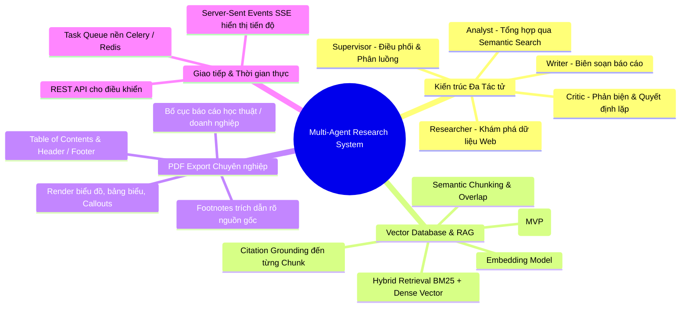

---

# 3. MỤC TIÊU VÀ NGUYÊN TẮC THIẾT KẾ CỐT LÕI

## 3.1. Các mục tiêu chiến lược
1. **Hỗ trợ khảo sát có cấu trúc**: Biến câu hỏi nghiên cứu thành plan, truy vấn, nguồn, claim/evidence và báo cáo; người dùng có thể xem/chỉnh plan và kiểm tra nguồn.
2. **Phát hiện vấn đề để người dùng thẩm định**: Hệ thống đánh dấu claim thiếu bằng chứng, nguồn mâu thuẫn và giới hạn; verdict của Critic không tự thay thế đánh giá con người.
3. **Truy xuất nguồn gốc có thể kiểm tra**: Mọi citation được xuất bản phải ánh xạ đến source và chunk tồn tại. Ánh xạ hợp lệ không tự chứng minh chunk hỗ trợ ngữ nghĩa cho claim; chất lượng hỗ trợ được đo bằng bộ đánh giá và kiểm tra mẫu.
4. **Truy xuất phù hợp theo nguồn và ngữ cảnh**: Dùng RAG để chọn đoạn liên quan; chất lượng phải đo bằng tập đánh giá, không mặc định vector search luôn chính xác.
5. **Đa dạng hóa định dạng xuất bản**: Hỗ trợ hiển thị trực quan Markdown trên Web và kết xuất tài liệu PDF chất lượng cao phục vụ in ấn, lưu trữ và thuyết trình.

## 3.2. Nguyên tắc vàng của hệ thống
> **"Multi-Agent không phải là việc gọi LLM nhiều lần tuần tự, mà là sự cộng tác giữa các thực thể có mục tiêu, công cụ, góc nhìn và trạng thái phân định rõ ràng."**

* **Separation of Concerns**: Tách lập kế hoạch, tìm kiếm, phân tích, viết và kiểm tra bằng workflow có thể quan sát; Critic là một lớp kiểm tra hỗ trợ, không được giả định hoàn toàn độc lập hoặc không thiên vị.
* **Untrusted Data Isolation**: Mọi dữ liệu crawl từ internet đều là dữ liệu tiềm ẩn nguy cơ (untrusted) – phải được tiền xử lý, strip mã độc và áp dụng rào chắn prompt injection.
* **Deterministic Guardrails**: Các quyết định rẽ nhánh và dừng lặp được điều khiển bằng code logic kết hợp output có cấu trúc (Pydantic/Structured Output), không dựa vào câu trả lời cảm tính của mô hình.

---

# 4. TỔNG QUAN KIẾN TRÚC HỆ THỐNG (SYSTEM ARCHITECTURE)

Hệ thống được thiết kế theo kiến trúc phân tầng hiện đại (Clean Layered Architecture), tách biệt giữa tầng giao diện, tầng điều phối tác vụ bất đồng bộ, tầng thực thi AI Agent và tầng lưu trữ dữ liệu đa mô hình.

## 4.1. Sơ đồ kiến trúc thành phần (Component Diagram)

```mermaid
flowchart TB
    %% ==========================================
    %% 1. CLIENT LAYER
    %% ==========================================
    subgraph ClientLayer [" 🌐 1. CLIENT LAYER (Web Application) "]
        direction LR
        UI["🖥️ Next.js 14 App Router<br/>(React + Tailwind + shadcn/ui)"]
        SSEClient["📡 SSE Real-time Client<br/>(Live Progress & Streaming)"]
        PDFViewer["📑 PDF Viewer & Downloader<br/>(Academic / Report Preview)"]
    end

    %% ==========================================
    %% 2. GATEWAY LAYER
    %% ==========================================
    subgraph GatewayLayer [" 🚪 2. API GATEWAY & CONTROLLERS (FastAPI) "]
        direction LR
        AuthRouter["🔐 Auth Module<br/>(JWT & OAuth2)"]
        ResearchRouter["📋 Research Controller<br/>(Task CRUD & Orchestration)"]
        StreamRouter["⚡ SSE Stream Controller<br/>(Event Dispatcher)"]
        ExportRouter["📤 Export Controller<br/>(PDF & Artifacts)"]
    end

    %% ==========================================
    %% 3. ASYNC TASK QUEUE
    %% ==========================================
    subgraph AsyncLayer [" ⏳ 3. ASYNC DISTRIBUTED TASK QUEUE "]
        direction LR
        RedisBroker[("⚡ Redis 7+ Broker<br/>• Celery Task Queue<br/>• SSE Pub/Sub Channel<br/>• Rate Limit & Cache")]
        CeleryWorker["⚙️ Celery Worker<br/>(Workflow Runner Engine)"]
        PDFWorker["🖨️ PDF Render Worker<br/>(WeasyPrint Engine)"]
    end

    %% ==========================================
    %% 4. MULTI-AGENT ORCHESTRATION
    %% ==========================================
    subgraph AgentLayer [" 🧠 4. MULTI-AGENT ORCHESTRATION (LangGraph Dual-Loop) "]
        direction TB

        subgraph IngestionFlow ["Stage A: Planning & Data Discovery"]
            Supervisor["🎯 Supervisor Agent<br/>(Task Decomposition & Routing)"]
            Researcher["🔍 Researcher Agent<br/>(Tavily API & Scraper)"]
            Curator["🧹 Curator Module<br/>(Score Filter & Deduplication)"]
        end

        subgraph SynthesisFlow ["Stage B: Synthesis & Grounding"]
            Analyst["🔬 Analyst Agent<br/>(RAG Semantic Synthesis)"]
            Writer["✍️ Writer Agent<br/>(Draft Report Composer)"]
            Critic["🛡️ Critic Agent<br/>(Fact-check & Hallucination Guard)"]
        end

        subgraph PostProcessingFlow ["Stage C: Publication & Grounding Verification"]
            CitValidator["🔍 Citation Validator<br/>(Reference Integrity + Grounding Evaluation)"]
            PostProcessor["🏷️ Post-Processor<br/>(Deterministic [1], [2] Numbering)"]
        end
    end

    %% ==========================================
    %% 5. TOOLS & EXTERNAL SERVICES
    %% ==========================================
    subgraph ToolingLayer [" 🛠️ 5. AGENT TOOLS & EXTERNAL SERVICES "]
        direction LR
        SearchTool["🌐 Tavily Search API<br/>(Deep Search + Raw Web)"]
        WebScraper["🛡️ Scraper & SSRF Guard<br/>(Trafilatura + Content Strip)"]
        LLMProvider["🤖 Foundation LLMs<br/>(Claude 3.5 Sonnet / GPT-4o)"]
        EmbeddingTool["📐 Text Embeddings<br/>(OpenAI / BGE Models)"]
    end

    %% ==========================================
    %% 6. PERSISTENCE & STORAGE
    %% ==========================================
    subgraph DataLayer [" 💾 6. PERSISTENCE & STORAGE LAYER "]
        direction LR
        PostgresDB[("🐘 PostgreSQL 16 (RDBMS)<br/>• Users, Tasks, Iterations<br/>• Evidences, Claims, Reports")]
        VectorStore[("🧬 Vector Database (pgvector)<br/>• Document Chunks<br/>• Dense Embeddings (HNSW)")]
        FileStorage[("📦 Object / Local Storage<br/>• Exported PDF Files<br/>• Raw Data & Artifacts")]
    end

    %% ==========================================
    %% 7. OBSERVABILITY LAYER
    %% ==========================================
    subgraph ObservabilityLayer [" 📊 7. OBSERVABILITY & MONITORING "]
        direction LR
        LangSmith["📈 LangSmith / LangFuse<br/>(Prompt & Token Traces)"]
        OTel["🔭 OpenTelemetry Collector<br/>(Distributed Tracing)"]
        Prometheus["📉 Prometheus & Grafana<br/>(Metrics & Health Alerts)"]
    end

    %% ==========================================
    %% FLOW CONNECTIONS
    %% ==========================================
    %% Client to Gateway
    UI -->|HTTP REST| ResearchRouter
    UI -->|Auth Requests| AuthRouter
    SSEClient <==|Server-Sent Events| StreamRouter
    PDFViewer -->|Download Request| ExportRouter

    %% Gateway to Async & Redis
    ResearchRouter -->|Enqueue Task| RedisBroker
    ExportRouter -->|Enqueue Export| RedisBroker
    RedisBroker -.->|Pub/Sub Events| StreamRouter

    %% Async Worker to Workflows
    RedisBroker ==>|Consume Task| CeleryWorker
    RedisBroker ==>|Consume Render| PDFWorker
    CeleryWorker ==>|Execute Graph| AgentLayer
    PDFWorker -->|Read Report| PostgresDB
    PDFWorker -->|Store Artifact| FileStorage
    ExportRouter -.->|Fetch Generated PDF| FileStorage

    %% Agent Pipeline Flow
    Supervisor ==>|1. Research Plan| Researcher
    Researcher -->|Parallel Search| SearchTool
    Researcher -->|Scrape & Strip| WebScraper
    Researcher ==>|2. Raw Content| Curator
    Curator -->|Embed Chunks| EmbeddingTool
    EmbeddingTool -->|Index Chunks| VectorStore
    Curator -.->|Record Sources| PostgresDB

    Curator ==>|3. Ready for Analysis| Analyst
    Analyst <-->|Semantic Search| VectorStore
    Analyst ==>|4. Evidence & Claims| Writer
    Writer <-->|Context Grounding| VectorStore
    Writer ==>|5. Draft Report| Critic

    %% Dual-Loops
    Critic -.->|🔁 Micro-loop: Revise Prose| Writer
    Critic -.->|🔄 Macro-loop: Delta Queries| Supervisor
    Critic ==>|6. Verdict PASS| CitValidator

    %% Post Processing & Storage
    CitValidator -->|Verify Grounding| VectorStore
    CitValidator ==>|7. Validated Draft| PostProcessor
    PostProcessor ==>|8. Final Markdown & Citations| PostgresDB

    %% LLM & Observability
    AgentLayer -.->|Prompt & Infer| LLMProvider
    CeleryWorker -.->|Traces & Costs| LangSmith
    CeleryWorker -.->|Distributed Spans| OTel
    CeleryWorker -.->|System Metrics| Prometheus

    %% ==========================================
    %% STYLING / THEMING
    %% ==========================================
    classDef clientStyle fill:#eff6ff,stroke:#3b82f6,stroke-width:2px,color:#1e3a8a;
    classDef gatewayStyle fill:#f5f3ff,stroke:#8b5cf6,stroke-width:2px,color:#4c1d95;
    classDef asyncStyle fill:#fffbeb,stroke:#f59e0b,stroke-width:2px,color:#78350f;
    classDef agentStyle fill:#ecfdf5,stroke:#10b981,stroke-width:2px,color:#064e3b;
    classDef toolStyle fill:#faf5ff,stroke:#d946ef,stroke-width:2px,color:#701a75;
    classDef dataStyle fill:#f8fafc,stroke:#64748b,stroke-width:2px,color:#0f172a;
    classDef obsStyle fill:#fff1f2,stroke:#f43f5e,stroke-width:2px,color:#881337;

    class UI,SSEClient,PDFViewer clientStyle;
    class AuthRouter,ResearchRouter,StreamRouter,ExportRouter gatewayStyle;
    class RedisBroker,CeleryWorker,PDFWorker asyncStyle;
    class Supervisor,Researcher,Curator,Analyst,Writer,Critic,CitValidator,PostProcessor agentStyle;
    class SearchTool,WebScraper,LLMProvider,EmbeddingTool toolStyle;
    class PostgresDB,VectorStore,FileStorage dataStyle;
    class LangSmith,OTel,Prometheus obsStyle;
```

## 4.2. Sơ đồ triển khai hạ tầng (Deployment Diagram)

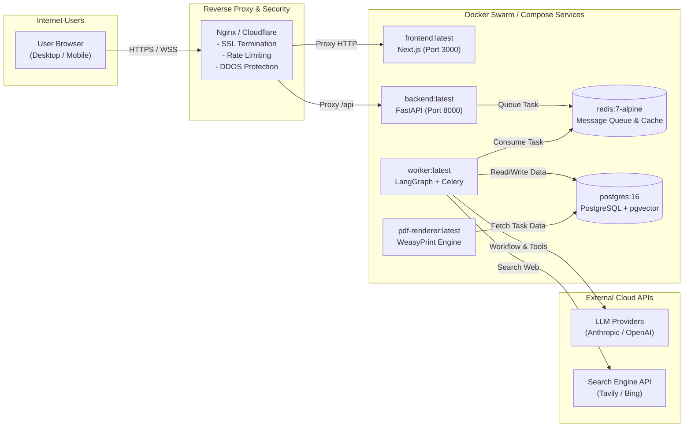

---

## 4.3. Giải thích Pipeline nghiên cứu (Research Pipeline Walkthrough)

Pipeline là **dây chuyền xử lý** từ lúc User nhập đề tài → đến lúc nhận báo cáo hoàn chỉnh. Thay vì ném 1 prompt vào LLM và hy vọng nó trả lời đúng, hệ thống **chia nhỏ** thành 8 thành phần chuyên biệt, mỗi thành phần chỉ làm 1 việc duy nhất.

> **Nguyên tắc cốt lõi**: Có **5 AI Agent** (dùng LLM để suy nghĩ) và các module code xác định. Logic code có thể bảo đảm tính lặp lại và kiểm tra quy tắc đã định nghĩa; điều đó không bảo đảm độ đúng của diễn giải hoặc bằng chứng ngữ nghĩa.

### Pipeline tổng quan

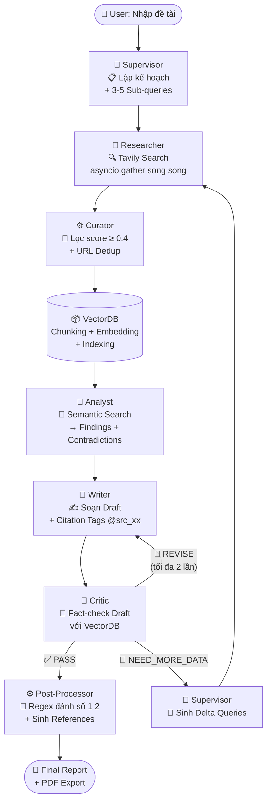

### Bước 1 — 📋 Lập kế hoạch (Supervisor Agent)

| Thông tin | Chi tiết |
| :--- | :--- |
| **Loại** | 🤖 AI Agent |
| **Input** | Đề tài gốc từ User, ví dụ: *"Tác động của AI đến thị trường lao động Việt Nam năm 2026"* |
| **Output** | Research Plan + 3–5 Sub-queries cụ thể |
| **Không làm** | Không tìm kiếm web — chỉ lập kế hoạch |

**Ví dụ output:**
```
Sub-query 1: "Tỷ lệ thất nghiệp do AI tại Việt Nam 2025-2026"
Sub-query 2: "Ngành nghề bị ảnh hưởng nhiều nhất bởi AI tại VN"
Sub-query 3: "Chính sách đào tạo lại lao động của Chính phủ VN"
Sub-query 4: "So sánh tác động AI thị trường lao động VN vs ASEAN"
```

**Tại sao cần bước này?** Nếu search thẳng đề tài gốc, kết quả sẽ rất chung chung. Chia nhỏ thành 4 query cụ thể → kết quả sâu hơn, phủ rộng hơn.

### Bước 2 — 🔍 Thu thập dữ liệu (Researcher Agent)

| Thông tin | Chi tiết |
| :--- | :--- |
| **Loại** | 🤖 AI Agent |
| **Kỹ thuật** | Gọi **Tavily Search API** song song bằng `asyncio.gather()` cho tất cả sub-queries **cùng lúc** |
| **Output** | 20–30 Raw Sources (URL + Clean Text) |
| **Đặc biệt** | Duy trì `visited_urls` set → ở vòng Macro-loop sau sẽ không crawl lại trang cũ |

**Tại sao dùng 1 Agent thay vì 3-4 Agent Researcher riêng?**

| Cách | Thời gian | Phức tạp | Chi phí LLM |
| :--- | :--- | :--- | :--- |
| 4 Agent riêng biệt | ~5 giây | Rất cao (merge state, error handling) | 4× system prompt |
| **1 Agent + asyncio (✅)** | **~5 giây** (Tavily xử lý song song) | Thấp | 1× system prompt |

> Tất cả 6 repo tham chiếu (GPT Researcher 18k⭐, company-research-agent, DeepResearchAgent...) đều dùng pattern **1 Agent + async**.

### Bước 3 — 🧹 Lọc & Gán nhãn (Curator Module)

| Thông tin | Chi tiết |
| :--- | :--- |
| **Loại** | ⚙️ Code Python thuần — **không dùng LLM** |
| **Input** | 20–30 Raw Sources từ Researcher |
| **Output** | 12–18 Filtered Sources + Source ID Mapping Table |
| **Kỹ thuật** | Relevance score filter ≥ 0.4, URL normalization, SHA256 content dedup, gán ID `src_01`, `src_02`... |

**Tại sao cần module này?** Tavily có thể trả về trang quảng cáo, SEO rác, hoặc trùng nội dung. Nếu nạp hết vào VectorDB → tốn embedding tokens + kết quả search bị nhiễu. Bước này được học từ **company-research-agent** (Curator node).

### Bước 4 — 📦 Vector hóa (Chunking + Embedding → VectorDB)

| Thông tin | Chi tiết |
| :--- | :--- |
| **Loại** | ⚙️ Code Pipeline — không dùng LLM |
| **Kỹ thuật** | Cắt văn bản thành chunks 512–1024 tokens (overlap 10–15%), sinh embedding vector 1536 chiều, nạp VectorDB kèm metadata (`task_id`, `source_id`, `chunk_index`) |

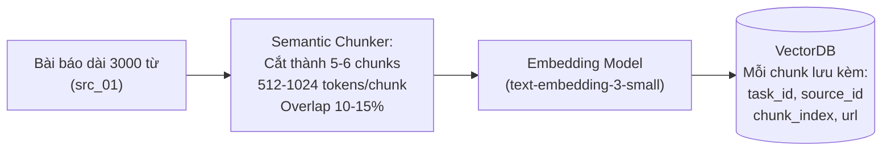

**Tại sao không đưa cả bài viết vào prompt LLM?** 20 bài × 3000 từ = 60,000 từ → tràn context hoặc LLM "quên" phần đầu. VectorDB cho phép **chỉ lấy đúng đoạn liên quan** khi cần → tiết kiệm tokens + chính xác hơn.

### Bước 5 — 🔬 Phân tích (Analyst Agent)

| Thông tin | Chi tiết |
| :--- | :--- |
| **Loại** | 🤖 AI Agent |
| **Kỹ thuật** | Semantic Search trên VectorDB (Top-15 chunks, cosine similarity ≥ 0.72) |
| **Output** | Structured Findings JSON: Key Findings kèm `chunk_id`, Contradictions giữa các nguồn |
| **Không làm** | Không viết văn xuôi — chỉ output JSON có cấu trúc |

**Ví dụ output:**
```json
{
  "findings": [
    {"claim": "Tỷ lệ thất nghiệp ngành sản xuất tăng 2.1%", "chunk_id": "c_07", "source_id": "src_01"},
    {"claim": "Ngành CNTT tuyển thêm 15% nhân sự AI", "chunk_id": "c_12", "source_id": "src_05"}
  ],
  "contradictions": [
    {"topic": "Mức tăng thất nghiệp", "source_a": "src_01: 2.1%", "source_b": "src_03: 5.0%"}
  ]
}
```

### Bước 6 — ✍️ Viết & Phản biện (Writer + Critic — Micro-loop)

Đây là giai đoạn phức tạp nhất, có **vòng lặp nhỏ** (Micro-loop):

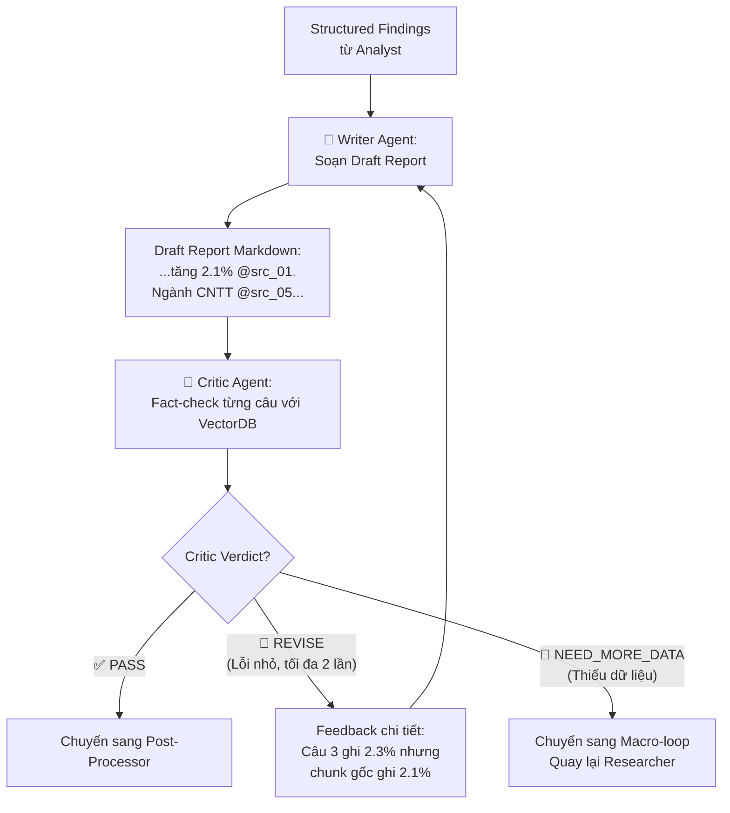

**Writer Agent** tổng hợp Findings thành văn xuôi Markdown chuẩn khoa học. Writer gắn nhãn citation bằng **tag `[@src_01]`, `[@src_02]`** — KHÔNG tự đánh số `[1]`, `[2]` (vì LLM hay nhầm số thứ tự khi văn bản dài).

**Critic Agent** đọc **Draft Report** (không phải output Analyst), đối chiếu từng câu khẳng định với Source Chunk gốc trong VectorDB, và ra 1 trong **3 verdict**:

| Verdict | Nghĩa | Hành động |
| :--- | :--- | :--- |
| `PASS` ✅ | Draft chính xác, đầy đủ | → Chuyển Post-Processor |
| `REVISE` 🔄 | Sai số liệu nhỏ / hành văn lệch | → Writer sửa lại (Micro-loop, tối đa 2 lần) |
| `NEED_MORE_DATA` 🔴 | Thiếu hẳn một mảng tri thức | → Macro-loop: Supervisor sinh Delta Queries → Researcher tìm thêm |

**Micro-loop** (tối đa 2 vòng): Writer soạn Draft → Critic check → REVISE → Writer sửa → Critic check lại → PASS ✅. Chỉ sửa lỗi văn phong / số liệu nhỏ, **KHÔNG quay lại Researcher** → tiết kiệm 1–2 phút + chi phí API.

### Macro-loop (khi thiếu dữ liệu thực sự)

Chỉ kích hoạt khi Critic verdict = `NEED_MORE_DATA`:

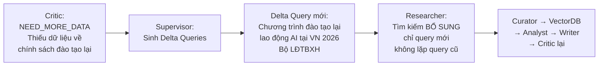

**Delta Queries**: Thay vì lặp lại query ban đầu (vô nghĩa), Supervisor **sinh câu hỏi ngách mới** dựa trên feedback cụ thể của Critic. Giới hạn an toàn: tối đa `max_iterations` vòng + tổng tokens không vượt `token_budget` (150,000).

### Bước 7 — 🔢 Hậu xử lý Citation (Post-Processor Module)

| Thông tin | Chi tiết |
| :--- | :--- |
| **Loại** | ⚙️ Code Python thuần (Regex) — **không dùng LLM** |
| **Kỹ thuật** | Quét regex `[@src_xx]` → đánh số `[1]`, `[2]` theo thứ tự xuất hiện đầu tiên → tự sinh mục References cuối trang → validate mọi citation trỏ đến Source có thật trong DB |

**Tại sao không để Writer tự đánh số `[1]`, `[2]`?** Writer phát tag nguồn ổn định; bộ xử lý xác định thay tag và kiểm tra tham chiếu. Tính deterministic bảo đảm cùng đầu vào cho cùng kết quả đánh số, nhưng không đánh giá được liệu nguồn có thực sự hỗ trợ claim hay không.

**Ví dụ chuyển đổi:**
```
Trước (Draft): "...tăng 2.1% [@src_01]. Ngành CNTT [@src_05]... theo chuyên gia [@src_01]..."
Sau (Final):   "...tăng 2.1% [1]. Ngành CNTT [2]... theo chuyên gia [1]..."

## References
[1] ILO Report 2026 - ilo.org/vietnam/...
[2] VnExpress AI và việc làm - vnexpress.net/...
```

### Ước tính Thời gian & Chi phí (Đã tối ưu hóa - Tiered LLM Strategy & Parallelization)

Với đề tài chuẩn (`STANDARD` depth, ~15 sources), áp dụng các kỹ thuật tối ưu hóa sau:
1. **Tiered Model Strategy:** Dùng mô hình siêu tốc (Gemini 1.5 Flash, GPT-4o-mini, Claude 3.5 Haiku) cho Analyst và Critic; dùng mô hình cao cấp (GPT-4o, Claude 3.5 Sonnet) cho Writer.
2. **Parallelization:** Dùng `asyncio.gather()` cho Analyst để đọc nhiều nguồn cùng lúc.
3. **Structured JSON Output:** Ép Critic trả về JSON cực ngắn, không giải thích dài dòng.
4. **SSE Streaming:** Truyền trực tiếp từng chữ của Writer xuống Frontend (0s perceived latency).

| Giai đoạn | Mô hình đề xuất | Thời gian xử lý | Chi phí ước tính |
| :--- | :--- | :--- | :--- |
| **Supervisor** | GPT-4o-mini / Haiku | ~2s - 3s | ~$0.001 |
| **Researcher** | N/A (Tavily API song song) | ~5s - 8s | ~$0.05 (Tavily API) |
| **Curator** | Python Code (Không dùng LLM)| < 1s | $0 |
| **Vector Embedding**| text-embedding-3-small | ~2s - 3s | ~$0.005 |
| **Analyst** | Gemini 1.5 Flash / Haiku (Song song) | **~3s - 5s** | ~$0.01 |
| **Writer** | Mô hình cấu hình theo release (Streaming)| Đo TTFB riêng với thời gian hoàn tất | Tính theo usage thực tế |
| **Critic** | Gemini 1.5 Flash / Haiku (JSON Out)| **~1s - 2s** | ~$0.005 |
| **Post-Processor** | Python Regex (Đánh số nguồn) | < 1s | $0 |
| **Tổng (1 Vòng lặp)** | Phối hợp đa mô hình | Chưa là SLO; đo p50/p95 trên benchmark | Tính theo usage thực tế |

*Ghi chú: SSE có thể truyền tiến độ hoặc nội dung từng phần nếu endpoint và provider hỗ trợ streaming; thời gian đến byte đầu tiên (TTFB) và thời gian hoàn thành phải đo riêng. Model/provider và giá thay đổi theo thời điểm, vì vậy không dùng ước tính này làm cam kết chi phí/SLO; lấy giá từ cấu hình triển khai và usage thực tế.*

---

# 5. ĐẶC TẢ CHI TIẾT CÁC TÁC TỬ (MULTI-AGENT SPECIFICATION)

## 5.1. Bảng vai trò và quyền hạn của các Agent & Module

> **Nguyên tắc thiết kế pipeline (học từ GPT Researcher, STORM, company-research-agent):**
> Pipeline tối ưu là: **Supervisor → Researcher → Curator → VectorDB → Analyst → Writer → Critic → Post-Processor**. Critic kiểm tra bản Draft của Writer (không phải output Analyst) để bắt hallucination trong văn xuôi. Citation được đánh số bằng code Python deterministic, không phải LLM.

| Thành phần | Loại | Trách nhiệm chính | Input chính | Output chính | Công cụ / Kỹ thuật |
| :--- | :--- | :--- | :--- | :--- | :--- |
| **Supervisor** | 🤖 Agent | - Lập đề cương (Research Plan) gồm 3–6 Sub-queries.<br>- Sinh **Delta Queries** khi Critic yêu cầu bổ sung dữ liệu.<br>- Kiểm soát Macro-loop và Token Budget. | - Research Question<br>- Cấu hình Task<br>- Critic Feedback (nếu Macro-loop) | - Research Plan & Sub-queries<br>- Delta Queries (vòng lặp sau)<br>- Quyết định: `RESEARCH` / `WRITE` / `FAIL` | Quản lý Workflow State |
| **Researcher** | 🤖 Agent | - Gọi Tavily Search API **song song** bằng `asyncio.gather()` cho tất cả sub-queries cùng lúc.<br>- Fetch & làm sạch nội dung web (strip HTML/JS/ads).<br>- Duy trì `visited_urls` set chống crawl lại trang cũ ở các vòng sau. | - Sub-queries từ Supervisor<br>- `visited_urls` set (loại trừ) | - Raw Sources (URL + Clean Text)<br>- Metadata (title, author, date) | `tavily_async_search`<br>`fetch_webpage`<br>`text_cleaner` |
| **Curator** | ⚙️ Code Module | - Lọc Sources bằng Tavily relevance score (threshold ≥ 0.4).<br>- Chuẩn hóa URL và khử trùng lặp bằng hash nội dung.<br>- Gán `source_id` dạng `src_01`, `src_02`... cho mỗi nguồn. | - Raw Sources từ Researcher | - Filtered & Scored Sources<br>- Source ID Mapping Table | Deterministic Python Code |
| **Chunker + Embedder** | ⚙️ Code Pipeline | - Chia văn bản sạch thành chunks (512–1024 tokens, overlap 10–15%).<br>- Sinh vector embeddings và nạp VectorDB kèm metadata `task_id`, `source_id`. | - Filtered Sources | - Document Chunks trong VectorDB<br>- `indexed_chunks_count` | `text_splitter`<br>`embedding_model`<br>`vector_upsert` |
| **Analyst** | 🤖 Agent | - Semantic Search trên VectorDB trích xuất luận điểm then chốt.<br>- Phát hiện các quan điểm đối lập, mâu thuẫn (Contradictions).<br>- Gắn `chunk_id` cho mỗi claim để truy nguồn. | - Đề cương nghiên cứu<br>- VectorDB Chunks | - Structured Findings JSON<br>- Claims & Evidence Links (kèm `chunk_id`) | `vector_semantic_search`<br>`extract_claims` |
| **Writer** | 🤖 Agent | - Tổng hợp Findings thành Draft Report dạng Markdown chuẩn khoa học.<br>- Gắn nhãn Citation dạng tag `[@src_01]`, `[@src_02]` (KHÔNG tự đánh số `[1]`, `[2]`). | - Verified Findings & Claims<br>- Source ID Mapping Table | - Draft Report (Markdown + Citation Tags)<br>- Có thể bị Critic yêu cầu chỉnh lại (Micro-loop) | `vector_retrieve_chunk`<br>`markdown_formatter` |
| **Critic** | 🤖 Agent | - Fact-check Draft Report bằng cách đối chiếu từng câu khẳng định với Source Chunk gốc trong VectorDB.<br>- Phát hiện: số liệu bịa đặt, gán nhầm nguồn, luận điểm phóng đại, thiếu bằng chứng.<br>- Ra 1 trong 3 verdict: `PASS`, `REVISE` (Micro-loop), `NEED_MORE_DATA` (Macro-loop). | - Draft Report từ Writer<br>- VectorDB Chunks để đối soát | - Verdict: `PASS` / `REVISE` / `NEED_MORE_DATA`<br>- Feedback chi tiết: câu nào sai, thiếu gì<br>- Missing Knowledge Areas (cho Delta Queries) | `verify_claim_vector`<br>`evidence_score` |
| **Citation Validator** | ⚙️ Code Module | - Xác minh mọi citation tag `[@src_xx]` trong Draft đã approved:<br>  • Source tồn tại trong DB?<br>  • URL hợp lệ?<br>  • Claim được hỗ trợ bởi chunk gốc?<br>  • Citation thuộc đúng source?<br>- Nếu invalid → loại bỏ citation hoặc gửi lại Writer sửa. | - Approved Draft<br>- Source ID Mapping<br>- Evidence DB | - Validated Draft (mọi citation hợp lệ)<br>- Validation Report (số valid/invalid) | Deterministic Python Code |
| **Post-Processor** | ⚙️ Code Module | - Quét regex toàn bộ tag `[@src_xx]` trong Draft đã validated.<br>- Đánh số lại thành `[1]`, `[2]`... theo thứ tự xuất hiện thực tế.<br>- Tự sinh mục References ở cuối báo cáo.<br>- Validate: mọi citation phải trỏ đến Source có thật trong DB. | - Validated Draft Report<br>- Source ID Mapping Table | - Final Report (Markdown chuẩn xác)<br>- Citation Table hoàn chỉnh | Deterministic Python Code (Regex) |

### Supervisor Decision Matrix (Deterministic Routing Rules)

Supervisor sử dụng **code logic** cho các quyết định routing — chỉ dùng LLM cho việc **sinh sub-queries** và **sinh Delta Queries**:

```python
# Supervisor Decision Matrix — Deterministic Rules (không cần LLM)
def supervisor_route(state: ResearchState) -> str:
    budget = state["budget"]

    # === Guard: Budget đã cạn? ===
    if budget["current_cost_usd"] >= budget["max_cost_usd"]:
        return "FORCE_WRITE"  # Kèm cảnh báo budget
    if budget["current_llm_calls"] >= budget["max_llm_calls"]:
        return "FORCE_WRITE"
    if state["current_iteration"] >= budget["max_iterations"]:
        return "FORCE_WRITE"  # Kèm cảnh báo max iterations
    if budget["elapsed_seconds"] >= budget["timeout_seconds"]:
        return "FAIL"  # Timeout

    # === Routing dựa trên Critic verdict ===
    if state["critic_verdict"] == "PASS":
        return "POST_PROCESS"
    if state["critic_verdict"] == "REVISE":
        if state["current_micro_revision"] < state["max_micro_revisions"]:
            return "WRITER"  # Micro-loop
        return "POST_PROCESS"  # Hết micro-loop
    if state["critic_verdict"] == "NEED_MORE_DATA":
        return "RESEARCH"  # Macro-loop: LLM sinh Delta Queries

    # === Trường hợp đặc biệt ===
    if len(state["collected_sources"]) < 3:
        return "RESEARCH"  # Chưa đủ nguồn tối thiểu

    return "WRITE"  # Mặc định
```

## 5.2. Cấu trúc Trạng thái dùng chung (Shared Research State & Annotated Reducers)
Toàn bộ các Agent trong hệ thống giao tiếp thông qua trạng thái chung `ResearchState`. Nhằm tuân thủ chuẩn mực của LangGraph và ngăn ngừa hiện tượng **ghi đè mất dữ liệu (State Overwriting)** khi chạy các vòng Macro-loop lặp lại, các trường dữ liệu tích lũy bắt buộc phải sử dụng **State Reducers (`Annotated`)**:

```python
import operator
from typing import Annotated, TypedDict, List, Dict, Set, Any, Optional


def merge_sets(left: Optional[Set[str]], right: Optional[Set[str]]) -> Set[str]:
    """Reducer gộp tập hợp URL đã crawl (Seen URL Cache) qua các vòng lặp."""
    return (left or set()).union(right or set())


def merge_dicts(left: Optional[Dict[str, Any]], right: Optional[Dict[str, Any]]) -> Dict[str, Any]:
    """Reducer cập nhật bảng mapping metadata nguồn mới vào bảng cũ."""
    res = dict(left or {})
    res.update(right or {})
    return res


class ResearchBudget(TypedDict):
    """Giới hạn tài nguyên cho mỗi Research Task — chống đội chi phí và vòng lặp vô hạn."""
    max_iterations: int               # Mặc định: 3
    max_sources: int                  # Mặc định: 20
    max_search_queries: int           # Mặc định: 30
    max_llm_calls: int                # Mặc định: 50
    max_input_tokens: int             # Mặc định: 100000
    max_output_tokens: int            # Mặc định: 50000
    max_cost_usd: float               # Mặc định: 2.0
    timeout_seconds: int              # Mặc định: 300 (5 phút)
    # --- Tracking hiện tại ---
    current_llm_calls: int
    current_input_tokens: int
    current_output_tokens: int
    current_cost_usd: float
    elapsed_seconds: float


class ResearchState(TypedDict):
    # === Cấu hình Task ===
    task_id: str
    user_id: str
    research_question: str
    research_depth: str               # 'SHALLOW' | 'STANDARD' | 'DEEP'
    language: str
    budget: ResearchBudget            # Giới hạn tài nguyên toàn bộ task
    require_plan_approval: bool       # Bật chế độ Human-in-the-Loop (Mặc định: False)
    max_micro_revisions: int          # Giới hạn Micro-loop Writer ⟷ Critic (mặc định: 2)
    current_iteration: int
    current_micro_revision: int       # Đếm số lần Writer chỉnh sửa trong vòng hiện tại
    attempt_number: int               # Số lần retry (cho Worker crash recovery)

    # === Kế hoạch & Truy vấn (Có Reducer tích lũy) ===
    plan: Dict[str, Any]              # Đề cương & danh sách câu hỏi con
    current_queries: Annotated[List[str], operator.add]   # Tích lũy lịch sử queries qua các vòng
    visited_urls: Annotated[Set[str], merge_sets]         # Seen URL Cache: tự động union chống crawl trùng

    # === Dữ liệu thu thập (Có Reducer nối tiếp) ===
    collected_sources: Annotated[List[Dict[str, Any]], operator.add] # Tích lũy nguồn qua các vòng Macro
    source_id_mapping: Annotated[Dict[str, Dict[str, Any]], merge_dicts] # Ánh xạ source_tag -> URL
    indexed_chunks_count: int         # Tổng số chunk đã index vào VectorDB

    # === Bằng chứng & Luận điểm (Grounding Chain - Có Reducer) ===
    evidences: Annotated[List[Dict[str, Any]], operator.add]   # Tích lũy Evidence đã trích xuất
    claims: Annotated[List[Dict[str, Any]], operator.add]      # Tích lũy Claims rút ra từ Evidence

    # === Phân tích ===
    analysis_results: Dict[str, Any]  # Luận điểm, mâu thuẫn, phát hiện chính (kèm chunk_id)

    # === Viết & Phản biện (Ủy quyền cho Subgraph) ===
    draft_report_markdown: str        # Bản nháp từ Writer (có tag @src_xx)
    critic_verdict: str               # 'PASS' | 'REVISE' | 'NEED_MORE_DATA'
    critic_feedback: List[str]        # Feedback chi tiết: câu nào sai, thiếu gì
    critic_missing_areas: List[str]   # Danh sách knowledge gaps -> sinh Delta Queries
    citation_validation: Dict[str, Any] # Kết quả Citation Validator: valid/invalid counts

    # === Kết quả cuối cùng ===
    final_report_markdown: str        # Báo cáo sau Post-Processor (citation đã đánh số [1], [2])
    citations: List[Dict[str, Any]]   # Danh sách trích dẫn hoàn chỉnh
    errors: Annotated[List[str], operator.add] # Tích lũy danh sách lỗi nếu có
```

### Tại sao bắt buộc phải dùng Annotated Reducers?
Trong LangGraph, nếu một trường kiểu `List` hoặc `Set` không được gắn `Annotated[..., reducer]`, thì khi Node ở vòng lặp sau trả về giá trị mới, LangGraph sẽ **ghi đè hoàn toàn** (overwrite) giá trị cũ. Việc này sẽ làm mất sạch danh sách các bài viết đã cào từ vòng 1 (`collected_sources`), mất các luận điểm trước đó (`claims`), và làm hỏng cơ chế chống cào trùng URL (`visited_urls`).

---

## 5.3. Kiến trúc Đồ thị con Độc lập (Modular Subgraph: Writer ⟷ Critic)

Nhằm tối ưu tính mô-đun và tuân thủ đúng chuẩn Subagent của LangGraph, cụm **Writer ⇄ Critic (Micro-loop)** được đóng gói thành một **Compiled Subgraph** độc lập mang tên `report_synthesis_subgraph`:

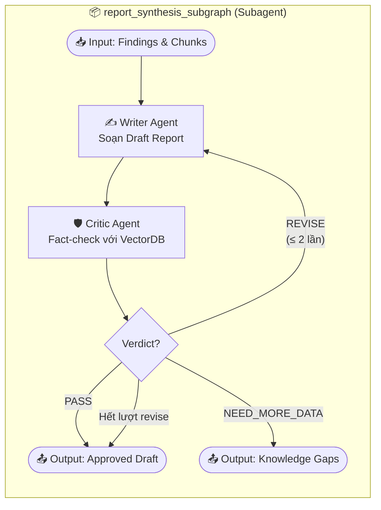

### Lợi ích kiến trúc của Subgraph:
1. **Cô lập trạng thái cục bộ (State Encapsulation):** Biến đếm số lần chỉnh sửa văn phong (`current_micro_revision`) chỉ tồn tại và tăng bên trong Subgraph, không gây ô nhiễm (pollution) lên đồ thị chính.
2. **Kiểm thử độc lập (Unit Testability):** Cho phép viết các bài test giả lập (Mock Test) chỉ riêng cho cụm biên tập - phản biện bằng cách truyền trực tiếp `claims` và `evidences` vào Subgraph mà không cần chạy qua Supervisor hay Researcher.
3. **Khả năng thay thế linh hoạt (Plug & Play):** Dễ dàng nâng cấp hoặc thay thế logic của Writer hoặc Critic mà không làm ảnh hưởng đến các Node khác trên đồ thị cha.

---

## 5.4. Cơ chế Checkpointing Bền vững & Can thiệp Người dùng (Human-in-the-Loop - HITL)

### 5.4.1. Checkpoint Engine với PostgreSQL (`PostgresSaver`)
Hệ thống sử dụng `PostgresSaver` của LangGraph để ghi lại trạng thái (snapshot state) của quy trình tại mỗi bước chuyển Node. Mỗi Research Task tương ứng với một `thread_id` duy nhất (`task_id`):
* **Khôi phục sự cố tức thì (Zero-loss Crash Recovery):** Nếu tiến trình Celery Worker bị crash (OOM, restart container), Worker mới khởi động chỉ cần load checkpoint gần nhất từ PostgreSQL và tiếp tục chạy mà không phải gọi lại LLM hay cào lại web từ đầu.
* **Kiểm toán & Truy vết (Time-Travel Debugging):** Cho phép xem lại toàn bộ lịch sử biến đổi của trạng thái qua từng Node, phục vụ debug và đánh giá chất lượng prompt.

### 5.4.2. Quy trình Can thiệp Người dùng (Human-in-the-Loop Workflow)
Khi người dùng kích hoạt cờ `require_plan_approval: True` lúc tạo Task:

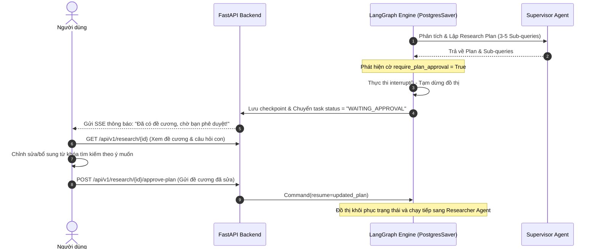

---

## 5.5. Sơ đồ tuần tự tương tác giữa các Agent (Sequence Diagram)

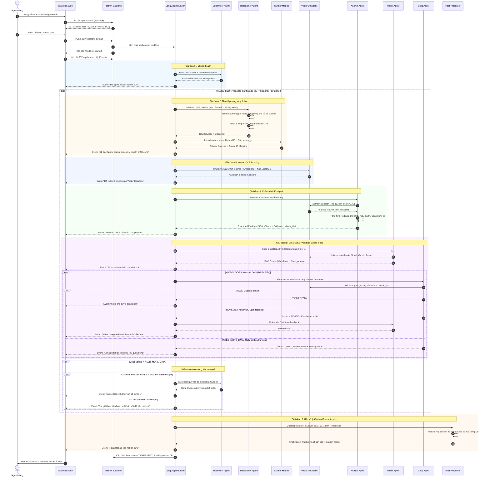

## 5.6. Sơ đồ điều hướng logic có điều kiện (Conditional Routing Flowchart)

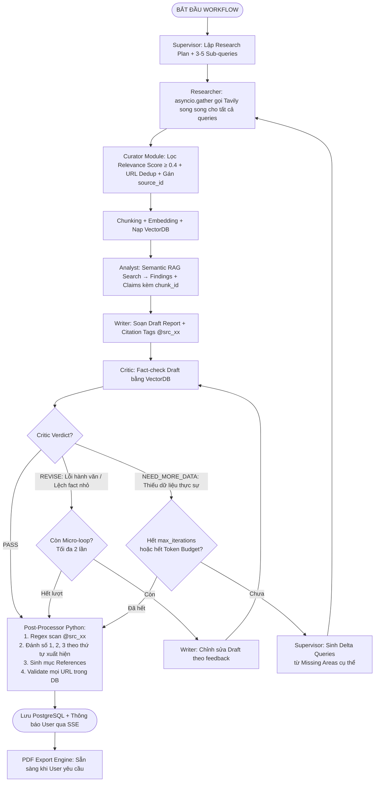

---

# 6. ĐẶC TẢ TÍCH HỢP VECTOR DATABASE VÀ SEMANTIC RAG

Vector Database là thành phần bắt buộc trong kiến trúc từ phiên bản 2.0, đóng vai trò làm bộ nhớ tri thức ngắn hạn (Working Memory) cho toàn bộ phiên nghiên cứu của các Agent.

## 6.1. Quy trình xử lý và nạp dữ liệu (Ingestion Pipeline)

```mermaid
flowchart LR
    TavilyResults["Tavily API Results\n(asyncio.gather song song)"] --> RawHTML["Raw HTML/Text\nfrom URLs"]
    RawHTML --> Cleaner["Text Cleaner\n(Strip Scripts/Ads/Boilerplate)"]
    Cleaner --> CuratorFilter["Curator Module\n- Relevance Score ≥ 0.4\n- URL Normalization & Dedup\n- Gán source_id: src_01, src_02"]
    CuratorFilter --> CleanText["Filtered Clean Text\n+ Source ID Mapping"]
    CleanText --> ChunkEngine["Semantic Chunker\n- Kích thước: 512-1024 tokens\n- Overlap: 10-15%"]
    ChunkEngine --> Chunks["Document Chunks"]
    Chunks --> Embedder["Embedding Model\n(text-embedding-3-small)"]
    Embedder --> DenseVector["Dense Vectors (1536 dims)"]
    DenseVector --> VectorStorage[("Vector Store (pgvector cho MVP)\nPayload Metadata:\n- task_id, source_id\n- chunk_index, url, title")]
```

## 6.2. Chiến lược truy xuất dữ liệu (Retrieval Strategy)
* **Hybrid Search**: Kết hợp Dense Vector Search (Cosine Similarity) với Sparse Search (BM25 / Full-text search trên PostgreSQL) để đảm bảo không bỏ sót các từ khóa chuyên ngành, số liệu và thực thể tên riêng.
* **Metadata Filtering**: Mọi truy vấn bắt buộc có filter `task_id` để cô lập hoàn toàn tri thức giữa các Research Task và giữa các người dùng khác nhau (Multi-tenant isolation).
* **Top-K & Re-ranking**: Analyst và Critic lấy tối đa 15 chunk rồi áp dụng ngưỡng đã hiệu chỉnh trên tập đánh giá. Ngưỡng không phải hằng số phổ quát; phải đo precision/recall theo ngôn ngữ và chủ đề trước khi phát hành.

## 6.3. Truy xuất nguồn gốc và chống ảo giác (Citation Grounding)
* Mỗi nhận định (claim) do Analyst trích xuất đều phải mang ID của `DocumentChunk` nguồn.
* Writer Agent chỉ được phép chèn trích dẫn `[N]` vào câu nếu nội dung câu đó được sinh ra trực tiếp từ `DocumentChunk` tương ứng.
* Ngăn xuất bản citation không tồn tại bằng kiểm tra tag và quan hệ dữ liệu. Đánh giá semantic entailment riêng trên tập chuẩn; hệ thống không cam kết loại bỏ triệt để mọi hallucination.

---

# 7. ĐẶC TẢ MODULE XUẤT BÁO CÁO ĐA ĐỊNH DẠNG (EXPORT ENGINE)

Hệ thống cung cấp module chuyên biệt để biên dịch báo cáo cuối cùng thành các định dạng chuẩn phục vụ nghiên cứu và xuất bản.

## 7.1. Các định dạng hỗ trợ

1. **Markdown (`.md`)**:
   - Định dạng gốc, kết xuất tức thì. Phù hợp cho lập trình viên, tích hợp vào GitHub, Notion, Obsidian.
2. **Word Document (`.docx`)**:
   - Phục vụ nghiên cứu sinh, dân văn phòng. Sử dụng thư viện `python-docx` để giữ nguyên các định dạng H1, H2, in đậm, danh sách, và đặc biệt là hệ thống bảng biểu. Người dùng có thể dễ dàng tải về để tinh chỉnh thêm, căn lề, thêm logo.
3. **PDF (`.pdf`)**:
   - Tài liệu khóa cứng chuẩn xuất bản (Read-only). Sử dụng `WeasyPrint` hoặc `ReportLab`.
   - Hỗ trợ dàn trang chuẩn A4, Header/Footer (Tên đề tài, số trang X/Y), tự động tạo Mục lục (Table of Contents), và Footnotes cho trích dẫn.
4. **LaTeX / HTML (`.tex` / `.html`)** *(Tùy chọn mở rộng)*:
   - Sử dụng công cụ như `Pandoc` để chuyển đổi tự động. Phù hợp để chèn trực tiếp báo cáo vào các bài báo khoa học quốc tế (IEEE, Springer, Elsevier).

## 7.2. Quy trình kết xuất đa định dạng

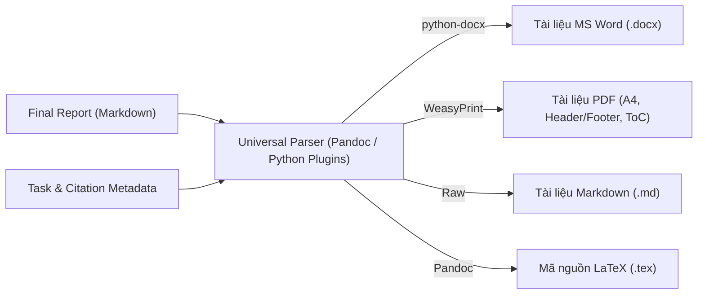

## 7.3. Quy chuẩn định dạng (Typography & Styling)
1. **Khổ giấy & Lề**: Chuẩn A4 quốc tế (210 x 297 mm), lề tiêu chuẩn (Top/Bottom: 2.5cm, Left/Right: 2cm).
2. **Typography**: Sử dụng Unicode tiếng Việt (Times New Roman, Arial, hoặc Noto Serif/Sans). Cỡ chữ 11pt-12pt, giãn dòng 1.5.
3. **Xử lý Trích dẫn (Citations)**: Trích dẫn `[1]`, `[2]` trong nội dung sẽ tự động được liên kết (hyperlink) tới Danh mục Tài liệu tham khảo ở cuối trang (hoặc cuối file).
4. **Hình ảnh & Bảng biểu**: Tự động scale vừa lề giấy, tránh tràn trang chữ. Tự động ngắt trang hợp lý.
6. **Mục Trích dẫn & Thư mục tài nguyên (References)**: Đặt ở cuối tài liệu, liệt kê rõ ràng tên tác giả, tiêu đề, ngày truy cập và URL liên kết có thể nhấp (clickable hyperlinks).

---

# 8. DANH SÁCH VÀ CHI TIẾT CÁC USE CASE

## 8.1. Sơ đồ Use Case tổng quan (Use Case Diagram)

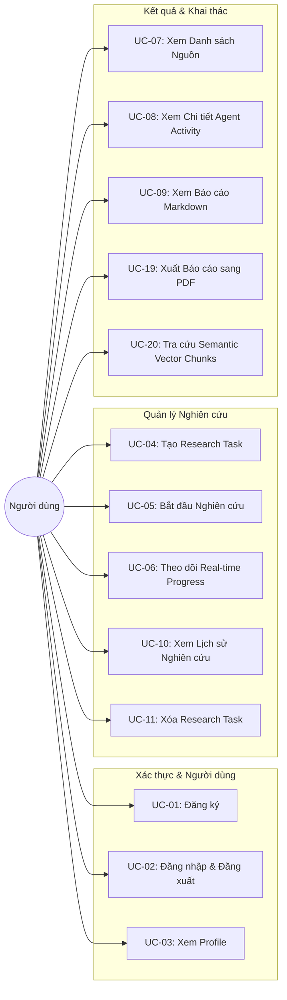

## 8.2. Danh mục Use Case chi tiết

| Mã UC | Tên Use Case | Actor chính | Mô tả vắn tắt |
| :--- | :--- | :--- | :--- |
| **UC-01** | Đăng ký tài khoản | User | Người dùng tạo tài khoản mới bằng Email/Username và Mật khẩu. |
| **UC-02** | Đăng nhập & Đăng xuất | User | Xác thực và cấp phát/hủy bỏ JWT Bearer Token. |
| **UC-03** | Xem thông tin tài khoản | User | Xem thông tin cá nhân, giới hạn quota và số task đã thực hiện. |
| **UC-04** | Tạo Research Task | User | Khởi tạo chủ đề nghiên cứu, câu hỏi trọng tâm và cấu hình thông số. |
| **UC-05** | Bắt đầu Research | User | Chuyển task sang trạng thái chạy và kích hoạt LangGraph Worker. |
| **UC-06** | Theo dõi Real-time Progress | User | Nhận stream sự kiện (SSE) hiển thị từng bước làm việc của các Agent. |
| **UC-07** | Xem Research Sources | User | Xem danh mục các trang web/bài báo đã được Researcher thu thập. |
| **UC-08** | Xem Agent Activity | User | Xem lịch sử chi tiết: thời gian chạy, số tokens, tool calls của từng Agent. |
| **UC-09** | Xem Research Report | User | Đọc báo cáo hoàn chỉnh hiển thị bằng giao diện Markdown trực quan. |
| **UC-10** | Xem Research History | User | Duyệt danh sách các task cũ kèm bộ lọc trạng thái và thời gian. |
| **UC-11** | Xóa Research Task | User | Xóa vĩnh viễn task, dọn dẹp quan hệ trong DB và các vectors trong VectorDB. |
| **UC-12** | Thu thập & Làm sạch nguồn | Researcher Agent | Tìm kiếm web, bóc tách text, loại bỏ quảng cáo/boilerplate. |
| **UC-13** | Chunking & Nạp VectorDB | Researcher Agent | Chia văn bản, sinh embeddings và lưu trữ vào Vector Store. |
| **UC-14** | Truy vấn ngữ nghĩa & Phân tích | Analyst Agent | Tìm kiếm tương đồng ngữ nghĩa để tổng hợp phát hiện và mâu thuẫn. |
| **UC-15** | Đánh giá & Phản biện chéo | Critic Agent | Đánh giá chất lượng chứng cứ và phát hiện thiếu sót tri thức. |
| **UC-16** | Điều phối & Ra quyết định lặp | Supervisor Agent | Điều phối flow, tăng biến đếm iteration hoặc kết thúc nghiên cứu. |
| **UC-17** | Biên soạn báo cáo & Gắn Citation | Writer Agent | Soạn thảo báo cáo có cấu trúc và ánh xạ citation chính xác đến nguồn. |
| **UC-18** | Tự phục hồi lỗi Agent (Self-healing) | Supervisor Agent | Tự động thử lại (retry) hoặc đổi query tìm kiếm khi một Agent gặp sự cố. |
| **UC-19** | Xuất báo cáo sang PDF | User | Yêu cầu kết xuất và tải xuống tài liệu PDF định dạng in ấn chuyên nghiệp. |
| **UC-20** | Tra cứu Semantic Vector Chunks | User / Auditor | Xem trực tiếp các đoạn chunk được trích xuất trong VectorDB gắn với từng trích dẫn. |

---

# 9. YÊU CẦU CHỨC NĂNG CHI TIẾT (FUNCTIONAL REQUIREMENTS)

## 9.1. Quản lý Tài khoản & Xác thực (Auth)
* **FR-01 (User Registration)**: Cho phép người dùng đăng ký với email hợp lệ, username duy nhất và mật khẩu tối thiểu 8 ký tự có ký tự đặc biệt.
* **FR-02 (User Authentication)**: Xác thực người dùng và phát hành JWT Access Token (hạn 60 phút) cùng Refresh Token (hạn 7 ngày). Mật khẩu phải băm bằng thuật toán Argon2 hoặc Bcrypt.
* **FR-03 (Access Control)**: Tất cả các API nghiệp vụ nghiên cứu phải yêu cầu xác thực JWT.
* **FR-04 (Data Isolation & Ownership)**: Người dùng tuyệt đối không thể truy cập, xem, sửa hoặc xóa Task, Source, Vector hay Report thuộc về tài khoản khác.

## 9.2. Quản lý Yêu cầu Nghiên cứu (Task Management)
* **FR-05 (Task Creation)**: Cho phép tạo đề tài nghiên cứu với các tham số bắt buộc: `title`, `research_question`.
* **FR-06 (Research Configuration)**: Cho phép tinh chỉnh:
  * `research_depth`: `SHALLOW` (nhanh, 1 vòng lặp), `STANDARD` (mặc định, 1-2 vòng lặp), `DEEP` (nghiên cứu sâu, tối đa 3 vòng lặp).
  * `language`: Ngôn ngữ xuất báo cáo (`vi`, `en`, v.v.).
  * `max_sources`: Số lượng nguồn thu thập tối đa (từ 5 đến 30).
  * `report_length`: Độ dài kỳ vọng (`SHORT`, `MEDIUM`, `LONG`).
  * `citation_style`: Kiểu trích dẫn (`IEEE`, `APA`, `HARVARD`).
* **FR-06b (Research Budget Configuration)**: Cho phép cấu hình ngân sách tài nguyên cho task (hoặc áp dụng budget mặc định theo `research_depth`):
  * `max_llm_calls`: Giới hạn số lần gọi LLM (mặc định: 50).
  * `max_input_tokens`, `max_output_tokens`: Giới hạn trần token (mặc định: 100k input, 50k output).
  * `max_cost_usd`: Ngưỡng ngân sách chi phí LLM tối đa tính bằng USD (mặc định: $2.00/task).
  * `timeout_seconds`: Thời gian chạy tối đa trước khi tự động ngắt an toàn (mặc định: 300s).
* **FR-07 (Task Lifecycle States)**: Quản lý trạng thái task: `PENDING`, `QUEUED`, `PLANNING`, `WAITING_APPROVAL`, `RESEARCHING`, `INDEXING`, `ANALYZING`, `WRITING`, `REVIEWING`, `FINALIZING`, `COMPLETED`, `RETRYING`, `FAILED`, `CANCELLED`. State machine ở Mục 11 là nguồn chuẩn duy nhất cho transition hợp lệ.
* **FR-08 (Task Cancellation)**: Cho phép người dùng bấm hủy tác vụ đang chạy; hệ thống phải giải phóng worker và dọn dẹp tài nguyên.

## 9.3. Điều phối Tác tử & Luồng nghiên cứu (Multi-Agent & Workflow)
* **FR-09 (Supervisor Planning)**: Supervisor phân tách câu hỏi chính thành danh sách từ 3 đến 6 câu hỏi con (sub-questions) và chiến lược tìm kiếm tương ứng.
* **FR-10 (Parallel Search via Tavily)**: Researcher Agent sử dụng `asyncio.gather()` để gọi **Tavily Search API song song** cho tất cả sub-queries cùng lúc. Không cần spawn nhiều Agent Researcher riêng biệt. Researcher duy trì `visited_urls` set để tránh crawl lại trang cũ ở các vòng Macro-loop sau.
* **FR-11 (Source Scraping & Sanitization)**: Thu thập nội dung web dạng text thuần, tự động loại bỏ thẻ HTML, JavaScript, CSS và các phần tử điều hướng thừa.
* **FR-12 (Curator Module – Deterministic Filtering)**: Module code Python thuần (không phải AI Agent) thực hiện: lọc Source theo Tavily relevance score (threshold ≥ 0.4), chuẩn hóa URL, khử trùng lặp bằng hash nội dung (SHA256), và gán ID dạng `src_01`, `src_02` cho mỗi nguồn.
* **FR-13 (Analyst Synthesis)**: Analyst Agent phải chỉ ra rõ ràng:
  1. Các phát hiện chủ chốt (Key Insights) kèm `chunk_id` tham chiếu.
  2. Bằng chứng hỗ trợ (Evidence with source reference).
  3. Các quan điểm trái chiều hoặc dữ liệu mâu thuẫn giữa các nguồn.
* **FR-14 (Critic on Draft – Not on Analyst)**: Critic Agent kiểm tra **bản nháp (Draft) của Writer** — không phải output của Analyst. Critic thực hiện fact-check bằng cách đối soát từng câu khẳng định trong Draft với Source Chunk gốc trong VectorDB. Critic ra 1 trong 3 verdict:
  * `PASS`: Draft đạt chuẩn → chuyển sang Citation Validator & Post-Processor.
  * `REVISE`: Lỗi hành văn hoặc lệch fact nhỏ → Writer chỉnh sửa lại (Micro-loop, tối đa 2 lần).
  * `NEED_MORE_DATA`: Thiếu dữ liệu thực sự → Supervisor sinh Delta Queries (Macro-loop).
* **FR-15 (Dual-loop Iteration Control)**: Hệ thống triển khai 2 cấp vòng lặp:
  * **Micro-loop (Writer ⟷ Critic)**: Tối đa 2 lần — sửa lỗi hành văn/fact mà KHÔNG cần quay lại Researcher (tiết kiệm 1–2 phút + chi phí API).
  * **Macro-loop (Critic → Supervisor → Researcher)**: Tối đa `max_iterations` lần — chỉ khi Critic phát hiện thiếu dữ liệu thực sự (knowledge gap). Supervisor phải sinh **Delta Queries** (truy vấn ngách mới dựa trên feedback cụ thể), KHÔNG được lặp lại query ban đầu.
* **FR-16 (Token & Cost Budget Guardrail)**: Trước mỗi LLM call, embedding và search call tính phí, hệ thống kiểm tra budget đã cam kết cộng với chi phí ước lượng của call kế tiếp. Nếu không đủ ngân sách, không phát sinh call đó; nếu đã có dữ liệu tối thiểu để viết thì tạo báo cáo từng phần có cảnh báo `BUDGET_REACHED`, nếu chưa đủ dữ liệu tối thiểu thì kết thúc `FAILED` với lý do `INSUFFICIENT_EVIDENCE`. Không được vượt hard ceiling cấu hình.
* **FR-16b (Zero-Result Handling)**: Nếu sau 3 lần thử tìm kiếm không thu được nguồn nào hợp lệ, workflow phải dừng và cập nhật trạng thái `FAILED` kèm lý do cụ thể.
* **FR-16c (Supervisor Deterministic Decision Matrix)**: Supervisor Agent sử dụng các quy tắc điều hướng bằng code deterministic (Python logic) thay vì hoàn toàn phụ thuộc vào câu trả lời cảm tính của LLM. LLM chỉ được dùng để sinh sub-queries và Delta Queries.
* **FR-16d (Citation Verification Layer)**: Module code Python kiểm tra mọi tag `[@src_xx]` sau khi Critic phê duyệt: source/chunk phải tồn tại, thuộc đúng task và được phép truy cập. Kiểm tra URL sống là best-effort tại thời điểm xác minh; mức hỗ trợ ngữ nghĩa được đánh giá riêng bằng tập chuẩn, không được coi là bảo đảm tuyệt đối bằng code.

## 9.4. Tích hợp VectorDB & RAG (VectorDB & Retrieval)
* **FR-17 (Automated Chunking)**: Chia nhỏ văn bản của nguồn đã thu thập thành các chunk có độ dài tối đa 800 tokens, overlap 100 tokens.
* **FR-18 (Embedding Generation)**: Tự động sinh vector embeddings cho từng chunk và gán metadata (`task_id`, `source_id`, `chunk_index`).
* **FR-19 (Vector Storage & Isolation)**: Lưu trữ vector vào Vector Database. Mọi collection/partition phải được gán chỉ mục lọc theo `task_id`.
* **FR-20 (Semantic Querying)**: Cung cấp hàm tìm kiếm tương đồng vector cho Analyst và Critic với tham số `top_k` và `min_score`.
* **FR-21 (Vector Cleanup on Delete)**: Khi một Research Task bị xóa, toàn bộ vector embeddings liên quan trong VectorDB phải được xóa hoàn toàn theo dạng cascade.

## 9.5. Tạo Báo cáo & Trích dẫn (Report & Citations)
* **FR-22 (Report Formatting)**: Báo cáo kết quả phải tuân thủ chuẩn Markdown có cấu trúc học thuật gồm tối thiểu: Tóm tắt điều hành, Đặt vấn đề, Phương pháp luận, Các kết quả chính, Phân tích chi tiết, Luận điểm đối lập & Giới hạn, Kết luận và Danh mục tài liệu tham khảo.
* **FR-23 (Citation by Tag, Not by Number)**: Writer Agent gắn nhãn trích dẫn bằng **tag dạng `[@src_01]`, `[@src_02]`** — tuyệt đối KHÔNG tự đánh số `[1]`, `[2]`. Việc đánh số được thực hiện bởi Post-Processor Module bằng code Python deterministic.
* **FR-24 (Post-Processor – Deterministic Citation Numbering)**: Module code thuần quét tag `[@src_xx]`, đánh số theo thứ tự xuất hiện đầu tiên, sinh References và kiểm tra source/chunk thuộc task hiện tại. Tag không hợp lệ khiến bước xuất bản thất bại có kiểm soát hoặc được đánh dấu rõ là chưa xác minh; không được âm thầm xóa citation làm thay đổi ý nghĩa báo cáo.

## 9.6. Xuất Báo cáo PDF (PDF Export)
* **FR-25 (PDF Generation Endpoint)**: Cung cấp API sinh file PDF từ báo cáo hoàn chỉnh theo yêu cầu của người dùng.
* **FR-26 (Professional Document Layout)**: File PDF xuất ra phải đáp ứng chuẩn in ấn: có trang bìa (Cover Page), Mục lục tự động (Table of Contents), Header/Footer có số trang động dạng trang hiện tại/tổng trang, và định dạng trích dẫn chân trang (Footnotes) rõ ràng.
* **FR-27 (Export Caching)**: File PDF đã xuất được lưu trữ trong Object Storage/Cache. Các lần tải lại cùng phiên bản báo cáo không cần re-render trừ khi báo cáo có sự cập nhật.

## 9.7. Theo dõi Tiến trình Thời gian thực & Quan sát (Observability)
* **FR-28 (SSE Event Streaming)**: Cung cấp endpoint Server-Sent Events phát liên tục các sự kiện trạng thái: `agent_start`, `agent_step`, `source_found`, `chunk_indexed`, `critic_verdict`, `report_ready`, `error`.
* **FR-29 (Agent Execution Auditing)**: Ghi lại đầy đủ từng lần thực thi của Agent (`AgentRun`): thời gian bắt đầu, kết thúc, số token tiêu tốn, chi phí ước tính, prompt version, input hash và danh sách các tool đã gọi.
* **FR-30 (LLM Tracing & Cost Monitoring with LangSmith / Langfuse)**: Tích hợp nền tảng LLM Observability thu thập trace chi tiết từng lượt gọi LLM, prompt inputs/outputs, latency, token breakdown và chi phí USD thời gian thực.
* **FR-31 (Distributed Tracing with OpenTelemetry)**: Tích hợp OpenTelemetry instrumentation cho toàn bộ pipeline từ HTTP request, Celery Worker, LangGraph nodes cho đến database queries.
* **FR-32 (API Rate Limiting & User Quotas)**: Kiểm soát tần suất gọi API theo User ID bằng thuật toán Sliding Window với Redis: tối đa 10 create tasks/giờ, tối đa 2 tác vụ chạy đồng thời trên mỗi user.
* **FR-33 (Source & Evidence Explorer — MVP)**: Người dùng có thể xem nguồn, thời điểm truy xuất, URL, metadata có sẵn, snippets, relevance và các claim/evidence liên kết; có thể xem các claim đang thiếu evidence hoặc có nguồn mâu thuẫn. Thiếu metadata phải hiển thị là không có, không tự suy diễn.
* **FR-34 (Image Discovery — Giai đoạn 2, chưa triển khai)**: Khi tính năng được bật, hệ thống ưu tiên trích ảnh ứng viên từ các trang đã thu thập; nếu chưa đủ ảnh phù hợp thì có thể dùng Serper.dev theo ADR-001 khi backend có key và còn quota/budget. Hệ thống tự lọc và thêm ảnh minh họa vào report, không hỏi xác nhận từng ảnh; người dùng có thể xóa từng ảnh hoặc tắt ảnh trước khi export. Ảnh trùng, lỗi, ngoài chủ đề, URL không an toàn hoặc điều khoản nguồn cấm sử dụng phải bị loại. Không có thông tin license thì lưu `Unknown`, hiển thị nguồn/cảnh báo và không tuyên bố ảnh được cấp phép tái sử dụng. Nếu browser tải ảnh trực tiếp từ website ngoài, privacy notice phải nêu host đó nhận request từ browser.
* **FR-35 (Image Attribution & Safety — Giai đoạn 2)**: Lưu URL ảnh, URL trang nguồn, provider, title/caption, tác giả, attribution/license nếu được provider cung cấp, thời điểm truy xuất, checksum và trạng thái kiểm tra. Không tự khẳng định quyền tái sử dụng khi thiếu license. Kiểm tra redirect/IP, giới hạn MIME type, dung lượng và timeout. Export mặc định bỏ ảnh có quyền sử dụng chưa rõ hoặc chỉ hiển thị sau xác nhận phù hợp chính sách dự án.
* **FR-36 (Charts from Evidence — Giai đoạn 2)**: Chỉ tạo biểu đồ từ dữ liệu số đã trích xuất, có kiểu dữ liệu, đơn vị, thời gian, địa lý và evidence/source liên kết; lưu provenance và phép biến đổi. Không nội suy dữ liệu bị thiếu nếu không được yêu cầu và gắn nhãn.
* **FR-37 (AI-generated Visuals — Giai đoạn 3, tùy chọn)**: Nếu hỗ trợ sinh ảnh minh họa, phải ghi nhãn rõ `AI-generated`, phân biệt khỏi ảnh tìm trên web và không cho phép sử dụng làm evidence để chứng minh factual claim.

---

# 10. THIẾT KẾ DỮ LIỆU VÀ SƠ ĐỒ THỰC THỂ (DATA ARCHITECTURE & ERD)

## 10.1. Sơ đồ quan hệ thực thể (ER Diagram - Mermaid)

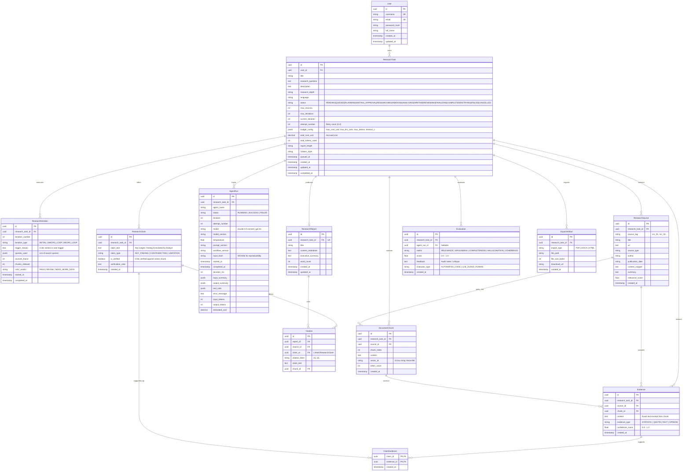

## 10.2. Chi tiết các bảng dữ liệu (Data Dictionary)

### 1. `User` (Người dùng)
Lưu thông tin tài khoản và xác thực.
* `id` (UUID, PK): Khóa chính.
* `username` (VARCHAR(50), Unique, Not Null).
* `email` (VARCHAR(255), Unique, Not Null).
* `password_hash` (VARCHAR(255), Not Null).
* `created_at`, `updated_at` (TIMESTAMP WITH TIME ZONE).

### 2. `ResearchTask` (Yêu cầu nghiên cứu)
Lưu thông tin cấu hình, ngân sách tài nguyên và tiến độ của từng phiên nghiên cứu.
* `id` (UUID, PK): Khóa chính.
* `user_id` (UUID, FK -> User.id): Người tạo.
* `title` (VARCHAR(255), Not Null).
* `research_question` (TEXT, Not Null): Câu hỏi hoặc chủ đề trọng tâm.
* `research_depth` (VARCHAR(20), Default: 'STANDARD'): `SHALLOW`, `STANDARD`, `DEEP`.
* `language` (VARCHAR(10), Default: 'vi'): Mã ngôn ngữ.
* `status` (VARCHAR(30), Not Null): Trạng thái (`PENDING`, `QUEUED`, `PLANNING`, `WAITING_APPROVAL`, `RESEARCHING`, `INDEXING`, `ANALYZING`, `WRITING`, `REVIEWING`, `FINALIZING`, `COMPLETED`, `RETRYING`, `FAILED`, `CANCELLED`).
* `max_sources` (INTEGER, Default: 10).
* `max_iterations` (INTEGER, Default: 2).
* `current_iteration` (INTEGER, Default: 0).
* `attempt_number` (INTEGER, Default: 0): Số lần tự động thử lại khi worker gặp sự cố (tối đa 2).
* `budget_config` (JSONB): Cấu hình budget (`max_cost_usd`, `max_llm_calls`, `max_input_tokens`, `max_output_tokens`, `timeout_seconds`).
* `total_cost_usd` (DECIMAL(10, 4), Default: 0.0): Tổng chi phí LLM thực tế đã tích lũy.
* `total_tokens_used` (INTEGER, Default: 0): Tổng token tiêu thụ.
* `report_length` (VARCHAR(20), Default: 'MEDIUM').
* `citation_style` (VARCHAR(20), Default: 'IEEE').
* `queued_at` (TIMESTAMP WITH TIME ZONE): Thời điểm đưa vào hàng đợi nếu hệ thống chạm ngưỡng concurrency limit.
* `created_at`, `updated_at`, `completed_at` (TIMESTAMP WITH TIME ZONE).

### 2b. `ResearchIteration` (Vòng lặp nghiên cứu - MỚI)
Ghi nhận chi tiết từng vòng lặp (Initial, Micro-loop, Macro-loop) phục vụ audit và phân tích hiệu quả hội tụ tri thức.
* `id` (UUID, PK).
* `research_task_id` (UUID, FK -> ResearchTask.id, ON DELETE CASCADE).
* `iteration_number` (INTEGER, Not Null): 1, 2, 3...
* `iteration_type` (VARCHAR(30)): `INITIAL`, `MACRO_LOOP`, `MICRO_LOOP`.
* `trigger_reason` (TEXT): Lý do kích hoạt (ví dụ "Critic: NEED_MORE_DATA").
* `queries_used` (JSONB): Mảng các câu truy vấn thực hiện trong vòng lặp này.
* `sources_found` (INTEGER): Số nguồn mới tìm được.
* `chunks_indexed` (INTEGER): Số chunk mới nạp VectorDB.
* `critic_verdict` (VARCHAR(20)): `PASS`, `REVISE`, `NEED_MORE_DATA`.
* `started_at`, `completed_at` (TIMESTAMP WITH TIME ZONE).

### 3. `ResearchSource` (Nguồn dữ liệu đã thu thập)
Lưu các trang web, tài liệu được Researcher Agent thu nạp.
* `id` (UUID, PK).
* `research_task_id` (UUID, FK -> ResearchTask.id, ON DELETE CASCADE).
* `source_tag` (VARCHAR(30), Not Null): Tag citation ổn định, unique trong phạm vi task, ví dụ `src_01`.
* `title` (VARCHAR(500)).
* `url` (TEXT, Not Null).
* `source_type` (VARCHAR(50)): `ARTICLE`, `PAPER`, `NEWS`, `OFFICIAL`, `WEBSITE`.
* `author` (VARCHAR(255)).
* `publication_date` (VARCHAR(50)).
* `content_snippet` (TEXT): Đoạn trích đại diện tiêu biểu (đã làm sạch).
* `summary` (TEXT): Tóm tắt ngắn gọn do AI sinh.
* `relevance_score` (FLOAT): Điểm phù hợp (0.0 đến 1.0).

### 4. `DocumentChunk` (Đoạn văn bản Vector hóa - MỚI)
Thực thể trung gian lưu trữ vết cắt văn bản nạp vào VectorDB.
* `id` (UUID, PK).
* `research_task_id` (UUID, FK -> ResearchTask.id, ON DELETE CASCADE).
* `source_id` (UUID, FK -> ResearchSource.id, ON DELETE CASCADE).
* `chunk_index` (INTEGER, Not Null): Thứ tự đoạn văn trong nguồn.
* `content` (TEXT, Not Null): Nội dung thô của chunk.
* `vector_id` (VARCHAR(100)): ID định danh vector trong pgvector, hoặc bỏ cột này nếu vector gắn trực tiếp theo `DocumentChunk.id`.
* `token_count` (INTEGER): Số lượng token.
* `created_at` (TIMESTAMP WITH TIME ZONE).

### 4b. `Evidence` (Bằng chứng trích dẫn gốc)
Trích đoạn nguyên văn cụ thể từ DocumentChunk làm căn cứ minh chứng cho một phát hiện khoa học.
* `id` (UUID, PK).
* `research_task_id` (UUID, FK -> ResearchTask.id, ON DELETE CASCADE).
* `source_id` (UUID, FK -> ResearchSource.id, ON DELETE CASCADE).
* `chunk_id` (UUID, FK -> DocumentChunk.id, ON DELETE CASCADE).
* `content` (TEXT, Not Null): Đoạn trích chính xác làm bằng chứng.
* `evidence_type` (VARCHAR(30)): `STATISTIC`, `QUOTE`, `FACT`, `OPINION`.
* `confidence_score` (FLOAT): Độ tin cậy của bằng chứng (0.0 - 1.0).
* `created_at` (TIMESTAMP WITH TIME ZONE).

### 4c. `ResearchClaim` (Luận điểm nghiên cứu)
Luận điểm, nhận định hoặc kết luận do Analyst đúc rút từ chuỗi Evidence; là đơn vị được Critic thẩm định.
* `id` (UUID, PK).
* `research_task_id` (UUID, FK -> ResearchTask.id, ON DELETE CASCADE).
* `claim_text` (TEXT, Not Null): Nội dung nhận định/luận điểm.
* `claim_type` (VARCHAR(30)): `KEY_FINDING`, `CONTRADICTION`, `LIMITATION`.
* Quan hệ Evidence được lưu qua bảng nối `claim_evidence` với khóa chính ghép (`claim_id`, `evidence_id`) và khóa ngoại thật; không dùng mảng UUID giả lập foreign key.
* `is_verified` (BOOLEAN, Default: false): Cờ xác nhận đã được Critic đối soát thành công.
* `verification_note` (TEXT): Ghi chú thẩm định từ Critic.
* `created_at` (TIMESTAMP WITH TIME ZONE).

### 4d. `ClaimEvidence` (Bảng nối luận điểm và bằng chứng)
* `claim_id` (UUID, FK -> ResearchClaim.id, ON DELETE CASCADE).
* `evidence_id` (UUID, FK -> Evidence.id, ON DELETE CASCADE).
* `created_at` (TIMESTAMP WITH TIME ZONE).
* Khóa chính ghép (`claim_id`, `evidence_id`); cặp phải thuộc cùng `research_task_id`.

### 5. `AgentRun` (Lịch sử hoạt động của Agent - Chuẩn Enterprise Reproducibility)
Theo dõi chi tiết quá trình làm việc, tái lập kết quả và chi phí của từng Agent Run.
* `id` (UUID, PK).
* `research_task_id` (UUID, FK -> ResearchTask.id, ON DELETE CASCADE).
* `agent_name` (VARCHAR(50), Not Null): `Supervisor`, `Researcher`, `Analyst`, `Critic`, `Writer`.
* `status` (VARCHAR(30)): `RUNNING`, `SUCCESS`, `FAILED`.
* `iteration` (INTEGER): Vòng lặp thứ mấy.
* `attempt_number` (INTEGER, Default: 1): Lần thử thứ mấy (phục vụ retry worker crash).
* `model` (VARCHAR(100)): Model cụ thể (`claude-3-5-sonnet-20240620`, `gpt-4o-2024-05-13`).
* `model_version` (VARCHAR(50)): Version định danh của LLM release.
* `temperature` (FLOAT, Default: 0.2).
* `prompt_version` (VARCHAR(50)): Version template prompt (ví dụ `critic-v2.1`).
* `workflow_version` (VARCHAR(50)): Version đồ thị LangGraph (ví dụ `graph-v2.2`).
* `input_hash` (VARCHAR(64)): Mã băm SHA256 của payload đầu vào để đảm bảo tính tái lập (reproducibility).
* `started_at`, `completed_at` (TIMESTAMP WITH TIME ZONE).
* `duration_ms` (INTEGER): Thời gian thực thi tính bằng mili-giây.
* `input_summary` (JSONB): Tóm tắt đầu vào ngắn gọn.
* `output_summary` (JSONB): Tóm tắt kết quả sinh ra.
* `tool_calls` (JSONB): Danh sách các công cụ được gọi kèm tham số.
* `error_message` (TEXT): Ghi nhận lỗi nếu có.
* `input_tokens` (INTEGER, Default: 0): Số prompt tokens.
* `output_tokens` (INTEGER, Default: 0): Số completion tokens.
* `estimated_cost` (DECIMAL(10, 6), Default: 0.0): Chi phí ước tính (USD).

### 5b. `Evaluation` (Đánh giá chất lượng & Chuẩn bị Fine-tuning - MỚI)
Lưu kết quả đánh giá chất lượng tự động, LLM-as-a-judge và chuyên gia con người để tạo benchmark dataset phục vụ fine-tuning mô hình sau này.
* `id` (UUID, PK).
* `research_task_id` (UUID, FK -> ResearchTask.id, ON DELETE CASCADE).
* `agent_run_id` (UUID, FK -> AgentRun.id, Nullable, ON DELETE SET NULL).
* `metric` (VARCHAR(50), Not Null): `RELEVANCE`, `GROUNDING`, `COMPLETENESS`, `HALLUCINATION`, `COHERENCE`.
* `score` (FLOAT, Not Null): Thang điểm chuẩn hóa từ 0.0 đến 1.0.
* `feedback` (TEXT): Nhận xét chi tiết, lý do trừ điểm hoặc bằng chứng đối soát.
* `evaluator_type` (VARCHAR(30), Not Null): `AUTOMATED_CODE` (rules), `LLM_JUDGE` (GPT-4o/Claude), `HUMAN` (chuyên gia).
* `created_at` (TIMESTAMP WITH TIME ZONE).

### 6. `ResearchReport` (Báo cáo nghiên cứu cuối cùng)
* `id` (UUID, PK).
* `research_task_id` (UUID, FK -> ResearchTask.id, Unique, ON DELETE CASCADE).
* `title` (VARCHAR(255), Not Null).
* `content_markdown` (TEXT, Not Null): Báo cáo dạng Markdown.
* `executive_summary` (TEXT): Tóm tắt điều hành.
* `word_count` (INTEGER).
* `created_at`, `updated_at` (TIMESTAMP WITH TIME ZONE).

### 7. `Citation` (Liên kết trích dẫn)
* `id` (UUID, PK).
* `report_id` (UUID, FK -> ResearchReport.id, ON DELETE CASCADE).
* `source_id` (UUID, FK -> ResearchSource.id, ON DELETE CASCADE).
* `claim_id` (UUID, FK -> ResearchClaim.id, Nullable, ON DELETE SET NULL): Luận điểm được trích dẫn.
* `citation_label` (VARCHAR(20)): Ví dụ `[1]`, `[2]`.
* `claim_text` (TEXT): Luận điểm được trích dẫn.
* `chunk_id` (UUID, FK -> DocumentChunk.id): Chunk làm căn cứ. Ràng buộc bổ sung bảo đảm chunk thuộc cùng source/task với citation.

### 8. `ExportArtifact` (Tệp xuất bản - MỚI)
Quản lý các tài liệu xuất bản như PDF, DOCX.
* `id` (UUID, PK).
* `research_task_id` (UUID, FK -> ResearchTask.id, ON DELETE CASCADE).
* `export_type` (VARCHAR(20), Not Null): `PDF`, `HTML`, `DOCX`.
* `file_path` (TEXT, Not Null): Đường dẫn tệp trên ổ đĩa hoặc S3 bucket.
* `file_size_bytes` (INTEGER): Kích thước file.
* `download_url` (TEXT): Đường dẫn tải tệp bảo mật có chữ ký số.
* `created_at` (TIMESTAMP WITH TIME ZONE).

### Ràng buộc dữ liệu và lựa chọn lưu trữ cho MVP
* MVP dùng **PostgreSQL 16 + pgvector** làm relational store và vector store duy nhất; không triển khai Qdrant/Milvus/Chroma trong cùng baseline. Chỉ đánh giá chuyển đổi khi benchmark hoặc yêu cầu vận hành chứng minh pgvector không đạt SLO.
* Dùng bảng nối `claim_evidence(claim_id UUID FK, evidence_id UUID FK, created_at timestamptz)` với PK ghép. `Citation.chunk_id` FK tới `DocumentChunk.id`; ràng buộc nghiệp vụ/DB phải đảm bảo `chunk_id`, `source_id`, `report_id` và `research_task_id` cùng thuộc một task.
* `ResearchSource.source_tag` là bắt buộc và unique trong phạm vi `research_task_id`; tag không được tái sử dụng giữa các task. Tất cả bảng nghiệp vụ có UUID primary key, `created_at` và `updated_at` timezone-aware (các bảng append-only có thể không cần `updated_at`, phải ghi rõ ngoại lệ).
* Xóa các vector và artifact ngoài PostgreSQL không thể nằm trong cùng transaction ACID. Dùng trạng thái xóa pending + job outbox/idempotent cleanup; task chỉ báo xóa hoàn tất sau khi các hệ lưu trữ xác nhận hoặc hết thời hạn retry và tạo cảnh báo vận hành.

## 10.3. Phạm vi phát hành và mở rộng người dùng theo giai đoạn
| Giai đoạn | Nhóm người dùng mục tiêu | Bao gồm | Điều kiện đưa sang giai đoạn sau |
|---|---|---|
| **MVP** | Sinh viên và nhà nghiên cứu cá nhân cần khảo sát ban đầu từ nguồn web công khai. | Luồng tạo task → plan → tìm kiếm → lưu nguồn/chunk → tổng hợp claim/evidence → Markdown; trang nguồn/evidence có thể kiểm tra; phân quyền, quota/budget và trạng thái cơ bản. Các hạng mục chỉ được gọi là hoàn tất sau khi có implementation/test evidence. | Luồng end-to-end chạy được; test quyền truy cập chéo; citation reference integrity; baseline chi phí, latency và chất lượng trên tập kiểm thử có phiên bản. |
| **Giai đoạn 2** | Chuyên gia phân tích công nghệ/thị trường và nhà nghiên cứu cần báo cáo sâu hơn; kết luận vẫn cần chuyên gia thẩm định. | Critic đối chiếu evidence; macro-loop; duyệt plan (HITL); checkpoint/recovery; PDF; tìm kiếm/đề xuất ảnh có attribution; biểu đồ từ số liệu evidence đã cấu trúc. | Có acceptance criteria và ADR cho provider ảnh; kiểm tra quyền/license/nguồn; kiểm chứng biểu đồ với dữ liệu gốc; đánh giá bảo mật và SLO. |
| **Giai đoạn 3** | Nhóm nghiên cứu, phòng ban phân tích và tổ chức/doanh nghiệp cần nghiên cứu cộng tác hoặc dùng tài liệu riêng. | DOCX/LaTeX, upload tài liệu người dùng, quản lý thành viên/quyền truy cập, retention/deletion theo tổ chức, đánh giá chuyên gia quy mô lớn; tùy nhu cầu mới xem xét fine-tuning, vector store thay thế và memory xuyên phiên. | Có nhu cầu người dùng và business case; rà soát privacy/license, phân quyền/tenant isolation và benchmark riêng. Ảnh AI (nếu có) phải gắn nhãn và không làm bằng chứng. |

MVP không đồng nghĩa với triển khai đồng thời mọi thành phần ở các sơ đồ. Các sơ đồ thể hiện kiến trúc đích; bảng trên xác định thứ tự thực hiện. Nếu đội dự án muốn thay đổi phạm vi, cập nhật bảng, API, data model và acceptance criteria cùng một phiên bản tài liệu.

## 10.4. Đề xuất năng lực sản phẩm bổ sung

Các yêu cầu sau được đưa vào roadmap, chưa thuộc MVP và không được hiểu là đã triển khai:

* **Source & Evidence Explorer (MVP):** cho phép lọc nguồn theo loại/ngày/relevance, xem URL và snippet; xem claim nào được hỗ trợ bởi chunk nào; đánh dấu nguồn mâu thuẫn hoặc chưa đủ căn cứ. Mỗi thông tin cần hiển thị ngày truy cập và giới hạn metadata.
* **Image Discovery (Giai đoạn 2):** tự động thêm ảnh phù hợp từ các trang đã thu thập; dùng Serper.dev bổ sung khi cần theo ADR-001. Người dùng có thể bỏ từng ảnh hoặc tắt ảnh mà không phải duyệt từng ảnh. Lưu URL ảnh và trang gốc, caption/alt text, tác giả/attribution/license khi provider công bố, ngày truy xuất và vị trí trong báo cáo. Không suy diễn quyền tái sử dụng; nếu license không rõ, lưu `Unknown` và hiển thị cảnh báo/nguồn; không dùng ảnh khi điều khoản nguồn/provider cấm.
* **Chart from Evidence (Giai đoạn 2):** chỉ tạo biểu đồ từ số liệu đã trích xuất có giá trị, đơn vị, thời gian, địa lý và evidence/source liên kết. Lưu cấu hình chuyển đổi và hiển thị nguồn dưới hình; không tự ước lượng điểm dữ liệu bị thiếu.
* **User Document Upload (Giai đoạn 3):** nghiên cứu kết hợp tài liệu người dùng với web, có quyền riêng tư, giới hạn định dạng/dung lượng, xóa dữ liệu và cô lập theo task.

Serper.dev đã được chọn làm provider bổ sung tùy chọn trong ADR-001; ảnh từ trang đã thu thập được ưu tiên để tránh gọi API không cần thiết. API key được giữ ở backend; quota/chi phí thuộc tài khoản dự án trong mô hình key dùng chung. Giá/quota cần kiểm tra từ nguồn chính thức khi cấu hình. Mọi ảnh web là minh họa, không được tính là evidence. Nếu sau này sinh ảnh bằng AI, ảnh phải gắn nhãn `AI-generated`, lưu thông tin model/prompt theo chính sách và không bao giờ được tính là evidence cho factual claim.

---

# 11. BIỂU ĐỒ TRẠNG THÁI TASK (STATE MACHINE DIAGRAM)

Quy trình quản lý trạng thái của một Research Task trong hệ thống:

```mermaid
stateDiagram-v2
    [*] --> PENDING: Tạo task
    PENDING --> QUEUED: Start được chấp nhận / quota worker đầy
    PENDING --> PLANNING: Start được chấp nhận / có worker
    QUEUED --> PLANNING: Worker nhận task
    PLANNING --> WAITING_APPROVAL: Cần duyệt plan
    PLANNING --> RESEARCHING: Không yêu cầu duyệt
    WAITING_APPROVAL --> RESEARCHING: Plan được duyệt/cập nhật
    WAITING_APPROVAL --> CANCELLED: User hủy
    RESEARCHING --> INDEXING: Đã thu thập nguồn
    INDEXING --> ANALYZING: Chunks/embeddings đã lưu
    ANALYZING --> WRITING: Có findings
    WRITING --> REVIEWING: Draft hoàn tất
    REVIEWING --> WRITING: REVISE và còn lượt micro-loop
    REVIEWING --> RESEARCHING: NEED_MORE_DATA và còn macro-loop/budget
    REVIEWING --> FINALIZING: PASS
    REVIEWING --> FINALIZING: Hết lượt/budget nhưng đủ bằng chứng tối thiểu; gắn cảnh báo
    FINALIZING --> COMPLETED: Citation hợp lệ và report lưu thành công
    FINALIZING --> FAILED: Citation integrity hoặc lưu report thất bại
    PLANNING --> FAILED: Lỗi không thể phục hồi / hết retry
    RESEARCHING --> FAILED: Zero-result sau 3 lần tìm kiếm / lỗi không thể phục hồi
    INDEXING --> FAILED: Lỗi vector store không thể phục hồi
    ANALYZING --> FAILED: Lỗi không thể phục hồi hoặc thiếu bằng chứng tối thiểu
    WRITING --> FAILED: Lỗi không thể phục hồi
    QUEUED --> CANCELLED: User hủy
    PLANNING --> CANCELLED: User hủy
    RESEARCHING --> CANCELLED: User hủy
    INDEXING --> CANCELLED: User hủy
    ANALYZING --> CANCELLED: User hủy
    WRITING --> CANCELLED: User hủy
    REVIEWING --> CANCELLED: User hủy
    FINALIZING --> CANCELLED: User hủy trước khi commit report
    PLANNING --> RETRYING: Lỗi tạm thời / worker lease mất
    RESEARCHING --> RETRYING: Lỗi tạm thời / worker lease mất
    INDEXING --> RETRYING: Lỗi tạm thời / worker lease mất
    ANALYZING --> RETRYING: Lỗi tạm thời / worker lease mất
    WRITING --> RETRYING: Lỗi tạm thời / worker lease mất
    RETRYING --> PLANNING: Tiếp tục từ checkpoint hợp lệ
    RETRYING --> FAILED: Hết 2 lần retry hoặc checkpoint không hợp lệ
    COMPLETED --> [*]
    FAILED --> [*]
    CANCELLED --> [*]
```

**Quy tắc transition:** transition được thực hiện có điều kiện compare-and-set theo trạng thái hiện tại và `version` của task để tránh chạy trùng. Celery delivery có thể at-least-once; mỗi node phải idempotent theo `task_id + node + iteration + attempt`. Retry chỉ áp dụng lỗi tạm thời (timeout, rate limit, 5xx, mất worker) với exponential backoff tối đa 3 lần cho lời gọi ngoài và tối đa 2 lần khôi phục workflow. Lỗi validation/4xx không retry. Hủy phát cancellation signal, ngăn node tiếp theo khởi chạy và dọn tài nguyên theo quy trình retryable. Resume từ checkpoint chỉ tiếp tục sau node cuối đã commit; side effect cần idempotency key. `COMPLETED`, `FAILED`, `CANCELLED` là trạng thái cuối.

---

# 12. ĐẶC TẢ GIAO DIỆN LẬP TRÌNH ỨNG DỤNG (REST API SPECIFICATION)

Hệ thống tuân thủ nghiêm ngặt nguyên tắc RESTful, trả về dữ liệu định dạng JSON chuẩn và truyền phát SSE dạng `text/event-stream`.

## 12.1. Authentication Endpoints
* `POST /api/v1/auth/register`: Đăng ký tài khoản mới.
  * Request: `{ "username": "...", "email": "...", "password": "..." }`
  * Response: `201 Created`
* `POST /api/v1/auth/login`: Đăng nhập hệ thống.
  * Request: `{ "username_or_email": "...", "password": "..." }`
  * Response: `200 OK` `{ "access_token": "...", "token_type": "bearer", "expires_in": 3600 }`
* `GET /api/v1/auth/me`: Lấy thông tin cá nhân của người dùng hiện tại.
* `POST /api/v1/auth/logout`: Hủy bỏ phiên đăng nhập và thu hồi token.

## 12.2. Research Task Endpoints
* `POST /api/v1/research`: Tạo mới một Research Task.
  * Request Body:
    ```json
    {
      "title": "Nghiên cứu ứng dụng Multi-Agent trong Y tế năm 2026",
      "research_question": "Xu hướng và thách thức của hệ thống Multi-Agent AI trong chẩn đoán y tế?",
      "research_depth": "STANDARD",
      "language": "vi",
      "max_sources": 15,
      "max_iterations": 2,
      "citation_style": "IEEE"
    }
    ```
  * Response: `201 Created` `{ "id": "uuid", "status": "PENDING", ... }`
* `GET /api/v1/research`: Lấy danh sách Research Task của User (có phân trang `page`, `page_size`, và lọc `status`).
* `GET /api/v1/research/{id}`: Xem chi tiết cấu hình và trạng thái hiện tại của task.
* `POST /api/v1/research/{id}/start`: Kích hoạt workflow nghiên cứu chạy ngầm.
* `POST /api/v1/research/{id}/approve-plan`: Phê duyệt hoặc điều chỉnh đề cương nghiên cứu (Human-in-the-Loop khi task ở trạng thái `WAITING_APPROVAL`).
  * Request Body: `{ "approved_queries": ["query 1", "query 2"], "user_feedback": "Tập trung thêm vào số liệu thống kê" }`
  * Response: `200 OK` `{ "status": "RESEARCHING", "message": "Plan approved, workflow resumed" }`
* `POST /api/v1/research/{id}/cancel`: Dừng khẩn cấp workflow đang chạy.
* `DELETE /api/v1/research/{id}`: Xóa task, dọn dẹp DB và toàn bộ vector trong VectorDB.

## 12.3. Real-time Streaming & Tracking Endpoints
* `GET /api/v1/research/{id}/events`: Kết nối Server-Sent Events (SSE) theo dõi sự kiện thời gian thực.
  * Event Payload mẫu:
    ```json
    event: agent_step
    data: {
      "agent": "Researcher",
      "iteration": 1,
      "message": "Đang phân tích và nạp 12 chunks vào VectorDB...",
      "timestamp": "2026-09-13T15:00:00Z"
    }
    ```
* `GET /api/v1/research/{id}/agents`: Xem danh sách tất cả các lượt chạy (`AgentRun`) kèm thống kê token và chi phí.
* `GET /api/v1/research/{id}/sources`: Lấy danh sách các nguồn (Sources) đã thu thập được.
* `GET /api/v1/research/{id}/sources/{source_id}/chunks`: Lấy danh sách các đoạn trích (Document Chunks) đã cắt và lưu vector.

## 12.4. Report & Export Endpoints (PDF)
* `GET /api/v1/research/{id}/report`: Lấy nội dung báo cáo nghiên cứu dạng Markdown và danh mục Citations.
* `GET /api/v1/research/{id}/report/pdf`: Xuất hoặc tải xuống file PDF của báo cáo.
  * Query parameters: `?download=true&style=academic`
  * Response: `Content-Type: application/pdf` (hoặc trả JSON link tải nếu render bất đồng bộ).

---

# 13. YÊU CẦU PHI CHỨC NĂNG (NON-FUNCTIONAL REQUIREMENTS)

## 13.1. Hiệu năng và Khả năng chịu tải (Performance & Scalability)
* **NFR-01 (API Latency)**: Với benchmark được định nghĩa ở phụ lục vận hành (tối thiểu 100 request/endpoint, concurrency 20, DB cùng region, không tính thời gian mạng phía client), p95 của API CRUD không bao gồm export/SSE phải dưới **300ms** ở tải mục tiêu. Ghi nhận p50/p95/p99 và lỗi.
* **NFR-02 (Asynchronous Decoupling)**: Tuyệt đối không chạy quy trình Multi-Agent trong luồng HTTP chính. Toàn bộ tiến trình AI phải chạy trên Worker Pool độc lập (Celery / Background Tasks) được kết nối qua Redis.
* **NFR-03 (Concurrent Workflows)**: Hệ thống phải xử lý tối thiểu 20 workflow đồng thời theo tải benchmark đã định nghĩa, duy trì API p95 và tỷ lệ lỗi trong ngưỡng; cấu hình worker, nguồn ngoài và tỷ lệ thành công phải được ghi trong báo cáo benchmark.
* **NFR-04 (Vector Search Latency)**: Với 100,000 vectors, filter theo task, cấu hình phần cứng và dữ liệu benchmark được ghi nhận, p95 truy vấn k-NN phải dưới **100ms**, không tính embedding/reranking từ xa.

## 13.2. An toàn & Bảo mật (Security & Safety)
* **NFR-05 (Prompt Injection Mitigation)**: Nội dung web được xử lý như dữ liệu không tin cậy, phân tách khỏi chỉ dẫn hệ thống, giới hạn độ dài và kiểm thử trên bộ tình huống prompt injection. Đây là kiểm soát giảm thiểu rủi ro, không phải cam kết triệt tiêu mọi tấn công.
* **NFR-06 (SSRF Protection)**: Chỉ cho phép `http/https`; kiểm tra DNS/IP trước kết nối và sau mỗi redirect, chặn loopback/private/link-local/multicast/reserved và metadata endpoints, từ chối credentials trong URL, giới hạn redirect/timeout/response bytes/content type. Cấm redirect vượt qua chính sách và không dùng proxy tùy ý.
* **NFR-07 (Secrets Management)**: Tuyệt đối không lưu trữ khóa bí mật, API Keys (OpenAI, Anthropic, Tavily) trong mã nguồn. Toàn bộ cấu hình phải nạp qua Environment Variables an toàn.
* **NFR-08 (Resource Quotas)**: Áp đặt giới hạn trần (Hard Ceiling) cho mỗi task: tối đa 3 vòng lặp, tối đa 30 sources, tối đa 150,000 tokens tổng để tránh rủi ro đội chi phí ngoài ý muốn.

## 13.3. Tính sẵn sàng & Độ tin cậy (Availability & Reliability)
* **NFR-09 (Fault Tolerance & Self-Healing)**: Nếu một lệnh gọi API tới LLM hoặc Search Engine bị lỗi mạng (Rate limit, Timeout, 5xx), hệ thống phải tự động thực hiện Exponential Backoff Retry tối đa 3 lần trước khi đánh dấu lỗi cho AgentRun.
* **NFR-10 (Data Integrity)**: Dữ liệu quan hệ bảo đảm giao dịch ACID. Xóa task dùng quy trình xóa có thể retry: đánh dấu xóa, xóa DB và artifact/vector theo task, ghi nhận kết quả; tác vụ dọn dẹp nền xử lý phần còn sót. Không tuyên bố atomic xuyên PostgreSQL, object storage và vector index.

## 13.4. Khả năng mở rộng & Bảo trì (Maintainability & Extensibility)
* **NFR-11 (Pluggable Model Architecture)**: Cho phép dễ dàng thay thế hoặc bổ sung các nhà cung cấp LLM khác nhau (OpenAI, Anthropic, Google Gemini, Ollama/Open-source) thông qua chuẩn interface của LangChain/LangGraph.
* **NFR-12 (Pluggable Vector Store)**: Module truy xuất phải có interface tách biệt để có thể thay backend trong tương lai. Baseline MVP chỉ triển khai `pgvector`; backend khác cần ADR và benchmark, không thuộc phạm vi mặc định.
* **NFR-13 (Backup & Recovery)**: PostgreSQL có backup tự động và kiểm tra restore định kỳ. Trước production, chủ hệ thống phải điền và nghiệm thu mục tiêu RPO/RTO theo tier triển khai; mọi lần restore phải xác minh consistency giữa task metadata, vector rows và export artifacts.
* **NFR-14 (Retention & Deletion)**: Quy định thời hạn lưu task, source text, prompt/trace, report và artifact theo cấu hình triển khai. API xóa tài khoản/task phải kích hoạt xóa hoặc ẩn danh hóa dữ liệu liên quan; log không được ghi secrets hoặc nội dung nhạy cảm đầy đủ. Thời hạn cụ thể là cấu hình triển khai cần được phê duyệt trước production.

---

# 14. TIÊU CHÍ NGHIỆM THU HỆ THỐNG (ACCEPTANCE CRITERIA)

Các mục dưới đây là tiêu chí cần nghiệm thu, không phải trạng thái hoàn thành hiện tại. Mặc định trạng thái là `Chưa xác minh`; chỉ chuyển sang `Đạt` khi đính kèm test case/kết quả CI hoặc biên bản nghiệm thu, build/version, ngày chạy và người xác nhận. Không đánh dấu trước bằng checkbox hoàn thành.

1. [ ] Người dùng có thể đăng ký tài khoản, đăng nhập và được cấp token JWT an toàn.
2. [ ] Người dùng chỉ có thể xem, tương tác và xóa các Research Task do chính mình tạo.
3. [ ] Người dùng có thể tạo một đề tài nghiên cứu kèm theo các tham số cấu hình: độ sâu, ngôn ngữ, số lượng nguồn tối đa.
4. [ ] Bấm bắt đầu tác vụ sẽ khởi chạy background workflow mà không gây nghẽn giao diện hay timeout HTTP request.
5. [ ] Supervisor Agent phân rã thành công câu hỏi nghiên cứu thành đề cương và các câu hỏi con có cấu trúc rõ ràng.
6. [ ] Researcher Agent tìm kiếm và thu thập thành công các nguồn tài liệu hợp lệ từ Internet thông qua Search API.
7. [ ] Dữ liệu thu thập được làm sạch, loại bỏ mã script/thẻ HTML rác và khử trùng lặp nội dung hiệu quả.
8. [ ] Toàn bộ nội dung văn bản được chia thành các Document Chunks và lưu trữ thành công vào Vector Database kèm embeddings.
9. [ ] Analyst Agent thực hiện Semantic Search trên VectorDB để trích xuất các luận điểm then chốt và các quan điểm trái chiều.
10. [ ] Critic đánh giá draft theo rubric có phiên bản, chỉ ra claim thiếu evidence/mâu thuẫn; đo chất lượng trên tập test gán nhãn, không giả định Critic hoàn toàn độc lập.
11. [ ] Nếu nghiên cứu chưa đạt tiêu chuẩn và chưa vượt quá `max_iterations`, hệ thống tự động quay lại vòng tìm kiếm bổ sung có mục tiêu.
12. [ ] Khi hết `max_iterations`, chỉ tạo báo cáo từng phần có cảnh báo nếu đủ evidence tối thiểu; nếu không đủ thì kết thúc với trạng thái/lý do `INSUFFICIENT_EVIDENCE`.
13. [ ] Writer Agent tạo ra báo cáo cuối cùng theo cấu trúc khoa học hoàn chỉnh dưới định dạng Markdown chuẩn.
14. [ ] Mọi citation xuất bản trỏ đến `ResearchSource` và `DocumentChunk` tồn tại, cùng thuộc task; báo cáo citation integrity có số lượng tag hợp lệ/không hợp lệ. Semantic support được nghiệm thu riêng trên tập kiểm thử đã gán nhãn, báo cáo precision/recall và ngưỡng theo phiên bản.
15. [ ] Giao diện người dùng nhận và hiển thị dòng sự kiện thời gian thực (SSE) mô tả trực quan Agent nào đang làm việc.
16. [ ] Người dùng có thể xem danh sách chi tiết các nguồn tin (URL, tác giả, tóm tắt, điểm phù hợp) được sử dụng.
17. [ ] Người dùng có thể xem chi tiết nhật ký Agent Activity (thời gian chạy, số tokens, tool calls, chi phí).
18. [ ] (Giai đoạn 2) Người dùng có thể xuất/tải PDF theo FR-26; kiểm tra render tiếng Việt, trang bìa, mục lục, header/footer, citation link và lỗi nội dung/trang trống.
19. [ ] Người dùng có thể xem lịch sử các nghiên cứu cũ và lọc theo trạng thái.
20. [ ] Khi người dùng xóa một Task, hệ thống tự động xóa sạch các bản ghi liên quan trong DB và các vectors trong VectorDB.
21. [ ] Hệ thống có cơ chế phòng chống Prompt Injection đối với dữ liệu crawl từ website.
22. [ ] Web Scraper được trang bị cơ chế bảo vệ ngăn chặn tấn công SSRF vào mạng nội bộ.
23. [ ] Hệ thống ghi nhận đầy đủ Structured Logs kèm `correlation_id` cho từng Task.
24. [ ] Toàn bộ ứng dụng có thể khởi tạo và chạy thành công thông qua `docker-compose up`.
25. [ ] Hệ thống triển khai state machine có transition hợp lệ, concurrency control, idempotent retry/cancel/resume theo quy tắc Mục 11; có trace liên kết từ API đến workflow node.
26. [ ] Benchmark ghi môi trường, dataset, concurrency, cấu hình worker/DB/vector index, p50/p95/p99, tỷ lệ lỗi và thời gian phụ thuộc external provider; đối chiếu NFR-01/03/04.
27. [ ] Kiểm thử SSRF gồm redirect sang private IP, DNS rebinding, IPv6, metadata endpoint, URL credentials, redirect loop, payload lớn và timeout; mọi trường hợp bị chặn có log an toàn.
28. [ ] Xóa task được thử ở các điểm lỗi DB/vector/object storage; job dọn dẹp retry được, không để artifact/vector tồn tại sau khi hoàn tất xóa và có cảnh báo cho cleanup thất bại.
29. [ ] Có kiểm thử prompt injection trên bộ mẫu versioned; ghi nhận tỷ lệ lọt và false positive. Đây là kiểm soát giảm thiểu, không đặt tiêu chí “không thể bị tấn công”.
30. [ ] PDF/export, SSE reconnect và workflow recovery được kiểm tra theo giai đoạn tương ứng; artifacts chỉ tải được bởi chủ sở hữu task và URL có thời hạn.
31. [ ] Source & Evidence Explorer hiển thị đúng mối liên kết claim-evidence-chunk-source và xử lý rõ metadata không có.
32. [ ] (Giai đoạn 2) Ảnh chỉ được chèn sau lựa chọn người dùng, có attribution/source page; ảnh không rõ quyền sử dụng không được tự động đưa vào export.
33. [ ] (Giai đoạn 2) Mỗi chart có thể truy ngược tới số liệu/evidence nguồn và tái tạo từ cấu hình chuyển đổi đã lưu.
34. [ ] (Giai đoạn 3, nếu triển khai) Ảnh sinh bằng AI có nhãn hiển thị và không được dùng làm bằng chứng factual.

---

# 15. DỰ ÁN THAM CHIẾU (REFERENCE PROJECTS)

Kiến trúc hệ thống được tối ưu hóa dựa trên phân tích chuyên sâu các dự án mã nguồn mở hàng đầu trong lĩnh vực Multi-Agent Research:

| Dự án | Stars | Bài học kiến trúc chính rút ra cho ATI |
| :--- | :--- | :--- |
| [GPT Researcher](https://github.com/assafelovic/gpt-researcher) | 18k+ | Pipeline 5 giai đoạn chuẩn mực (Plan → Collect → Review/Revise → Write → Publish). Reviewer + Revisor micro-loop cho từng sub-topic. Parallel sub-topic processing bằng `asyncio`. Publisher module tách riêng. |
| [company-research-agent](https://github.com/guy-hartstein/company-research-agent) | 200+ | Tavily là Search Provider chính. Curator node lọc relevance score. Dual Model (Gemini cho tổng hợp, GPT cho formatting). PDF Export là tính năng production. |
| [DeepResearchAgent](https://github.com/SkyworkAI/DeepResearchAgent) | 3.5k+ | Kiến trúc Self-Evolution (Act → Observe → Optimize → Remember). Memory System tách biệt (session + event). Config-driven agent composition. Tracing & Versioning module. |
| [STORM](https://github.com/stanford-oval/storm) | 20k+ | Paper học thuật gốc truyền cảm hứng cho GPT Researcher. Perspective-guided Question Asking → Multi-perspective QA → Article Generation with Citations. |
| [LangGraph](https://github.com/langchain-ai/langgraph) | 10k+ | Framework chính thức. Examples về Supervisor pattern, Hierarchical agents, Map-Reduce patterns. |
| [Mem0](https://github.com/mem0ai/mem0) | 25k+ | Memory layer cho AI Agents: long-term, short-term & entity memory. Tham khảo cho cross-session memory trong tương lai. |

---

# 16. KẾT LUẬN

Tài liệu Đặc tả Yêu cầu Phần mềm (SRS) phiên bản **2.5.0** xác định baseline yêu cầu và kiến trúc đích cho **Multi-Agent Research System**. MVP ưu tiên luồng khảo sát có cấu trúc, nguồn/evidence có thể kiểm tra, cô lập dữ liệu, budget/quota và trạng thái workflow. Image discovery và biểu đồ từ evidence là năng lực roadmap sau MVP, có yêu cầu attribution và provenance. Mọi mục tiêu chất lượng, hiệu năng và bảo mật phải được nghiệm thu bằng kiểm thử/benchmark có phiên bản; SRS không tự khẳng định tính năng đã triển khai hoặc bảo đảm không có hallucination.
