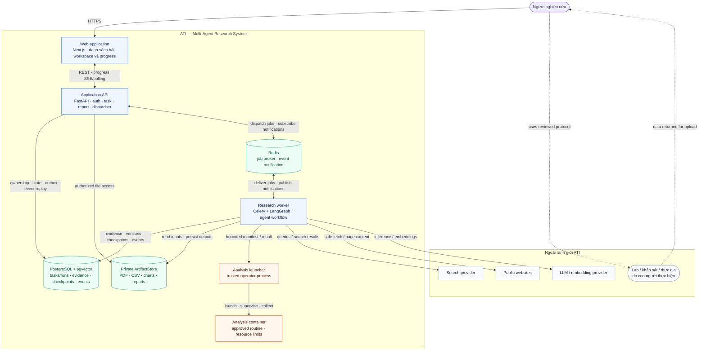
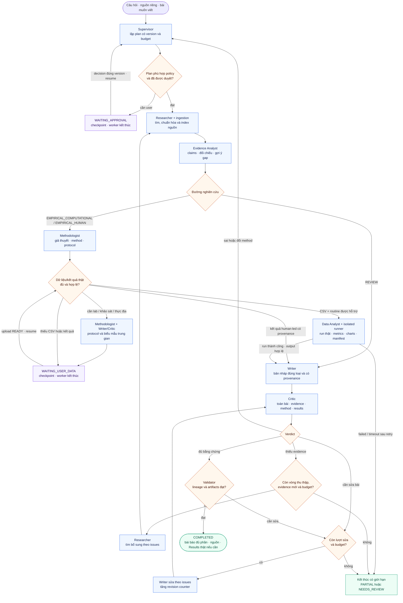
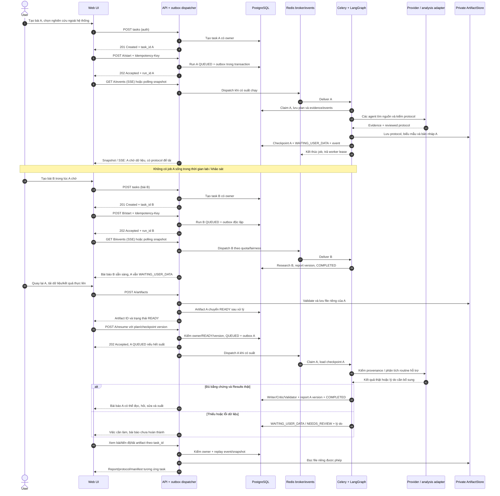
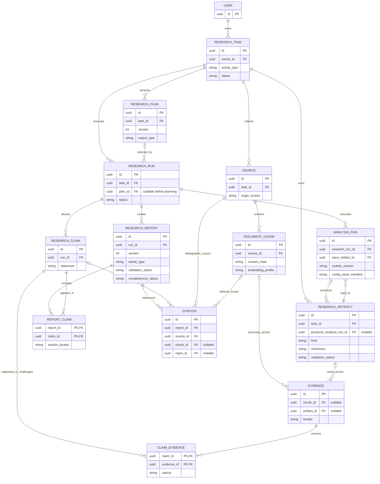
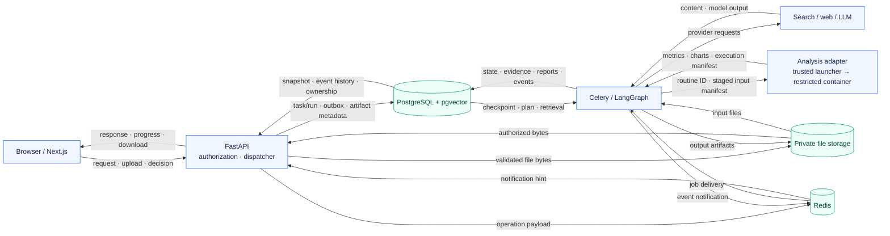
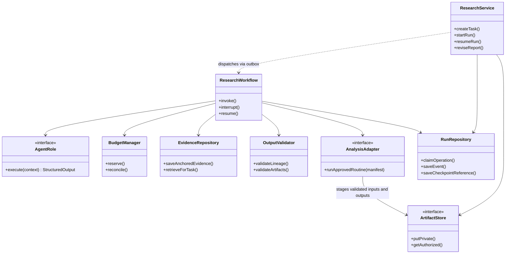

# System Design — Multi-Agent Research System (ATI)

## 1. Phạm vi và nguyên tắc

**Cập nhật thiết kế: 09/10/2026.** Đây là nguồn chuẩn cho sơ đồ mục tiêu; không mô tả mọi tính năng đã chạy. [SRS v4.1](../requirements/SRS.md) chốt yêu cầu; [ADR-004](decisions/ADR-004-multi-agent-research-delivery.md) giải thích quyết định; mục 9 tách hiện trạng.

ATI phối hợp agent để tạo bài báo có bằng chứng và thực nghiệm tái lập. Ba đường REVIEW / EMPIRICAL_COMPUTATIONAL / EMPIRICAL_HUMAN dùng chung provenance và review; **mỗi bài có workspace, run, checkpoint và phiên bản riêng**. Protocol là artifact trung gian của đường human-led, không phải bài báo đã hoàn thành. Execution tự động chỉ cho routine hỗ trợ. Không có dữ liệu thật thì không tạo Results. Gợi ý khoảng trống nghiên cứu phải nêu phạm vi nguồn đã xem; Critic không thay peer review.

Năm hình chính đáp ứng kiến trúc, data flow, inference, tương tác bất đồng bộ và mô hình dữ liệu. Hai phụ lục phục vụ kỹ thuật. Mermaid dùng notation dễ đọc; Logical DFD là biểu diễn logic, không tuyên bố đúng toàn bộ hình dạng Gane–Sarson. Hình kiến trúc thể hiện process/data boundary; agent là logic bên trong worker.

## 2. System Architecture — C4 Container View

Một kiến trúc hoàn chỉnh với các dependency chính. Mũi tên tới provider/storage biểu diễn lời gọi và dữ liệu trả về theo giao thức đó; không vẽ thêm từng response để tránh giao cắt.

- API/worker dùng chung codebase. Outbox dispatcher là background task của API, có DB claim/lease nếu nhiều replica.
- Telemetry là JSON logs + AgentRun/TaskEvent + UI timeline, xuyên API/worker/launcher; không bắt buộc một service mới. Monitoring không hiển thị suy luận nội bộ.
- Runner staging input/output riêng theo job; launcher kiểm manifest và thu artifacts. API/worker **không có Docker socket**. Container chỉ chạy routine tin cậy, không là sandbox cho mã đối kháng.
- File storage private local volume cho bản nộp, có interface đổi S3-compatible sau. Ảnh minh họa tùy chọn dùng source page trước; provider Serper có thể bổ sung qua adapter theo ADR-001, không phải dependency bắt buộc.
- Không tách phase/release trong hình; phạm vi triển khai được quản lý ở kế hoạch.
- Một user có nhiều task độc lập. Task đang chờ dữ liệu không giữ worker và không khóa task khác; quota chạy đồng thời kiểm ở dispatcher, không dùng Redis làm nơi lưu checkpoint.

## 3. Logical Data Flow — DFD Level 1

Tập trung dữ liệu nghiệp vụ; hạ tầng được tách sang Physical DFD. Mọi external entity/data store trao đổi qua process. Lab/thực địa trả dữ liệu cho người dùng rồi được nạp vào ATI.

```mermaid
flowchart LR
    User(["Người nghiên cứu"])
    Sources(["Nguồn tài liệu bên ngoài"])

    P1["1.0 Quản lý yêu cầu<br/>và kế hoạch nghiên cứu"]
    P2["2.0 Thu thập, kiểm tra<br/>và chuẩn hóa nguồn"]
    P3["3.0 Phân tích bằng chứng<br/>và gợi ý khoảng trống"]
    P4["4.0 Thiết kế phương pháp<br/>và protocol"]
    P5["5.0 Phân tích dữ liệu<br/>bằng routine hỗ trợ"]
    P6["6.0 Viết, phản biện<br/>và cung cấp bài nghiên cứu"]

    D1[("D1 · Yêu cầu và kế hoạch")]
    D2[("D2 · Tài liệu và đoạn nguồn")]
    D3[("D3 · Nhận định và bằng chứng")]
    D4[("D4 · Dữ liệu và kết quả phân tích")]
    D5[("D5 · Phiên bản bài và phản hồi")]

    User -->|"câu hỏi · constraints · quyết định"| P1
    P1 -->|"kế hoạch và trạng thái"| User
    P1 -->|"yêu cầu đã duyệt"| D1
    D1 -->|"phạm vi tìm nguồn"| P2
    User -->|"PDF · CSV · kết quả được phép"| P2
    P2 -->|"truy vấn và địa chỉ nguồn"| Sources
    Sources -->|"metadata và nội dung"| P2
    P2 -->|"tài liệu đã chuẩn hóa"| D2
    P2 -->|"dataset hoặc kết quả có provenance"| D4
    D2 -->|"đoạn nguồn và định danh"| P3
    P3 -->|"claims · quotes · mâu thuẫn"| D3
    P3 -->|"tổng hợp · câu hỏi nghiên cứu"| P4
    D1 -->|"loại đầu ra và constraints"| P4
    P4 -->|"protocol và kế hoạch phân tích"| D1
    P4 -->|"cấu hình phân tích được hỗ trợ"| P5
    D4 -->|"dataset hợp lệ"| P5
    P5 -->|"metrics · charts · manifest"| D4
    P5 -->|"bằng chứng kết quả"| D3
    D1 -->|"scope · method · protocol"| P6
    D3 -->|"claims và evidence anchors"| P6
    D4 -->|"artifacts đã xác nhận"| P6
    D5 -->|"bài và phản hồi phiên bản trước"| P6
    User -->|"câu hỏi hoặc yêu cầu sửa bài"| P6
    P6 -->|"bài mới và kết quả kiểm tra"| D5
    P6 -->|"bài báo đầy đủ · protocol trung gian · câu trả lời có nguồn"| User
    P6 -->|"câu hỏi thiếu bằng chứng"| P2
    P6 -->|"đề xuất đổi scope hoặc phương pháp"| P1

    classDef process fill:#eff6ff,stroke:#2563eb,color:#172554
    classDef data fill:#ecfdf5,stroke:#059669,color:#064e3b
    class P1,P2,P3,P4,P5,P6 process
    class D1,D2,D3,D4,D5 data
```

P5 chỉ chạy routine được hỗ trợ; dữ liệu/kết quả human-led đã nạp vẫn đi từ D4 qua kiểm provenance tới P6, không gắn nhãn ATI đã chạy nếu ATI không phân tích lại. P6 có thể cung cấp REVIEW không qua thí nghiệm hoặc cung cấp **protocol trung gian** khi đang chờ; chỉ bài đáp ứng gate theo loại mới là đầu ra `COMPLETED`. DFD không biểu diễn điều kiện điều khiển hay mọi provider call; xem inference và physical view.

## 4. Inference Flow — Multi-Agent Workflow

Flowchart mô tả điều khiển ở độ chi tiết vừa đủ. **Mọi provider call** ở tất cả node (kể cả plan, targeted search, revision và retry) qua cùng budget adapter; không lặp nhiều đường nét đứt budget gây rối.

**Quy tắc đọc hình:**

- Assisted cần user duyệt; Automatic chỉ duyệt trong policy/cap đã cấp. Approve giữ plan version, revise tạo version mới; node Plan kiểm decision hiện hữu, không sinh lại plan sau approve.
- Thu thập tối đa 3 rounds tính cả lần đầu; có thể dừng sớm khi no-evidence-delta. Writer tối đa 2 revisions sau draft đầu, citation repair dùng chung counter. Protocol là bản hướng dẫn đã review để người dùng thực hiện bên ngoài; không đi thẳng tới Done.
- Method change tạo plan version, kiểm lại policy và hủy hiệu lực Results cũ. Các lượt này vẫn chịu active-time/call/cost cap, không reset budget.
- WaitData không tự chạy bất kỳ file nào; upload/resume phải qua owner, READY, checkpoint/plan version và idempotency checks. Dataset hoặc routine chưa hỗ trợ phải hướng dẫn sửa dữ liệu/đổi method hợp lệ; không chuyển ngầm thành bài khác. Results do người dùng cung cấp phải được kiểm provenance và ghi nhãn; không tự báo đã tái lập. Thất bại runner được retry hữu hạn theo cùng manifest, sau đó chờ can thiệp hoặc thành NEEDS_REVIEW; không tạo Results giả.
- PARTIAL chỉ được phát hành khi lineage của phần giữ lại hợp lệ; lỗi lineage/method chưa giải quyết là NEEDS_REVIEW. Mọi node có thể kết thúc FAILED/CANCELLED; không vẽ lặp các nhánh này.
- Với bài human-led, Writer chỉ viết Results sau khi có dữ liệu/kết quả thực và metadata phương pháp đủ dùng; nếu cần suy luận định lượng nhưng routine không hỗ trợ, yêu cầu người dùng cung cấp kết quả phân tích có provenance hoặc thay phương pháp. `COMPLETED` luôn là bài báo đủ phần theo loại, không phải protocol.

## 5. Asynchronous Sequence — Hai bài độc lập, pause và resume

Tách tạo workspace (201 Created) và nhận job (202 Accepted). Ví dụ task A cần nghiên cứu ngoài hệ thống, còn task B là review; hai task giữ run/checkpoint/artifacts riêng. Không giữ worker trong thời gian chờ người dùng. Đây là contract target; route hiện tại còn trả 200 khi start.

Provider error, cancellation và redelivery được xử lý bằng transition/idempotency guards ở mỗi bước; không chỉ dựa Celery acknowledgement. File phải READY trước resume. Quota chạy đồng thời chỉ giới hạn job RUNNING; QUEUED bền vững có thể đợi, WAITING_* không chiếm suất. Notification không thay DB event; mất Pub/Sub vẫn khôi phục tiến độ từ DB.

## 6. Core ERD — Target Traceability Model

Chỉ vẽ trục dữ liệu nghiên cứu. Auth sessions, outbox, TaskEvent, AgentRun và checkpointer tables được mô tả trong [Data Model and API](../technical/data-model-and-api.md).

**Invariants cần triển khai ngoài hình:**

1. Evidence neo **đúng một** chunk hoặc artifact; mọi liên kết cùng task/owner. Đoạn quote/locator phải khớp nguồn; FK không chứng minh claim đúng về ngữ nghĩa.
2. Upload artifact có producer nullable; output phân tích có producer_analysis_run_id và input/config/hash/version truy xuất được. Một AnalysisRun hiện dùng một CSV đầu vào; mở nhiều input cần junction sau.
3. Citation là thư mục tài liệu. Kết quả thực nghiệm trace qua ReportClaim → ClaimEvidence → Evidence → Artifact → AnalysisRun → input. Không bắt artifact giả làm Source hoặc citation thư mục.
4. Report version unique trong task; plan version unique trong task. Claim có thể được tái dùng trong version cùng task nhưng phải giữ nguyên provenance. Citation gắn claim phải xuất hiện trong ReportClaim tương ứng.
5. Một active ResearchRun/task, nhiều task/user; WAITING_* chỉ khóa run của chính task, không giữ worker hoặc quota RUNNING. plan_id nullable trước khi Supervisor tạo plan, bắt buộc có trước research execution; khi revise plan trong run, cập nhật selected plan bằng CAS, giữ audit/version cũ. Delete/tombstone không được để resume tiếp tục.
6. Hình lược bỏ field vận hành; migration phải bổ sung composite keys/check constraints theo [data contract](../technical/data-model-and-api.md), không suy diễn schema hiện tại đã có chúng.

## 7. Phụ lục — Physical DFD

Bổ sung góc nhìn dữ liệu đi qua công nghệ triển khai, không thay Logical DFD.

Lab/khảo sát/thực địa không thuộc runtime ATI; người dùng nạp dữ liệu qua API có kiểm tra rồi API lưu private storage. Analysis node gom adapter/launcher/container trong góc nhìn dòng dữ liệu; ranh giới execution tách tại hình kiến trúc. Các bước validate/checkpoint là logic target, không phải bằng chứng đã triển khai.

## 8. Phụ lục — Conceptual Class Diagram

Interface logic phục vụ triển khai; không ánh xạ mỗi class thành agent hoặc service.

Bảy role implement cùng contract nhưng có input/output schema riêng. Validator không phải LLM role; semantic review thuộc Critic và đánh giá con người. Worker gọi analysis adapter, không được thực thi shell do model tạo.

## 9. Hiện trạng và khoảng cách

Đọc source `ebb525a` ngày 08/10: API/task/graph/tools và một phần provenance schema có; register đã có nhưng research routes còn dummy user. Budget guard, citation validation thật, ownership, durable waits, run/report versioning, upload/runner và đánh giá multi-agent chưa có đủ bằng chứng hoạt động.

Lần runtime gần nhất được ghi lại là 27/09, không xác minh các thay đổi sau đó. Xem [Product Assessment](../project/product-assessment.md) cho findings và [Implementation Plan](../project/implementation-plan.md) cho gates. Không ghi feature hoàn thành từ sơ đồ/đọc code.

## 10. Tài liệu tham khảo

- [C4 Model — Container diagram](https://c4model.com/diagrams/container): ranh giới application/data store.
- [IBM — Data flow diagram](https://www.ibm.com/think/topics/data-flow-diagram): phân biệt logical/physical data flow.
- [LangGraph — Interrupts](https://docs.langchain.com/oss/python/langgraph/interrupts): checkpoint và resume; side effect phải idempotent.
- [Celery — Tasks](https://docs.celeryq.dev/en/stable/userguide/tasks.html): delivery/acknowledgement và idempotency.
- [Docker — Security](https://docs.docker.com/engine/security/): giới hạn và ranh giới container.
