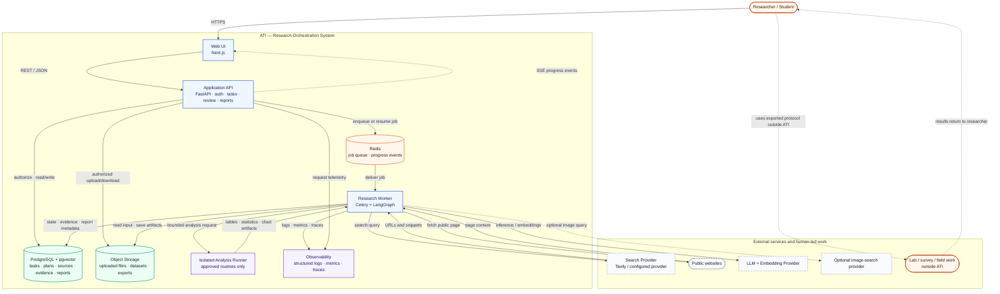
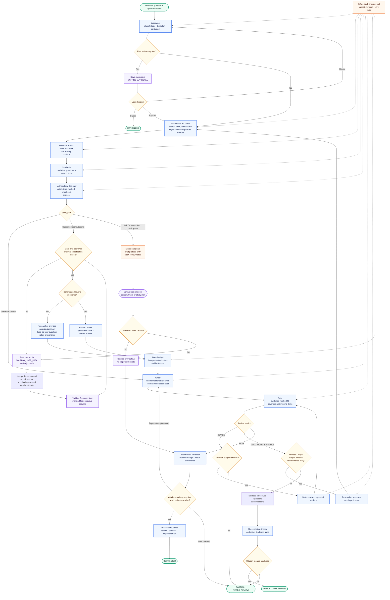
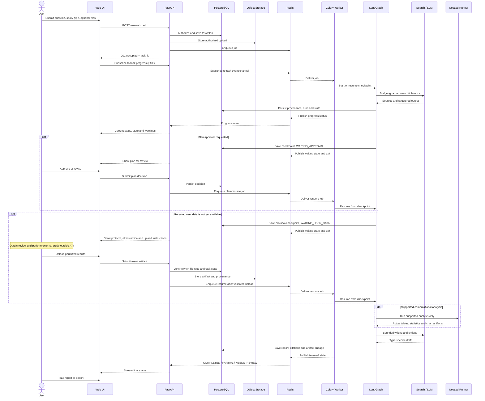
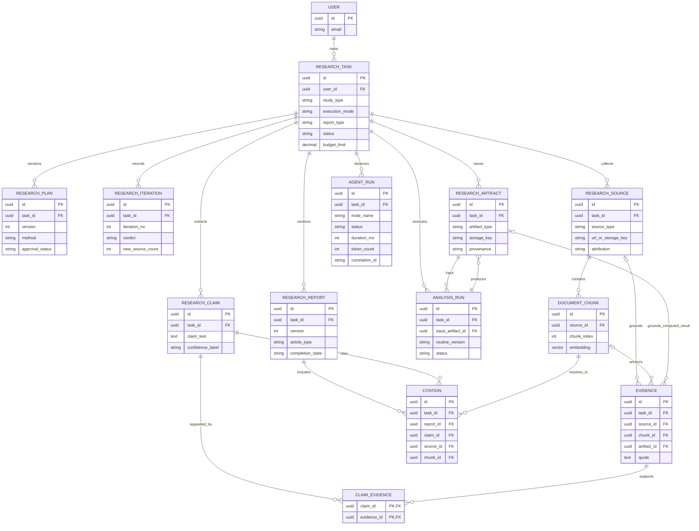
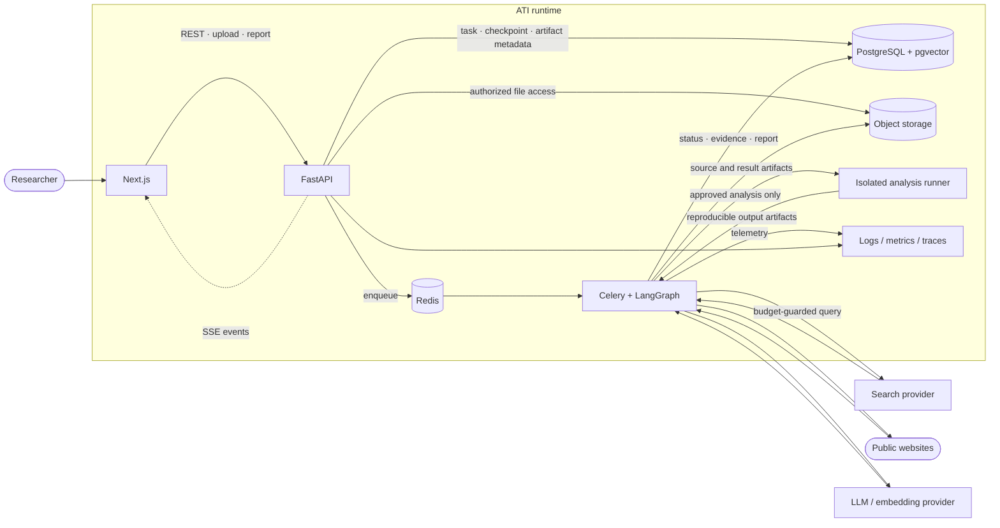
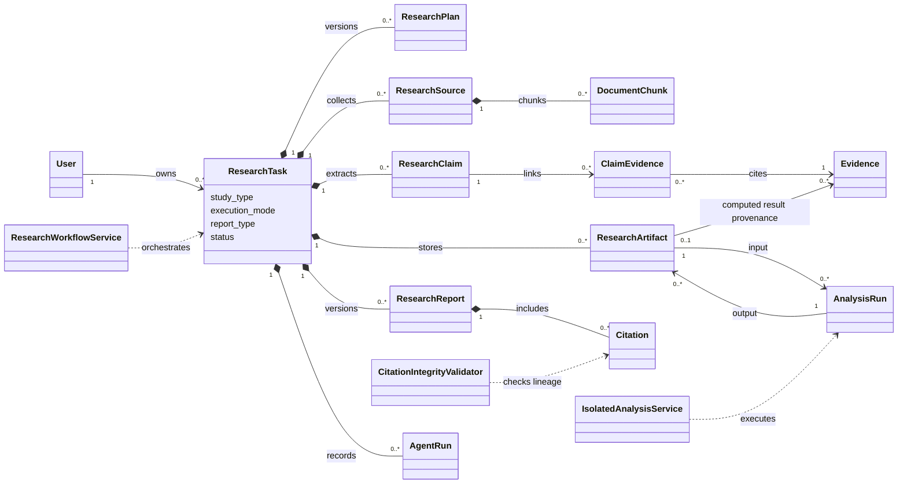

# System Design — Multi-Agent Research System (ATI)

## 1. Phạm vi và nguyên tắc

Đây là **nguồn chuẩn cho các sơ đồ kiến trúc mục tiêu** của ATI. Sơ đồ mô tả đích thiết kế, không khẳng định prototype đã có đủ chức năng; bằng chứng triển khai được ghi riêng ở mục 9 và [baseline-verification.md](../project/baseline-verification.md).

ATI điều phối quy trình nghiên cứu có AI hỗ trợ và con người giám sát: từ câu hỏi, tổng quan nguồn, candidate research question/gap, giả thuyết hoặc hướng nghiên cứu, phương pháp/protocol đến phân tích dữ liệu phù hợp và bản thảo bài báo theo loại nghiên cứu. Người dùng có thể đưa tài liệu của họ vào. Phần kết quả thực nghiệm chỉ được viết khi có dữ liệu thật và provenance. Với nghiên cứu cần lab, khảo sát, thực địa hoặc người tham gia, ATI tạo protocol/hướng dẫn; con người xin review cần thiết, tự thực hiện và nạp kết quả được phép xử lý.

**Các nguyên tắc xuyên suốt:**

- Candidate gap chỉ phản ánh những gì chưa rõ trong tập nguồn và phạm vi tìm kiếm đã báo cáo; không tuyên bố là khoảng trống tuyệt đối của cả lĩnh vực.
- Không tạo số liệu hoặc phần Results giả. Thiếu dữ liệu thì xuất literature review, protocol hoặc draft đánh dấu phần chưa hoàn tất.
- Chỉ chạy các routine phân tích có hỗ trợ, schema và cấu hình rõ. Không chạy mã tùy ý do LLM tạo trong API/worker. Runner phải tách biệt, có giới hạn tài nguyên và network mặc định bị chặn.
- Nghiên cứu người tham gia chỉ được hỗ trợ soạn protocol/tài liệu mẫu và hướng dẫn xin phê duyệt phù hợp. ATI không tuyển người, xin consent thay nhóm nghiên cứu, hay khởi động nghiên cứu ngoài đời.
- Macro research loop và micro revision loop đều bị giới hạn; Critic không thay thế peer review. Citation validation kiểm tra lineage, không chứng minh claim đúng về ngữ nghĩa.
- Ảnh minh họa là tùy chọn, lấy từ trang đã thu thập trước hoặc image provider đã cấu hình; người dùng có thể bỏ ảnh/tắt ảnh. Ảnh không phải evidence.

| Ký hiệu | Ý nghĩa |
|---|---|
| Hình chữ nhật / process | Container hoặc xử lý nghiệp vụ |
| Hình trụ | Kho dữ liệu |
| Nút bo tròn | Tác nhân, điểm đầu/cuối |
| Hình thoi | Quyết định / guard |
| Mũi tên nét đứt | Event hoặc luồng tùy chọn |

## 2. System Architecture — C4 Container View

Cho thấy các container chính và ranh giới với provider ngoài. LangGraph và các agent là logic bên trong worker; isolated runner là ranh giới riêng cho phân tích dữ liệu.

**Lưu ý:** Công nghệ cụ thể cho runner chưa được chốt; cần ADR và threat model trước khi xử lý dữ liệu/mã không tin cậy. Observability thể hiện năng lực mục tiêu, chưa có nghĩa đã cấu hình OTel/dashboard.

## 3. Logical Data Flow — DFD Level 1

DFD này chỉ biểu diễn dữ liệu và process nghiệp vụ, không đưa UI, API, Redis hoặc Celery vào.

```mermaid
flowchart LR
    Researcher(["Researcher"])
    Search(["Search provider"])
    Web(["Public websites"])
    Model(["LLM / embedding provider"])

    P1["1.0<br/>Define question,<br/>scope and plan"]
    P2["2.0<br/>Discover, upload<br/>and curate sources"]
    P3["3.0<br/>Synthesize evidence<br/>and candidate questions"]
    P4["4.0<br/>Design method,<br/>hypothesis and protocol"]
    P5["5.0<br/>Analyze supported data<br/>or receive human results"]
    P6["6.0<br/>Write, critique<br/>and validate article"]

    D1[("D1 · Tasks, plans,<br/>checkpoints")]
    D2[("D2 · Sources, chunks,<br/>vectors")]
    D3[("D3 · Claims, evidence,<br/>provenance")]
    D4[("D4 · Input data, protocols,<br/>analysis artifacts")]
    D5[("D5 · Article versions,<br/>citations, exports")]

    Researcher -->|"Question · scope · study type"| P1
    P1 -->|"Plan · status"| Researcher
    P1 <-->|"Task and plan state"| D1
    P1 -->|"Search/source requirements"| P2
    Researcher -->|"Uploaded papers / permitted data"| P2
    P2 -->|"Search query"| Search
    Search -->|"Candidate URLs"| P2
    P2 -->|"Fetch request"| Web
    Web -->|"Page/document content"| P2
    P2 -->|"Curated sources"| D2
    P2 -->|"Text for embeddings"| Model
    Model -->|"Vectors"| P2
    D2 -->|"Sources and passages"| P3
    P3 -->|"Synthesis/extraction request"| Model
    Model -->|"Claims and uncertainty"| P3
    P3 -->|"Claim-evidence links"| D3
    P3 -->|"Evidence synthesis and candidate questions"| P4
    P4 -->|"Method/protocol/data plan"| Researcher
    Researcher -->|"Approved plan / constraints"| P4
    P4 -->|"Protocol and analysis specification"| D4
    D4 -->|"Supported data + approved config"| P5
    Researcher -->|"Permitted external-study results"| P5
    P5 -->|"Actual tables, statistics, charts"| D4
    P5 -->|"Observed results and limitations"| P6
    D3 -->|"Evidence and lineage"| P6
    D4 -->|"Protocol / actual analysis artifacts"| P6
    P6 -->|"Draft, citations, review state"| D5
    D5 -->|"Report and export"| Researcher

    classDef actor fill:#fff7ed,stroke:#c2410c,stroke-width:1.5px,color:#431407
    classDef process fill:#eff6ff,stroke:#2563eb,stroke-width:1.5px,color:#172554
    classDef store fill:#ecfdf5,stroke:#059669,stroke-width:1.5px,color:#022c22
    classDef external fill:#f8fafc,stroke:#94a3b8,stroke-width:1.5px,stroke-dasharray:5 4,color:#0f172a

    class Researcher actor
    class P1,P2,P3,P4,P5,P6 process
    class D1,D2,D3,D4,D5 store
    class Search,Web,Model external
```

P5 có hai nhánh: runner phân tích dữ liệu trong phạm vi hỗ trợ, hoặc nhà nghiên cứu tự làm lab/khảo sát/thực địa ngoài ATI rồi nạp kết quả. DFD không hàm ý ATI tự tiến hành nghiên cứu thực địa.

## 4. Inference Flow — Multi-Agent Workflow

Sơ đồ điều khiển thể hiện vai trò, bounded loops, nhánh loại nghiên cứu, ethics gate, tạm dừng/resume và điều kiện tạo Results. Các role là node trong workflow, không phải các dịch vụ độc lập.

**Điều khiển bắt buộc:** macro research loop tối đa 3 vòng và dừng sớm nếu không tăng nguồn/evidence mới sau dedup; micro revision loop có giới hạn cấu hình; mọi provider call qua budget/timeout guard. WAITING_USER_DATA được lưu bền vững, worker kết thúc và chỉ job mới mới resume. Khi thiếu dữ liệu, không được tự điền Results. Autonomous mode chỉ áp dụng cho search/synthesis/revision có giới hạn; approval, ethics, dữ liệu thiếu hoặc hành động/chi phí vượt ngưỡng cần con người.

## 5. Asynchronous Sequence — Task, Pause and Resume

Thể hiện request ngắn, worker nền, event tiến độ và resume sau thời gian chờ không xác định; không giữ HTTP request hay Celery task chạy trong lúc người dùng làm nghiên cứu bên ngoài.

Upload, SSE, durable checkpoints, runner and resume are target requirements; baseline runtime chưa chứng minh các luồng này.

## 6. Core ERD — Target Traceability Model

ERD tập trung vào trục truy xuất: task/plan → source/evidence → data/analysis artifact → report/citation. Đây là mô hình mục tiêu, chưa phải inventory schema hiện tại.

**Ràng buộc mục tiêu:** mọi source/chunk/evidence/claim/citation của một báo cáo phải cùng task; file nằm trong object storage nhưng owner, checksum, loại file, retention và lineage nằm trong metadata; AnalysisRun phải lưu routine/version, input/output artifact, config, thời gian và trạng thái.

Evidence phải có đúng một loại neo provenance: `source_id` + `chunk_id` cho bằng chứng từ tài liệu, hoặc `artifact_id` cho kết quả phân tích đã tạo. Artifact kết quả phải truy được về `AnalysisRun`, routine/version và input artifact. `CITATION` chỉ đại diện trích dẫn nguồn học thuật và vẫn resolve về source/chunk; không dùng citation thay cho provenance của artifact.

## 7. Phụ lục — Physical DFD

Bản ánh ánh xạ runtime; Redis/Celery/API chỉ có ở đây vì sơ đồ hỏi dữ liệu chạy giữa các thành phần triển khai thế nào.

Nghiên cứu lab/khảo sát/thực địa diễn ra ngoài ATI và không phải runtime component. Nhà nghiên cứu tự thực hiện theo protocol; kết quả được phép xử lý quay lại qua luồng upload của User/API và lưu artifact trong Object Storage.

## 8. Phụ lục — Conceptual Class Diagram

Class view chỉ giữ entity và service cốt lõi; chi tiết ORM/API thuộc [data-model-and-api.md](../technical/data-model-and-api.md).

## 9. Hiện trạng và khoảng cách

Bằng chứng gần nhất được ghi trong baseline 27/09/2026 và cập nhật tài liệu 28/09/2026; chưa xác nhận lại runtime trong lần chỉnh tài liệu này.

| Năng lực | Bằng chứng hiện có | Còn thiếu tới target |
|---|---|---|
| Docker / PostgreSQL / Redis / Celery | Compose/services smoke-test; pgvector tồn tại; worker ping được | Recovery/load/security |
| FastAPI và task API | Health/OpenAPI, POST/GET task smoke-test | Auth, ownership và lifecycle routes |
| LangGraph | Compile, 5 routing smoke cases | E2E, reducer behavior, budget enforcement |
| Search/fetch/retrieval | Source code có | Provider thật, ingest/retrieval/provenance E2E |
| Report/citations | Model/node scaffold | Deterministic citation validator và semantic evaluation |
| Upload/object storage | Chưa xác minh | Upload ownership, validation, retention |
| Approval/data pause-resume | Chưa xác minh | Durable checkpoint và enqueue khi resume |
| Isolated runner | Chưa chọn/triển khai | ADR, threat model và resource/network isolation |
| UI progress/monitoring | Frontend starter, polling; SSE chưa mount | Stage/state events, structured logs, correlation |
| Image/PDF | Chưa xác minh E2E | Tùy chọn; không được làm chậm core workflow |

## 10. References

- [C4 Model — Diagrams](https://c4model.com/diagrams)
- [C4 Model — Notation](https://c4model.com/diagrams/notation)
- [IBM — Data Flow Diagrams](https://www.ibm.com/think/topics/data-flow-diagram)
- [OMG UML 2.5.1](https://www.omg.org/spec/UML/2.5.1/About-UML)
- [RFC 9110 — HTTP Semantics](https://www.rfc-editor.org/rfc/rfc9110)
- [Mermaid ER syntax](https://mermaid.js.org/syntax/entityRelationshipDiagram.html)
- [Mermaid Sequence syntax](https://mermaid.js.org/syntax/sequenceDiagram.html)
- [LangGraph persistence and interrupts](https://docs.langchain.com/oss/python/langgraph/persistence)
- [PRISMA 2020 Statement](https://www.prisma-statement.org/prisma-2020)
