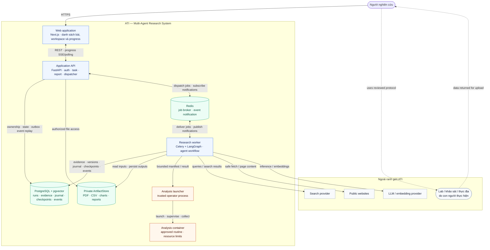
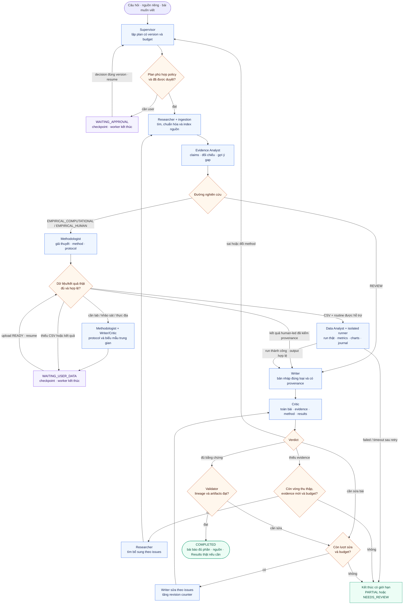
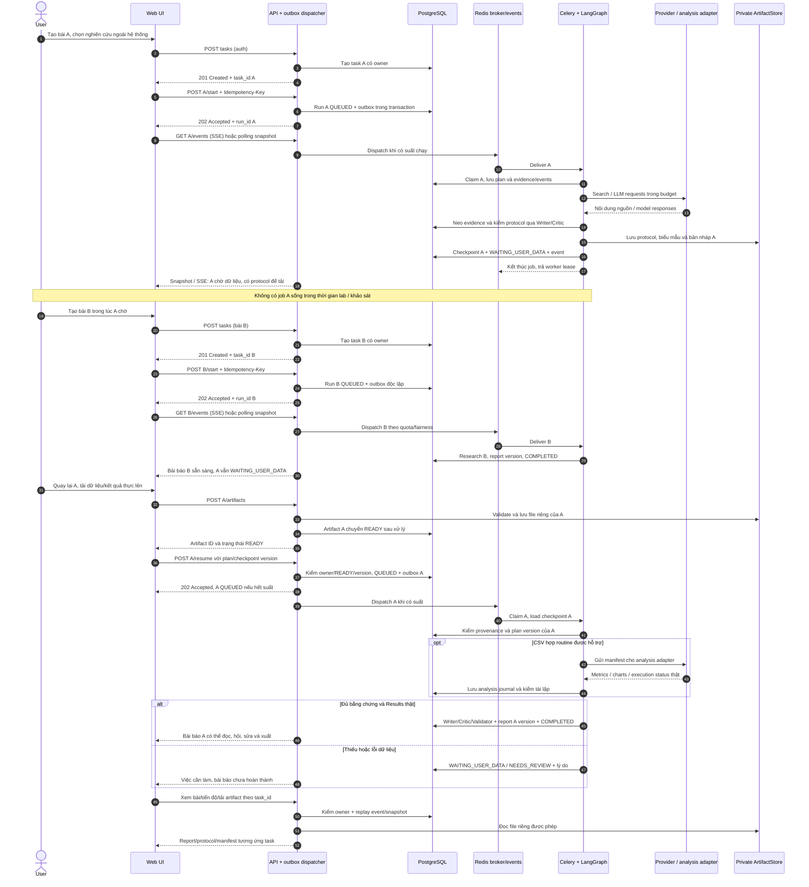
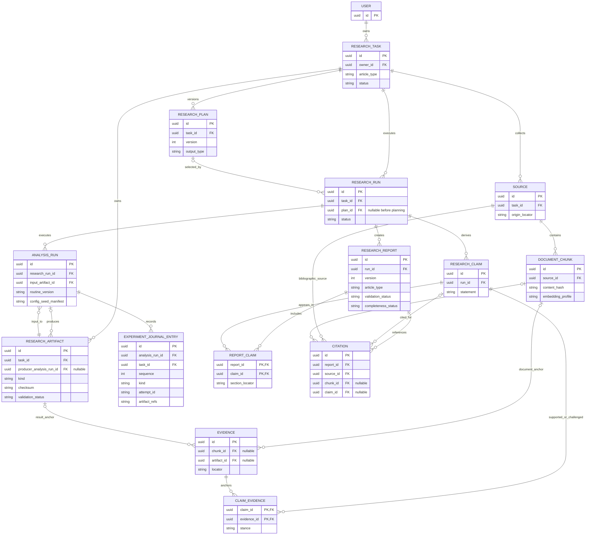

# Báo cáo Tiến độ Giữa kỳ

**Tên đề tài:** Hệ thống đa tác tử hỗ trợ nghiên cứu có bằng chứng và thực nghiệm tái lập 
**Tên tiếng Anh:** Multi-Agent Research System (ATI) 
**Thời gian thực hiện:** 10/09/2026–10/11/2026 · **Planning cập nhật:** 09/10/2026

| STT | Họ tên | MSSV | Trách nhiệm |
|---:|---|---|---|
| 1 | Nguyễn Đình Chiến | [Nhóm bổ sung] | Trưởng nhóm, kế hoạch, kiến trúc, code/tích hợp, xác minh kỹ thuật |
| 2 | Phạm Long Vũ | [Nhóm bổ sung] | Query/source set, dataset, rubric và QA thủ công |
| 3 | Nguyễn Văn Hiếu | [Nhóm bổ sung] | User scenarios, flow, demo checklist và issue log |
| 4 | Nguyễn Thị Hải My | [Nhóm bổ sung] | Related work, nguồn, chấm nội dung và biên tập |

**Giảng viên:** [Nhóm bổ sung] · **Ngày nộp báo cáo:** [Nhóm bổ sung]

Các trách nhiệm của Vũ, Hiếu và My trong bảng là **phân công dự kiến**, chưa được tính là kết quả đã bàn giao. MSSV, giảng viên và ngày nộp cần điền từ thông tin chính thức trước khi nộp; không tự suy đoán.

## 1. Overview — Tổng quan

ATI hỗ trợ người nghiên cứu từ câu hỏi và nguồn riêng tới **bản thảo bài báo hoàn chỉnh** theo loại, có bằng chứng, phương pháp và kết quả thật khi cần. Các agent phân vai tìm nguồn, phân tích, thiết kế phương pháp, viết và phản biện; graph điều phối bằng state/guards. Mỗi bài có workspace độc lập; người dùng xem tiến độ, hỏi/sửa bài và có thể làm bài khác khi một bài đang chờ dữ liệu.

| Đường nghiên cứu | Hệ thống thực hiện | Đầu ra |
|---|---|---|
| REVIEW | Web/PDF → evidence → tổng hợp và gợi ý gap → viết/kiểm | Literature review có phạm vi tìm nguồn, citations và limitations |
| EMPIRICAL_COMPUTATIONAL | Method + CSV hợp lệ → routine được duyệt → metrics/charts → viết/kiểm | Bài thực nghiệm và gói tái lập |
| EMPIRICAL_HUMAN | Protocol trung gian → người dùng thực hiện nghiên cứu, nạp kết quả thật → resume/viết/kiểm | Bài thực nghiệm hoàn chỉnh có provenance; protocol không là bài đã hoàn thành |

Tổng quan/human-led protocol áp dụng nhiều lĩnh vực; execution đầu tiên giới hạn một routine trên CSV numeric. Với lab/khảo sát/thực địa/người tham gia, con người thực hiện và xin phê duyệt phù hợp bên ngoài ATI. Thiếu actual data không tạo Results và task vẫn chờ; trong thời gian đó người dùng có thể tạo/chạy bài khác. Gợi ý gap chỉ dựa phạm vi nguồn đã xem; bản thảo hoàn chỉnh về cấu trúc không đồng nghĩa đã được peer review hoặc có novelty được công nhận.

**Mục tiêu bản nộp:** review web+PDF thành bài báo, một experiment CSV chạy thật thành bài empirical, protocol/wait/resume cho nghiên cứu ngoài hệ thống và bài empirical sau khi nạp kết quả thật, Q&A/revision cơ bản, monitoring và đánh giá multi-agent. Tất cả là target cho tới khi có evidence nghiệm thu.

## 2. Problems and Objectives — Vấn đề và mục tiêu

| Vấn đề | Mục tiêu | Cách đánh giá |
|---|---|---|
| Tìm/đọc/đối chiếu nguồn tốn thời gian, dễ bỏ sót quan điểm | Phối hợp Researcher và Evidence Analyst | Coverage, evidence support, nguồn trái chiều trong tập đánh giá |
| LLM viết claim khó kiểm chứng | Lưu claim → evidence → nguồn/đoạn hoặc analysis artifact | Kiểm lineage toàn bài và chấm semantic support riêng |
| Research gap dễ bị khẳng định quá mức | Nêu search scope, uncertainty và giới hạn | Rubric kiểm claims về novelty và missing evidence |
| Bài thực nghiệm cần số liệu thật | Chạy routine hỗ trợ, tạo metrics/charts có manifest | Tái lập cùng input/config/seed; không fabricate Results |
| Workflow dài, có thể chờ nhiều ngày | Durable interrupt/resume, worker kết thúc khi chờ | Restart rồi resume đúng plan/checkpoint, không lặp outputs |
| Agent loop có thể tốn phí hoặc lặp vô hạn | 3 vòng thu thập gồm lần đầu; 2 writer revisions; shared budget | Cases no-delta, hết cap, retry và cancellation |
| User không thấy tiến độ hoặc không sửa được bài | Timeline, Q&A và report versions | Kịch bản thực tế và manual QA |
| Nhiều agent chưa chắc tốt hơn một agent | Đánh giá baseline và ablation | Cùng corpus/model/cap, báo quality/cost/latency và thất bại |

Không đưa tỷ lệ cải thiện, SLA hoặc chất lượng “production-ready” khi chưa đo. Citation tồn tại và quote khớp là integrity; mức độ bằng chứng hỗ trợ claim là đánh giá ngữ nghĩa riêng.

Yêu cầu chi tiết được đánh mã FR-01–FR-17 và NFR-01–NFR-07 trong [SRS](../requirements/SRS.md). Mã nghiệm thu G0–G7 ở SRS thống nhất với kế hoạch P0–P7; bảng ánh xạ giúp truy từ yêu cầu tới công việc và bằng chứng, tránh đánh dấu hoàn tất chỉ từ tài liệu.

## 3. Technical Approaches — Công nghệ, phương pháp và trade-offs

### 3.1 Phối hợp đa tác tử

| Vai trò | Trách nhiệm |
|---|---|
| Supervisor | Lập plan có version, phạm vi, đường nghiên cứu và budget |
| Researcher | Lập query, tìm nguồn và targeted search theo thiếu sót |
| Evidence Analyst | Trích claims/evidence, đối chiếu, synthesis và gợi ý gap |
| Methodologist | Đề xuất giả thuyết/phương pháp/protocol khi cần |
| Data Analyst | Chọn routine hỗ trợ và diễn giải kết quả thật |
| Writer | Viết đúng cấu trúc REVIEW/EMPIRICAL_COMPUTATIONAL/EMPIRICAL_HUMAN; protocol chỉ là artifact trung gian |
| Critic | Review toàn bài cùng evidence/method/results, trả issues/verdict |

REVIEW chủ yếu dùng năm vai trò; method/data roles có điều kiện. Curator/ingestion, router, validator, budget và runner là code/tools, không tính thêm agent. Critic không là peer reviewer độc lập. Research loop quay lại thu thập khi thiếu bằng chứng; revision loop sửa bài; guards quyết định có được đi tiếp.

### 3.2 Stack và đánh đổi

| Thành phần | Lựa chọn | Lý do / đánh đổi |
|---|---|---|
| UI/API | Next.js + FastAPI | Contract rõ, job dài tách HTTP; cần owner/version checks xuyên UI/API |
| Workflow | LangGraph trong Celery worker | Phù hợp state/loop/checkpoint; cần pin versions và xử lý side effect khi resume |
| Queue/events | Redis + DB outbox/TaskEvent | At-least-once delivery, dedup/CAS; Pub/Sub không là nguồn trạng thái duy nhất |
| Database | PostgreSQL + pgvector | Một DB giảm vận hành; pin embedding profile, lọc task và kiểm index |
| Providers | Search + safe fetch + LLM/embedding adapter | Shared call/cost/time cap, timeout/retry, data policy |
| Files | Private local ArtifactStore, interface mở rộng object storage | Owner/checksum/size/parser validation; file không public |
| Analysis | Trusted launcher + restricted Docker container | Routine dự án duyệt; API/worker không Docker socket; không là sandbox arbitrary code |
| Monitoring | JSON logs, AgentRun/TaskEvent, UI polling/SSE | Quan sát stage/usage/errors; không bắt thêm stack OTel cho bản nộp |

Kiến trúc dùng một backend codebase và các process API/worker, không tách mỗi agent thành microservice. Khái niệm container view theo [C4](https://c4model.com/diagrams/container); pause/resume theo [LangGraph](https://docs.langchain.com/oss/python/langgraph/interrupts); idempotency theo [Celery](https://docs.celeryq.dev/en/stable/userguide/tasks.html). Pin thư viện tương thích trước implementation.

| Phương pháp / thuật toán | Áp dụng trong ATI | Đánh đổi và giới hạn |
|---|---|---|
| Truy xuất bằng embedding + pgvector | Web/PDF → chunk có locator/hash → tìm trong đúng task → Evidence Analyst chọn và đối chiếu đoạn nguồn | Tìm gần nghĩa hỗ trợ tổng hợp, nhưng đoạn được tìm thấy chưa chứng minh claim; cần quote/locator và kiểm ngữ nghĩa |
| Graph có state + hai vòng phản biện hữu hạn | Research loop tìm thêm evidence thiếu; Writer–Critic sửa bản thảo; guard theo budget và evidence delta | Bounded loop giảm chi phí/vòng lặp vô hạn, nhưng có thể dừng khi câu hỏi chưa giải quyết được; trả giới hạn rõ |
| Validator xác định + Critic | Code kiểm IDs/lineage/artifact/status; Critic đọc lập luận, phương pháp và kết quả theo section | FK và citation hợp lệ không bảo đảm nội dung đúng; con người vẫn kiểm kết luận khoa học |
| Routine thống kê có đối chứng | Mean baseline so với Ridge cùng split/metric, imputer/scaler chỉ fit train | Chạy thật, kiểm được và tái lập trong phạm vi hẹp; không suy rộng sang mọi phương pháp/lĩnh vực hoặc nhân quả |

LLM và embedding provider được cấu hình/pin theo run, có adapter, data policy và cap. Không tuyên bố một model cố định sẽ luôn tốt nhất; chất lượng đa tác tử phải qua phép so sánh ở §3.3.

Ma trận chi tiết chức năng–công nghệ–design pattern và ranh giới trust được nêu ở [Technical Design](../architecture/technical-design.md); HLD giải thích thành phần và trade-offs tại [System Architecture](../architecture/system-architecture.md).

### 3.3 Thực nghiệm và đánh giá

Routine tham chiếu `tabular_regression_v1`: CSV numeric → descriptive statistics → DummyRegressor(mean) so với Ridge(alpha=1), cùng train/test 80/20 seed 42. Preprocessing chỉ fit train; MAE chính, RMSE phụ; plots prediction/residual; không suy ra nhân quả, không thử lặp để chọn kết quả đẹp. Đây là lát cắt thực thi/tái lập, không phải thuật toán phù hợp mọi loại nghiên cứu. Nguyên tắc chống leakage tham khảo [scikit-learn](https://scikit-learn.org/stable/common_pitfalls.html).

`ExperimentJournalEntry` ghi plan trước chạy, từng attempt, kết quả âm hợp lệ, lỗi kỹ thuật và lần kiểm lại từ cùng manifest. Writer chỉ dùng metrics/artifacts đã xác minh; người dùng có thể đọc và tải journal cùng gói tái lập. Một lần chạy lại cùng seed kiểm repeatability kỹ thuật, chưa chứng minh kết luận tổng quát. [Đặc tả journal](../technical/experiment-journal-and-reproducibility.md) và [ADR-005](../architecture/decisions/ADR-005-experiment-journal-and-reproducibility.md) giữ quyết định này; code AI tự sinh thuộc mở rộng có gate an toàn/đánh giá riêng.

Đánh giá ATI khác với experiment của người dùng: 4 câu pilot và 8 held-out, ba cấu hình single-agent / multi-agent / multi-agent tắt macro loop; cố định corpus/model/cap, đo citation integrity, semantic support, coverage, cost/latency và failures. Chiến chấm ẩn nhãn cấu hình theo rubric đóng băng; chấm một người có nguy cơ thiên lệch và không đo được đồng thuận, nên không tuyên bố vượt trội phổ quát. [Evaluation Plan](evaluation-plan.md) ghi cách chọn mẫu và nghiệm thu.

## 4. System Design — Thiết kế hệ thống

Ba hình §4.1–4.3 trả lời trực tiếp yêu cầu **system architecture, data flow, inference flow chart**; §4.4–4.5 bổ sung để thấy pause/resume và truy xuất kết quả. Năm hình được đồng bộ từ [System Design](../architecture/system-design.md), là kiến trúc mục tiêu chứ không phải runtime đã nghiệm thu. Hướng dẫn bố cục để vẽ lại nằm ở đầu tài liệu System Design; mỗi hình nên ở một trang riêng.

### 4.1 System Architecture — C4 Container View

API dispatcher đọc outbox; Redis event chỉ là notification. Telemetry được lưu trong logs/DB và hiển thị ở UI, không bắt buộc service riêng. Analysis container chỉ chạy routine được duyệt qua launcher tin cậy.

### 4.2 Data Flow — Logical DFD Level 1

```mermaid
flowchart LR
    User(["Người nghiên cứu"])
    Sources(["Nguồn tài liệu bên ngoài"])

    P1["1.0 Quản lý yêu cầu<br/>và kế hoạch nghiên cứu"]
    P2["2.0 Thu thập và chuẩn hóa<br/>nguồn / dữ liệu đầu vào"]
    P3["3.0 Phân tích bằng chứng<br/>và gợi ý khoảng trống"]
    P4["4.0 Thiết kế phương pháp<br/>và protocol"]
    P5["5.0 Phân tích dữ liệu<br/>bằng routine hỗ trợ"]
    P6["6.0 Viết, phản biện<br/>và cung cấp bài nghiên cứu"]

    D1[("D1 · Yêu cầu và kế hoạch")]
    D2[("D2 · Tài liệu và đoạn nguồn")]
    D3[("D3 · Nhận định và bằng chứng")]
    D4[("D4 · Dữ liệu và kết quả phân tích")]
    D5[("D5 · Phiên bản bài và phản hồi")]

    User -->|"câu hỏi · constraints · quyết định"| P1
    P1 -->|"kế hoạch và trạng thái"| User
    P1 -->|"yêu cầu đã duyệt"| D1
    D1 -->|"phạm vi tìm nguồn"| P2
    User -->|"PDF · CSV · kết quả được phép"| P2
    P2 -->|"truy vấn và địa chỉ nguồn"| Sources
    Sources -->|"metadata và nội dung"| P2
    P2 -->|"tài liệu đã chuẩn hóa"| D2
    P2 -->|"dataset hoặc kết quả có provenance"| D4
    D2 -->|"đoạn nguồn và định danh"| P3
    P3 -->|"claims · quotes · mâu thuẫn"| D3
    P3 -->|"tổng hợp · câu hỏi nghiên cứu"| P4
    D1 -->|"loại đầu ra và constraints"| P4
    P4 -->|"protocol và kế hoạch phân tích"| D1
    P4 -->|"cấu hình phân tích được hỗ trợ"| P5
    D4 -->|"dataset hợp lệ"| P5
    P5 -->|"metrics · charts · journal · manifest"| D4
    P5 -->|"bằng chứng kết quả"| D3
    D1 -->|"scope · method · protocol"| P6
    D3 -->|"claims và evidence anchors"| P6
    D4 -->|"artifacts đã xác nhận"| P6
    D5 -->|"bài và phản hồi phiên bản trước"| P6
    User -->|"câu hỏi hoặc yêu cầu sửa bài"| P6
    P6 -->|"bài mới và kết quả kiểm tra"| D5
    P6 -->|"bài báo đầy đủ · protocol trung gian · câu trả lời có nguồn"| User
    P6 -->|"câu hỏi thiếu bằng chứng"| P2
    P6 -->|"đề xuất đổi scope hoặc phương pháp"| P1

    classDef process fill:#eff6ff,stroke:#2563eb,color:#172554
    classDef data fill:#ecfdf5,stroke:#059669,color:#064e3b
    class P1,P2,P3,P4,P5,P6 process
    class D1,D2,D3,D4,D5 data
```

Mọi data store/external entity đi qua process; không đưa broker hoặc API vào logical view. Nghiên cứu bên ngoài trả dữ liệu cho người dùng, người dùng nạp qua process thu thập.

### 4.3 Inference Flow — Multi-Agent Workflow

Budget guard bọc mọi provider call/retry ở tất cả node. Protocol dùng cùng Writer/Critic/Validator và caps. Plan approve không sinh lại plan; method change tạo version mới, không reset budget hay giữ Results cũ. Protocol chỉ được COMPLETED nếu đúng output user yêu cầu; thiếu dữ liệu empirical phải chờ hoặc user đổi output. PARTIAL cần lineage hợp lệ; lỗi chưa xử lý là NEEDS_REVIEW.

### 4.4 Asynchronous Sequence — Pause/Resume

Tạo task trả 201, start/resume nhận job trả 202. WAITING_* giữ checkpoint và kết thúc worker; file READY + decision đúng owner/version mới được resume. Bài A chờ không chiếm suất RUNNING và không chặn bài B; mỗi task có artifacts, event và report versions riêng. Protocol là trung gian, bài empirical chỉ hoàn thành sau khi có Results thật.

### 4.5 Core ERD — Traceability Model

Evidence neo đúng một chunk hoặc artifact; report → ReportClaim → claim → evidence → artifact → AnalysisRun → input là đường truy xuất kết quả. Citation vẫn là thư mục source/chunk. FK kiểm quan hệ kỹ thuật, không chứng minh nội dung claim đúng. Mọi link phải cùng task/owner; uploaded artifact có producer nullable. Physical DFD/class view và invariants đầy đủ ở [System Design phụ lục](../architecture/system-design.md).

## 5. Development Plan — Kế hoạch phát triển

Thời hạn 10/09–10/11/2026. Giai đoạn đầu đã có planning/scaffold và baseline log 27/09. Lịch còn lại tính từ 08/10, giả định Chiến có 3–4 giờ tập trung/ngày; cần điều chỉnh theo velocity thực tế sau baseline.

| Thời gian | Công việc | Giờ ước tính | Người phụ trách | Gate/đầu ra |
|---|---|---:|---|---|
| 08–10/10 | P0 baseline/dependency/DB/test isolation | 4–6 | Chiến | G0: tái lập môi trường |
| 11–14/10 | P1 auth/ownership/run/outbox/events | 12–16 | Chiến | G1: lifecycle và quyền |
| 15–19/10 | P2 web E2E/evidence/critic/validator/budget | 16–20 | Chiến | G2: review chạy thật |
| 20–23/10 | P3 PDF/dashboard nhiều bài/progress | 11–14 | Chiến | G3: web+PDF |
| 24–26/10 | P4 plan/protocol/wait/resume | 14–18 | Chiến | G4: durable resume |
| 27–30/10 | P5 routine/metrics/charts/journal/rerun/human-led results/empirical | 24–34 | Chiến | G5: experiment thật và tái lập |
| 31/10–02/11 | P6 Q&A/revision/export và delete/cleanup | 9–12 | Chiến | G6: phiên bản, đầu ra và retention |
| 03–07/11 | P7 evaluation/manual QA/fix/báo cáo | 14–20 | Chiến | G7: kết quả có evidence |
| 08–10/11 | Buffer/freeze/demo/backup | Ngoài ước tính | Chiến | Bản nộp |

Chi tiết ước lượng 104–140 giờ trong [Implementation Plan](implementation-plan.md), gồm nhật ký mọi lần thử và một lần chạy lại để kiểm tái lập. Giả định thời gian tập trung thực tế còn 90–115 giờ tạo khoảng thiếu 14–50 giờ; riêng P5 cần 24–34 giờ trong bốn ngày mục tiêu. Đây là kế hoạch rủi ro cao, phải đo lại sau G0/G1 và báo mốc/gate nào cần điều chỉnh nếu không tăng được thời gian. Khi trễ, ưu tiên các gate thật và cắt polish/ảnh/PDF đẹp; không báo số liệu/provenance/ownership chưa đạt là đã hoàn thành.

Report version/ReportClaim và plan schema được đặt nền ở P2; P4 mở approval/resume, P6 mở Q&A/revision. WAITING_* giữ active run **của chính task** nhưng trả worker/quota RUNNING; Q&A đọc phiên bản bài qua operation có cap riêng. Mọi trường hợp xóa task phải chặn truy cập/resume và kết quả đến muộn theo policy đã ghi trong SRS.

## 6. Progress — Tiến độ có bằng chứng

| Hạng mục | Bằng chứng hiện có | Chưa được xác nhận |
|---|---|---|
| Planning | SRS v4.1 đồng bộ vào `SRS ATI.md`, ADR-004/005, diagrams, user journey, experiment journal và implementation/evaluation plans cập nhật 09/10 | Feature chưa hoàn tất chỉ vì đã mô tả |
| Docker/DB/API/worker/graph | Baseline chạy 27/09: services, health/task smoke, worker ping, graph compile/routing mẫu | Revision hiện tại, clean DB migration, research provider E2E |
| Auth/provenance schema | Source `ebb525a` có register và ClaimEvidence/Citation migration | Login/ownership, migration áp dụng, validator thật |
| Research workflow | Có search/fetch/embed/retrieval/Writer/Critic source | Đủ budget/lineage/review/loop và chất lượng thực tế |
| Upload/resume/analysis/Q&A | Có thiết kế và backlog | Chưa đủ runtime evidence |
| Monitoring/evaluation | Kế hoạch event/log/timeline và baseline/ablation | Chưa có số đo chất lượng/cost/superiority |

[Baseline Verification](baseline-verification.md) giữ nguyên lệnh/kết quả lịch sử. Đọc source ngày 08/10 không chứng minh deployment hiện tại đã chạy. Lượt chốt planning này chỉ kiểm tài liệu/sơ đồ, không gọi provider hoặc chạy experiment.

## 7. AI Disclosure — Đóng góp con người và AI

| Thành phần | Trách nhiệm / hỗ trợ | Trạng thái khai báo |
|---|---|---|
| Nguyễn Đình Chiến | Chủ trách nhiệm kế hoạch, quyết định scope/architecture, implementation/tích hợp và nghiệm thu | Có AI hỗ trợ code/tài liệu; không diễn đạt thành mọi dòng code đều tự viết |
| Phạm Long Vũ | Dataset/query/rubric và QA/chấm nội dung | Phân công; cập nhật bàn giao thực tế |
| Nguyễn Văn Hiếu | Scenarios/flow/checklist/issue log | Phân công; cập nhật bàn giao thực tế |
| Nguyễn Thị Hải My | Related work/nguồn, chấm và biên tập | Phân công; cập nhật bàn giao thực tế |
| Gemini | Đã hỗ trợ tạo bản nháp planning docs theo thông tin chủ dự án | Chiến rà nội dung với yêu cầu, code và source; xác nhận model/prompt/file sử dụng trước nộp |
| Antigravity | Dự kiến hỗ trợ viết code theo issue/branch; chưa có evidence đủ để ghi nhận task cụ thể trong tiến độ giữa kỳ | Chỉ bổ sung phần việc khi có commit/PR và kết quả Chiến kiểm lại |
| Codex | Hỗ trợ đọc source/docs, rà kiến trúc, đề xuất/chỉnh SRS, planning, journal và diagrams; các lượt trước có hỗ trợ code/baseline | Các lượt 08–09/10 là rà soát/planning, không nghiệm thu runtime; Chiến review quyết định cuối |

AI của sản phẩm ATI khác với AI giúp nhóm phát triển. Không tự điền tỷ lệ AI/con người hoặc model version chưa xác minh. Người làm chịu trách nhiệm nguồn, số liệu, code và kết luận. Hồ sơ chi tiết ở [AI Disclosure](ai-disclosure.md).

## 8. Tài liệu kèm theo và tham khảo

- [SRS](../requirements/SRS.md), [HLD](../architecture/system-architecture.md), [ADR-004](../architecture/decisions/ADR-004-multi-agent-research-delivery.md), [ADR-005](../architecture/decisions/ADR-005-experiment-journal-and-reproducibility.md).
- [Product Assessment](product-assessment.md), [Implementation Plan](implementation-plan.md), [Evaluation Plan](evaluation-plan.md), [Team Task Guide](team-task-guide.md).
- [GPT Researcher](https://github.com/assafelovic/gpt-researcher): tham khảo thu thập nguồn và báo cáo.
- [STORM](https://github.com/stanford-oval/storm): tham khảo lập câu hỏi nhiều góc nhìn và tổ chức tri thức.
- [AI Scientist v2](https://github.com/SakanaAI/AI-Scientist-v2): tham khảo chu trình thực nghiệm/bài viết; không đồng nhất scope rộng của ATI với khả năng tự nghiên cứu mọi lĩnh vực.
- [Building effective agents](https://www.anthropic.com/engineering/building-effective-agents): tham khảo thiết kế workflow có cấu trúc, đánh giá trade-offs; không là bằng chứng ATI tốt hơn baseline.

MSSV, giảng viên, ngày nộp, bàn giao cá nhân và progress thực tế còn phải điền từ thông tin nhóm; không tạo dữ liệu giả.
