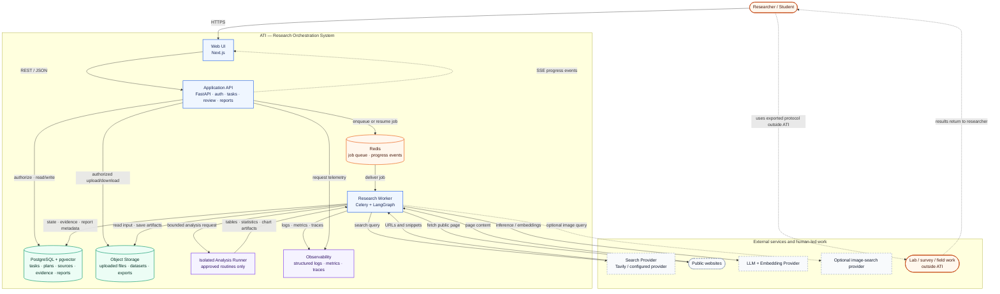
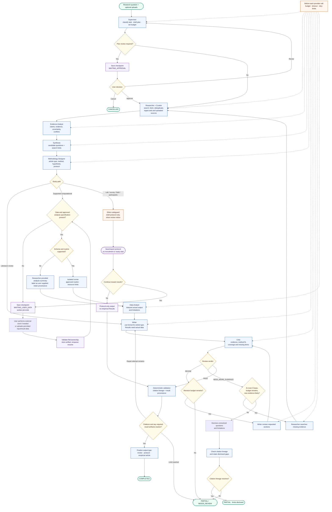
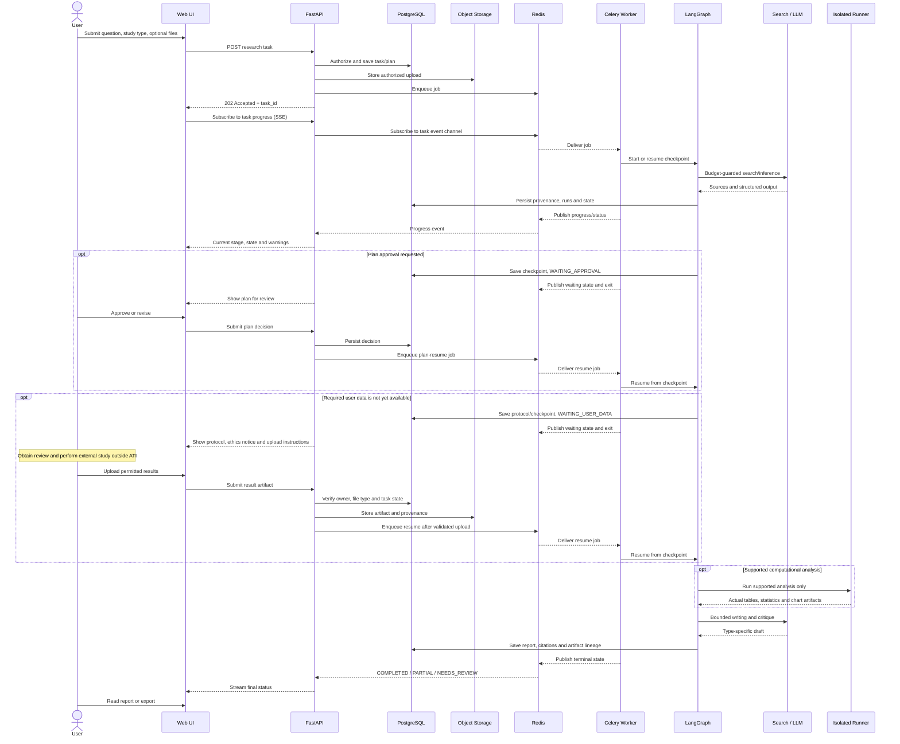
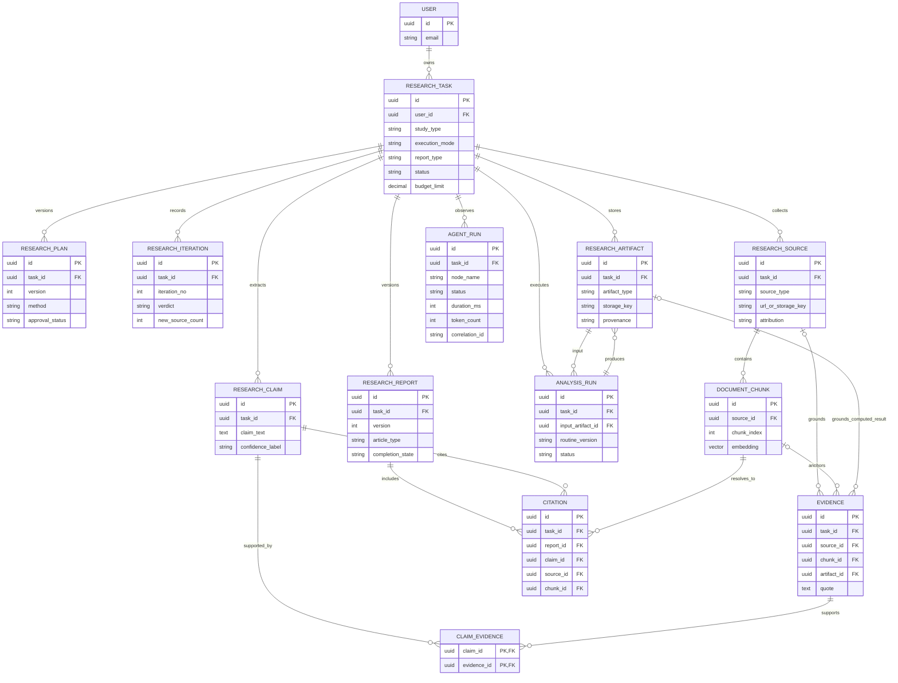

# Báo cáo Tiến độ Giữa kỳ

**Tên đề tài:** Hệ thống Điều phối Nghiên cứu Đa Tác tử có Người giám sát 
**Tên tiếng Anh:** Human-Supervised Multi-Agent Research Orchestrator (ATI) 
**Thời gian thực hiện:** 10/09/2026–10/11/2026

| STT | Họ tên | MSSV | Vai trò |
|---:|---|---|---|
| 1 | Nguyễn Đình Chiến | [Nhóm bổ sung] | Trưởng nhóm; kế hoạch, kiến trúc, toàn bộ code, tích hợp và xác minh |
| 2 | Phạm Long Vũ | [Nhóm bổ sung] | Evaluation set, rubric, manual QA; không code |
| 3 | Nguyễn Văn Hiếu | [Nhóm bổ sung] | User scenarios, demo checklist/issue log; không code |
| 4 | Nguyễn Thị Hải My | [Nhóm bổ sung] | Related work, source matrix, biên tập báo cáo; không code |

**Giảng viên:** [Nhóm bổ sung] · **Ngày báo cáo:** [Nhóm bổ sung]

## 1. Overview — Tổng quan

ATI hướng tới hỗ trợ cá nhân/người học điều phối một quy trình nghiên cứu: câu hỏi → nguồn web/tài liệu user → evidence synthesis và candidate research questions/gaps → hypothesis/method/protocol → phân tích dữ liệu được hỗ trợ → bài viết theo study type. Người dùng quan sát được trạng thái/tiến độ và kiểm tra provenance từ claim về source/chunk hoặc từ kết quả phân tích về input/routine.

Với computational research, ATI chỉ chạy routine cho phép trên dữ liệu đã validate trong isolated runner. Với lab, khảo sát, thực địa hoặc người tham gia, ATI chỉ tạo protocol/checklist; nhà nghiên cứu tự xin review/phê duyệt, tiến hành ngoài hệ thống và tải kết quả được phép xử lý. ATI không tuyển người/khởi động study. Không có actual data thì không sinh Results. Candidate gap được giới hạn trong corpus/search scope đã xem và không được khẳng định như sự thật toàn ngành.

**Demo trước 10/11:** ưu tiên một literature-review workflow đầu-cuối (web + PDF user source, claim/evidence/citation, candidate gap, report/progress); tối đa một analysis slice hẹp nếu an toàn/tái lập. Các diagram là target design, không phải trạng thái prototype đã nghiệm thu.

## 2. Problems and Objectives — Vấn đề và mục tiêu

### 2.1 Vấn đề

| ID | Vấn đề | Hệ quả |
|---|---|---|
| P1 | Tìm, đọc và so sánh nhiều nguồn thủ công mất thời gian | Dễ bỏ sót nguồn/quan điểm |
| P2 | LLM viết claim khó kiểm chứng | Người đọc không biết câu dựa trên đoạn nào |
| P3 | Citation tồn tại không chứng minh evidence hỗ trợ claim | Cần kiểm tra lineage và semantic support riêng |
| P4 | Research gap/conclusion dễ bị nói quá chắc | Phải nêu corpus, search scope, uncertainty |
| P5 | Workflow dài cần chờ user/data | Không thể giữ HTTP request hoặc worker sống nhiều ngày |
| P6 | Bài thực nghiệm cần kết quả thật | Không được sinh Results khi thiếu dữ liệu |
| P7 | User không biết agent đang làm gì | Khó phát hiện lỗi, trạng thái chờ và chi phí |

### 2.2 Mục tiêu đo được sau khi chốt baseline

| ID | Mục tiêu | Tiêu chí nghiệm thu |
|---|---|---|
| O1 | Tạo workflow nghiên cứu có cấu trúc | Task → plan → source → evidence → output phù hợp |
| O2 | Lưu provenance | Citation resolve đúng task/source/chunk; analysis output nối về input/routine/config |
| O3 | Nêu candidate gap có giới hạn | Báo cáo search scope, uncertainty và missing evidence |
| O4 | Research/revision loop bị giới hạn | Macro ≤3 vòng, stop nếu không có evidence mới sau dedup; micro max cấu hình |
| O5 | Hỗ trợ experiment an toàn | Routine allowlist, input validation, output tái lập trong runner |
| O6 | Chờ và resume nghiên cứu ngoài hệ thống | Persist WAITING_USER_DATA, kết thúc worker, resume bằng job mới |
| O7 | Hiển thị tiến độ/monitoring | Task stage/state/warning và logs có correlation/cost đã redacted |
| O8 | Bài báo theo loại | Empirical Results chỉ có dữ liệu thật; thiếu data → review/protocol/partial |

Các ngưỡng số về latency, chi phí và quality cần benchmark; hiện chưa báo là kết quả.

## 3. Technical Approaches — Công nghệ và trade-offs

### 3.1 Workflow

Supervisor phân loại/lập plan; Researcher + Curator tìm/lọc/index; Evidence Analyst trích claim/evidence/conflicts; Synthesis/Methodology đề xuất candidate questions và protocol; Data Analyst chạy routine được duyệt; Writer/Critic tạo và rà output; validator kiểm tra citation/artifact lineage. Đây là các node/role có điều phối, không phải services độc lập. Critic không thay peer review.

### 3.2 Stack mục tiêu và đánh đổi

| Phần | Hướng chọn | Lợi ích | Trade-off / kiểm soát |
|---|---|---|---|
| UI/API | Next.js + FastAPI REST | UI riêng, contract/OpenAPI rõ | Auth, upload và progress phải đồng bộ |
| Workflow | LangGraph | State, routing, bounded loops/checkpoints | Cần test reducers/routing/persistence |
| Background | Celery + Redis | Tách job dài khỏi HTTP | Redis không source of truth; cần DB state/idempotency |
| Data | PostgreSQL + pgvector | Một DB cho metadata và vectors | Benchmark/index/task filters trước khi tách DB |
| Search/LLM | Tavily + cấu hình provider | Thay provider, hỗ trợ retrieval/inference | Chi phí, latency, privacy; budget/timeout/log |
| Files | Private object storage (target) | Phù hợp PDF/dataset/output lớn | Owner/size/type/checksum/retention; chưa verify |
| Analysis | Isolated runner cho routines được duyệt | Không chạy code không tin cậy trong API/worker | Provider/tech chưa chốt; cần ADR/threat model |
| Progress | DB status + structured logs; SSE target, polling fallback | UI theo dõi stage/wait/error | SSE chưa mount; OTel/dashboard chưa verify |

C4 Container View sử dụng ranh giới container theo C4 [1]; workflow checkpoint/resume tham khảo cơ chế persistence/interrupt của LangGraph [2]. Các reporting guideline như PRISMA chỉ áp dụng khi loại review/phạm vi phù hợp; report này không tuyên bố ATI tuân thủ guideline nếu chưa kiểm tra [5].

Nếu runner chưa qua safety gate, không chạy code tùy ý; defer analysis execution hoặc dùng protocol/user-provided results có provenance.

## 4. System Design — Thiết kế hệ thống

Năm sơ đồ dưới đây được nhúng từ [system-design.md](../architecture/system-design.md), nguồn chuẩn cho diagram. Chúng mô tả target end-state, không mô tả runtime hiện tại.

### 4.1 System Architecture — C4 Container View

### 4.2 Data Flow — Logical DFD Level 1

```mermaid
flowchart LR
    Researcher(["Researcher"])
    Search(["Search provider"])
    Web(["Public websites"])
    Model(["LLM / embedding provider"])

    P1["1.0<br/>Define question,<br/>scope and plan"]
    P2["2.0<br/>Discover, upload<br/>and curate sources"]
    P3["3.0<br/>Synthesize evidence<br/>and candidate questions"]
    P4["4.0<br/>Design method,<br/>hypothesis and protocol"]
    P5["5.0<br/>Analyze supported data<br/>or receive human results"]
    P6["6.0<br/>Write, critique<br/>and validate article"]

    D1[("D1 · Tasks, plans,<br/>checkpoints")]
    D2[("D2 · Sources, chunks,<br/>vectors")]
    D3[("D3 · Claims, evidence,<br/>provenance")]
    D4[("D4 · Input data, protocols,<br/>analysis artifacts")]
    D5[("D5 · Article versions,<br/>citations, exports")]

    Researcher -->|"Question · scope · study type"| P1
    P1 -->|"Plan · status"| Researcher
    P1 <-->|"Task and plan state"| D1
    P1 -->|"Search/source requirements"| P2
    Researcher -->|"Uploaded papers / permitted data"| P2
    P2 -->|"Search query"| Search
    Search -->|"Candidate URLs"| P2
    P2 -->|"Fetch request"| Web
    Web -->|"Page/document content"| P2
    P2 -->|"Curated sources"| D2
    P2 -->|"Text for embeddings"| Model
    Model -->|"Vectors"| P2
    D2 -->|"Sources and passages"| P3
    P3 -->|"Synthesis/extraction request"| Model
    Model -->|"Claims and uncertainty"| P3
    P3 -->|"Claim-evidence links"| D3
    P3 -->|"Evidence synthesis and candidate questions"| P4
    P4 -->|"Method/protocol/data plan"| Researcher
    Researcher -->|"Approved plan / constraints"| P4
    P4 -->|"Protocol and analysis specification"| D4
    D4 -->|"Supported data + approved config"| P5
    Researcher -->|"Permitted external-study results"| P5
    P5 -->|"Actual tables, statistics, charts"| D4
    P5 -->|"Observed results and limitations"| P6
    D3 -->|"Evidence and lineage"| P6
    D4 -->|"Protocol / actual analysis artifacts"| P6
    P6 -->|"Draft, citations, review state"| D5
    D5 -->|"Report and export"| Researcher

    classDef actor fill:#fff7ed,stroke:#c2410c,stroke-width:1.5px,color:#431407
    classDef process fill:#eff6ff,stroke:#2563eb,stroke-width:1.5px,color:#172554
    classDef store fill:#ecfdf5,stroke:#059669,stroke-width:1.5px,color:#022c22
    classDef external fill:#f8fafc,stroke:#94a3b8,stroke-width:1.5px,stroke-dasharray:5 4,color:#0f172a

    class Researcher actor
    class P1,P2,P3,P4,P5,P6 process
    class D1,D2,D3,D4,D5 store
    class Search,Web,Model external
```

### 4.3 Inference Flow — Multi-Agent Workflow

### 4.4 Asynchronous Sequence — Pause/Resume

### 4.5 Core ERD — Traceability Model

Trong mô hình mục tiêu, Evidence neo vào `source_id` + `chunk_id` cho bằng chứng tài liệu, hoặc `artifact_id` cho kết quả phân tích. Artifact phải truy xuất được về AnalysisRun, routine/version và input; Citation thư mục vẫn trỏ tới source/chunk, không thay thế lineage của kết quả.

Physical DFD và conceptual class diagram ở [System Design phụ lục 7–8](../architecture/system-design.md). HLD giải thích boundary/container/trade-offs ở [system-architecture.md](../architecture/system-architecture.md).

## 5. Development Plan — Kế hoạch phát triển

Kỳ hạn 10/09–10/11/2026; cập nhật 06/10 còn khoảng 5 tuần tới hạn. Mốc dưới là kế hoạch, không phải trạng thái hoàn thành.

| Thời gian | Công việc | Phụ trách | Đầu ra |
|---|---|---|---|
| 10/09–24/09 | Chốt đề tài, requirements, mục tiêu, kiến trúc | Chiến; nhóm góp ý | Planning docs |
| 25/09–28/09 | Baseline Docker/DB/API/worker/graph | Chiến | Biên bản commands/results |
| 29/09–12/10 | Freeze demo scope; auth/schema gate; query/scenario set | Chiến, Vũ, Hiếu | DoD, 10+ query, 4 scenarios |
| 13/10–20/10 | Web/PDF source ingestion, retrieval, evidence lineage | Chiến; My review nguồn | Mock-first workflow |
| 21/10–29/10 | Writer/citation; analysis slice nếu safety gate đạt | Chiến, Vũ | Report/routine tái lập hoặc defer |
| 30/10–04/11 | Bounded loops, task state/progress; protocol/resume nếu kịp | Chiến, Hiếu | Status/error/wait flow |
| 05/11–07/11 | Manual QA, evaluation sample, fix demo blockers | Cả nhóm | Checklist/evaluation notes |
| 08/11–10/11 | Freeze, demo, backup, report/AI disclosure | Chiến, My, Hiếu | Demo và bản nộp |

Nếu trễ: giữ auth/ownership → một E2E review → provenance → đúng output/state → evaluation. Defer runner nếu chưa an toàn; không cắt security/provenance hoặc bịa Results.

## 6. Progress — Tiến độ có bằng chứng

Snapshot runtime gần nhất: kiểm tra 27/09/2026, biên bản cập nhật 28/09. Source changes sau snapshot chưa được xác minh trong lượt báo cáo này.

| Hạng mục | Đã có evidence | Còn thiếu |
|---|---|---|
| Docker/Compose | Config/build/start đạt; backend, worker, Postgres, Redis chạy | Load/recovery/production security |
| PostgreSQL/pgvector/Alembic | Postgres 16.15, vector extension, tables; current revision 5ee074153cf3 | Upgrade DB rỗng chưa thử |
| FastAPI/task API | Health/OpenAPI 200; POST + GET task smoke-test đạt | Auth/owner enforcement, lifecycle routes |
| Celery | Worker ping trả pong | Chưa dispatch research job thật |
| LangGraph | Compile; 5 routing cases mẫu đạt | Chưa invoke toàn workflow/provider; budget/reducer E2E |
| Search/RAG/report | Có code cho search/fetch/embed/retrieval/claim/report | Chưa provider E2E, citation/provenance/semantic quality |
| UI/SSE/upload/runner | Frontend starter; SSE stub; upload/runner chưa có baseline evidence | E2E chưa chạy |
| Monitoring | Có một số state/run fields trong source | Logs/progress/dashboard/tracing chưa nghiệm thu |

Chi tiết tại [baseline-verification.md](baseline-verification.md). Có source code không đồng nghĩa Verified. Baseline không chạy workflow thật vì có thể phát sinh phí provider.

## 7. AI Disclosure — Vai trò con người và AI

### 7.1 Con người

| Thành viên | Phần người làm | Trạng thái |
|---|---|---|
| Nguyễn Đình Chiến | Lên kế hoạch, quyết định scope/architecture, toàn bộ coding, tích hợp, xác minh và review AI output | Chủ dự án xác nhận vai trò; bổ sung commit/run evidence trước khi nộp |
| Phạm Long Vũ | Query/source set, rubric, dataset nếu được chọn, manual QA | Phân công; ghi bàn giao thực tế sau |
| Nguyễn Văn Hiếu | User scenarios, flow, demo checklist/issue log | Phân công; ghi bàn giao thực tế sau |
| Nguyễn Thị Hải My | Related-work/source matrix, consistency review, biên tập | Phân công; ghi bàn giao thực tế sau |

### 7.2 AI hỗ trợ

| Công cụ | Hỗ trợ được ghi nhận | Con người kiểm tra |
|---|---|---|
| Google Gemini | Chủ dự án cho biết đã tạo planning-document drafts | Nhóm rà soát/chỉnh; model/version, prompt và phần được giữ cần xác nhận |
| OpenAI Codex | Rà repo/docs, hỗ trợ baseline; history ghi patch dependency và worker State keys; đồng bộ SRS/system design/README; lượt này rà model, migration và registration route | Chiến review code; baseline log là evidence; lượt docs rà link tĩnh, lượt code rà tĩnh, không chạy test/provider |
| Antigravity | Dự kiến dùng coding theo quy trình Codex review; chưa có artifact được xác nhận trong snapshot | Bổ sung branch/commit/model thực tế nếu đã dùng |

AI của sản phẩm ATI (plan/synthesis/writing/critique) tách biệt với AI hỗ trợ nhóm. Không khai báo tỷ lệ % AI/con người nếu không đo được. Nhóm chịu trách nhiệm nội dung, code, nguồn, privacy và kết luận; trước khi nộp điền model/version/reviewer/date/policy môn học.

## 8. Tài liệu kèm theo

- [System Design](../architecture/system-design.md) — diagram source chuẩn.
- [SRS rút gọn](../requirements/SRS.md) — chức năng, NFR, acceptance/demo gates.
- [HLD](../architecture/system-architecture.md) — container, boundary và trade-offs.
- [Roadmap](roadmap-and-progress.md), [baseline](baseline-verification.md), [AI disclosure](ai-disclosure.md).
- Các ngưỡng chưa benchmark phải ghi là mục tiêu; không trình bày như số liệu đạt được.

## 9. Tài liệu tham khảo

1. [C4 Model — Diagrams and notation](https://c4model.com/diagrams)
2. [LangGraph — Persistence and interrupts](https://docs.langchain.com/oss/python/langgraph/persistence)
3. [Mermaid — Flowchart syntax](https://mermaid.js.org/syntax/flowchart.html)
4. [OMG UML 2.5.1](https://www.omg.org/spec/UML/2.5.1/About-UML)
5. [PRISMA 2020 Statement](https://www.prisma-statement.org/prisma-2020)
6. [RFC 9110 — HTTP Semantics](https://www.rfc-editor.org/rfc/rfc9110)

Các tham chiếu này hỗ trợ cách gọi sơ đồ, checkpoint/workflow và reporting guideline; chúng không phải bằng chứng ATI đã triển khai hoặc tuân thủ đầy đủ các tiêu chuẩn đó.
